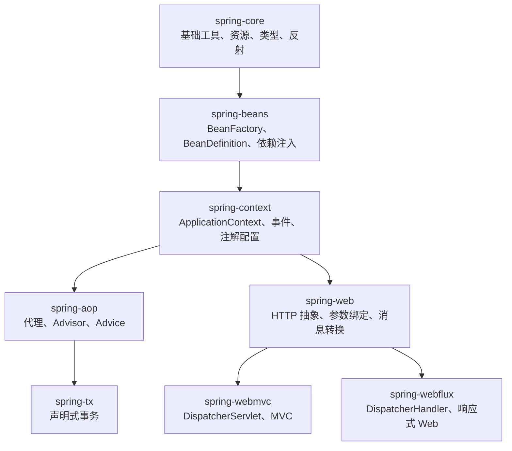

# Spring Framework 源码地图

这份地图回答一个问题：每个模块解决什么问题，什么时候应该读它。

## 总体分层



## 模块速览

| 模块 | 解决的问题 | 新手什么时候读 |
|------|------------|----------------|
| `spring-core` | 资源加载、反射工具、类型解析、注解工具 | 遇到 `Resource`、`ResolvableType`、`AnnotationUtils` 时读 |
| `spring-beans` | Bean 元数据、Bean 创建、依赖注入 | 第一周重点读 |
| `spring-context` | 应用上下文、事件、注解配置、国际化 | 第一周重点读 |
| `spring-aop` | 代理创建、切面匹配、拦截器链 | 第二周读 |
| `spring-tx` | 事务拦截、传播行为、事务同步 | 第二周读 |
| `spring-jdbc` | JDBC 模板、数据源事务管理 | 读事务时配合看 |
| `spring-web` | Web 基础抽象、参数绑定、消息转换 | 第三周读 MVC/WebFlux 时配合看 |
| `spring-webmvc` | Servlet MVC 请求分发 | 第三周读 |
| `spring-webflux` | 响应式 Web 请求分发 | 第三周读 |
| `spring-test` | Spring 测试支持 | 跑源码测试时查 |

## 阅读主线

### IoC 主线

```text
spring-context
  -> AbstractApplicationContext.refresh()
spring-beans
  -> DefaultListableBeanFactory
  -> AbstractBeanFactory.doGetBean()
  -> AbstractAutowireCapableBeanFactory.doCreateBean()
```

### AOP 主线

```text
spring-aop
  -> AbstractAutoProxyCreator
  -> ProxyFactory
  -> JdkDynamicAopProxy / CglibAopProxy
  -> ReflectiveMethodInvocation
```

### 事务主线

```text
spring-tx
  -> TransactionInterceptor
  -> TransactionAspectSupport
  -> PlatformTransactionManager
spring-jdbc
  -> DataSourceTransactionManager
```

### MVC 主线

```text
spring-webmvc
  -> DispatcherServlet.doDispatch()
  -> HandlerMapping
  -> HandlerAdapter
spring-web
  -> HandlerMethodArgumentResolver
  -> HandlerMethodReturnValueHandler
```

## 新手阅读建议

- 先读 `spring-context` 和 `spring-beans`，不要先读 MVC。
- 读源码时不要只看接口，要找到默认实现。
- 每次只追一条链路，例如“容器启动”或“Bean 创建”。
- 遇到工具类可以先跳过，等主线清楚后再回来补。

