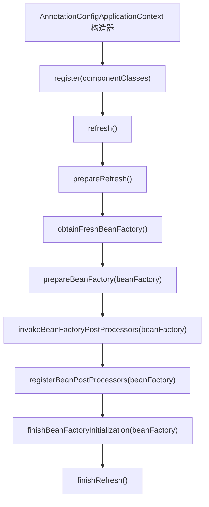
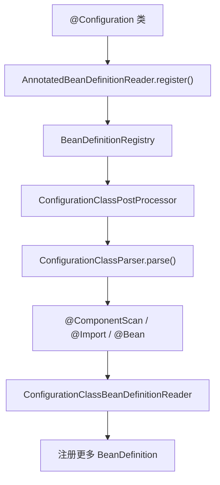
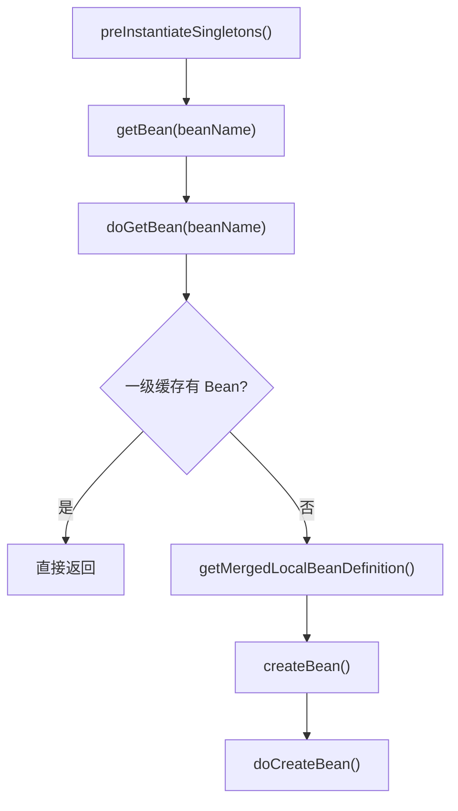
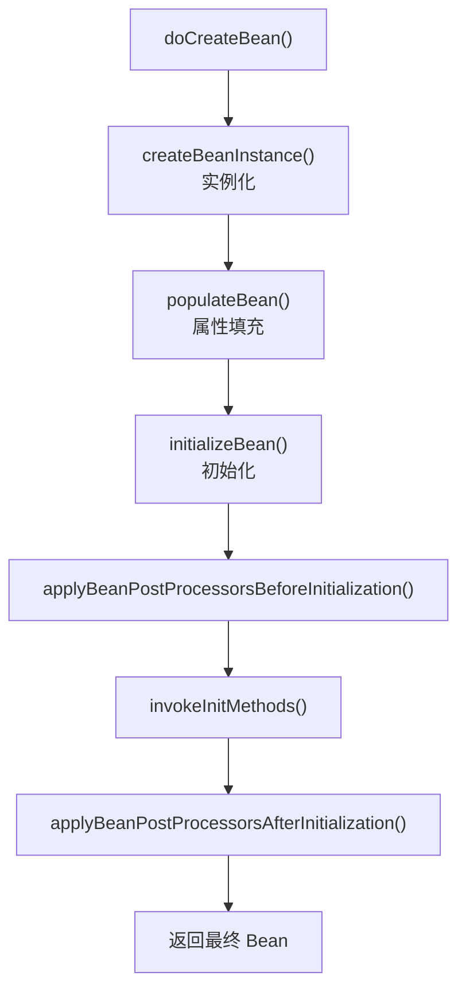
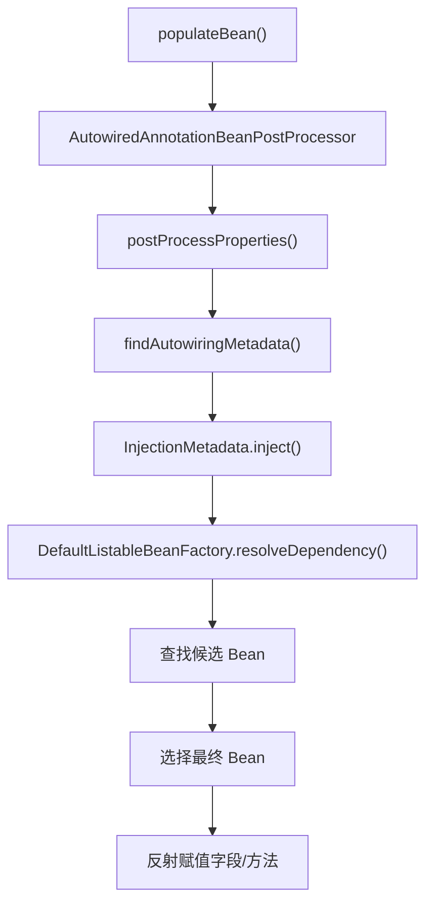
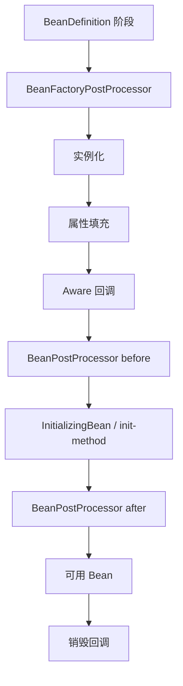

# 每日流程图

这里集中放第一周最关键的流程图，适合新手反复对照。

## Day 1：`refresh()` 主流程

```mermaid
flowchart TD
    A["AnnotationConfigApplicationContext 构造器"] --> B["register(componentClasses)"]
    B --> C["refresh()"]
    C --> D["prepareRefresh()"]
    D --> E["obtainFreshBeanFactory()"]
    E --> F["prepareBeanFactory(beanFactory)"]
    F --> G["invokeBeanFactoryPostProcessors(beanFactory)"]
    G --> H["registerBeanPostProcessors(beanFactory)"]
    H --> I["finishBeanFactoryInitialization(beanFactory)"]
    I --> J["finishRefresh()"]
```

## Day 2：注解到 BeanDefinition

```mermaid
flowchart TD
    A["@Configuration 类"] --> B["AnnotatedBeanDefinitionReader.register()"]
    B --> C["BeanDefinitionRegistry"]
    C --> D["ConfigurationClassPostProcessor"]
    D --> E["ConfigurationClassParser.parse()"]
    E --> F["@ComponentScan / @Import / @Bean"]
    F --> G["ConfigurationClassBeanDefinitionReader"]
    G --> H["注册更多 BeanDefinition"]
```

## Day 3：`getBean()` 主线

```mermaid
flowchart TD
    A["preInstantiateSingletons()"] --> B["getBean(beanName)"]
    B --> C["doGetBean(beanName)"]
    C --> D{"一级缓存有 Bean?"}
    D -- 是 --> E["直接返回"]
    D -- 否 --> F["getMergedLocalBeanDefinition()"]
    F --> G["createBean()"]
    G --> H["doCreateBean()"]
```

## Day 4：Bean 创建三阶段

```mermaid
flowchart TD
    A["doCreateBean()"] --> B["createBeanInstance()<br/>实例化"]
    B --> C["populateBean()<br/>属性填充"]
    C --> D["initializeBean()<br/>初始化"]
    D --> E["applyBeanPostProcessorsBeforeInitialization()"]
    E --> F["invokeInitMethods()"]
    F --> G["applyBeanPostProcessorsAfterInitialization()"]
    G --> H["返回最终 Bean"]
```

## Day 5：`@Autowired` 注入链路

```mermaid
flowchart TD
    A["populateBean()"] --> B["AutowiredAnnotationBeanPostProcessor"]
    B --> C["postProcessProperties()"]
    C --> D["findAutowiringMetadata()"]
    D --> E["InjectionMetadata.inject()"]
    E --> F["DefaultListableBeanFactory.resolveDependency()"]
    F --> G["查找候选 Bean"]
    G --> H["选择最终 Bean"]
    H --> I["反射赋值字段/方法"]
```

## Day 6：生命周期扩展点

```mermaid
flowchart TD
    A["BeanDefinition 阶段"] --> B["BeanFactoryPostProcessor"]
    B --> C["实例化"]
    C --> D["属性填充"]
    D --> E["Aware 回调"]
    E --> F["BeanPostProcessor before"]
    F --> G["InitializingBean / init-method"]
    G --> H["BeanPostProcessor after"]
    H --> I["可用 Bean"]
    I --> J["销毁回调"]
```

