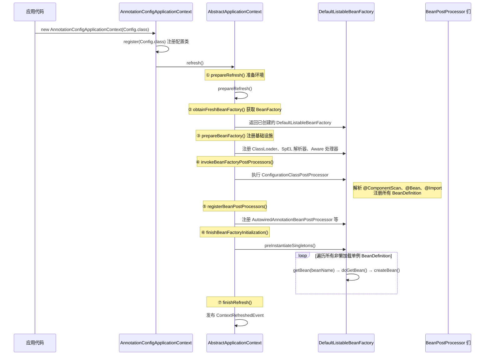
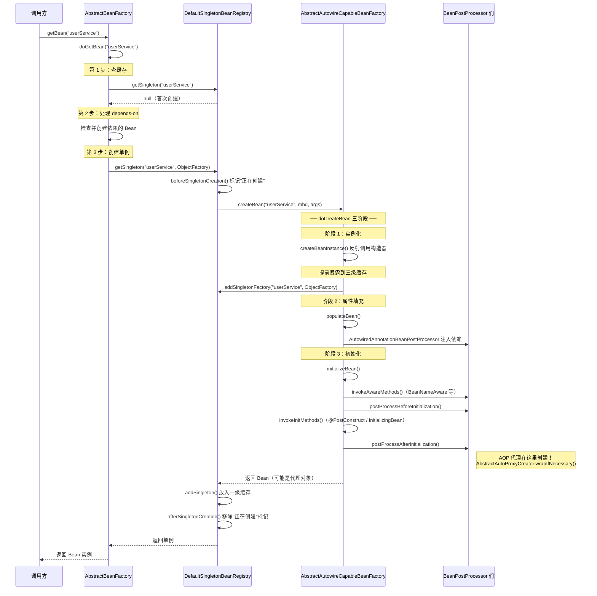
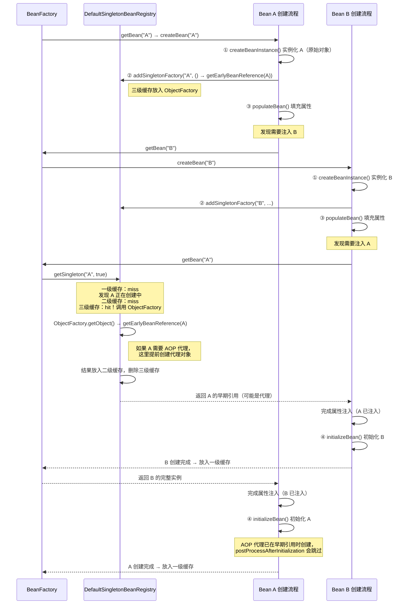
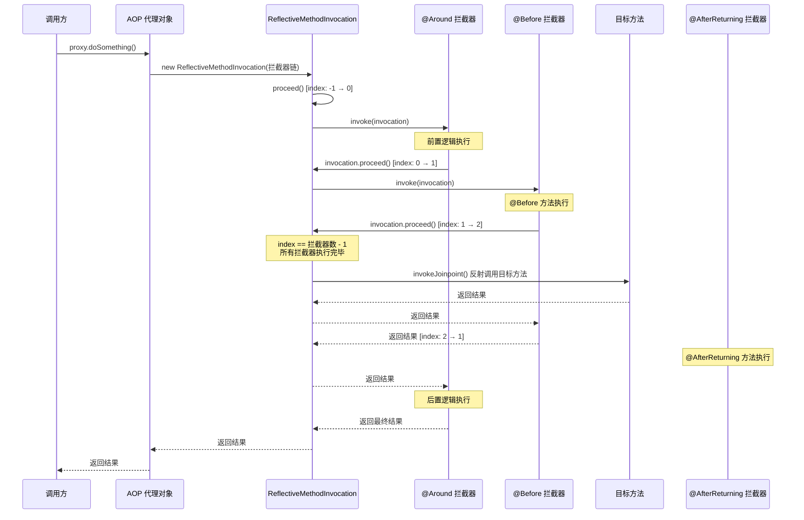
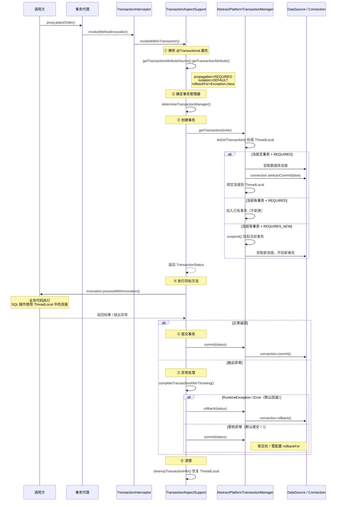
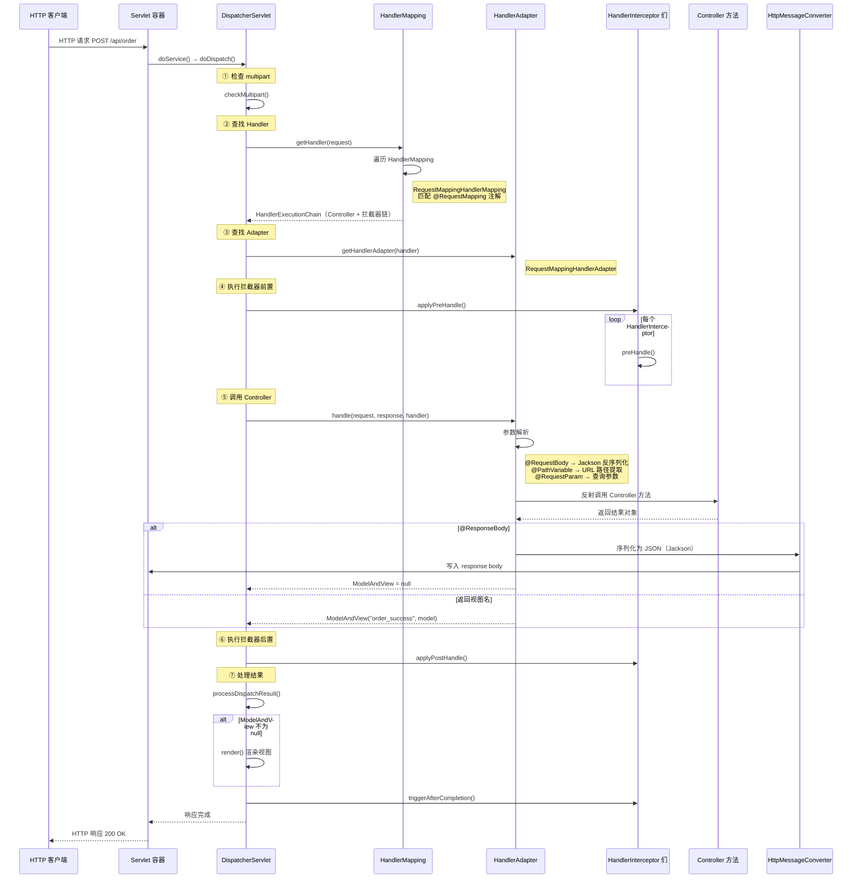
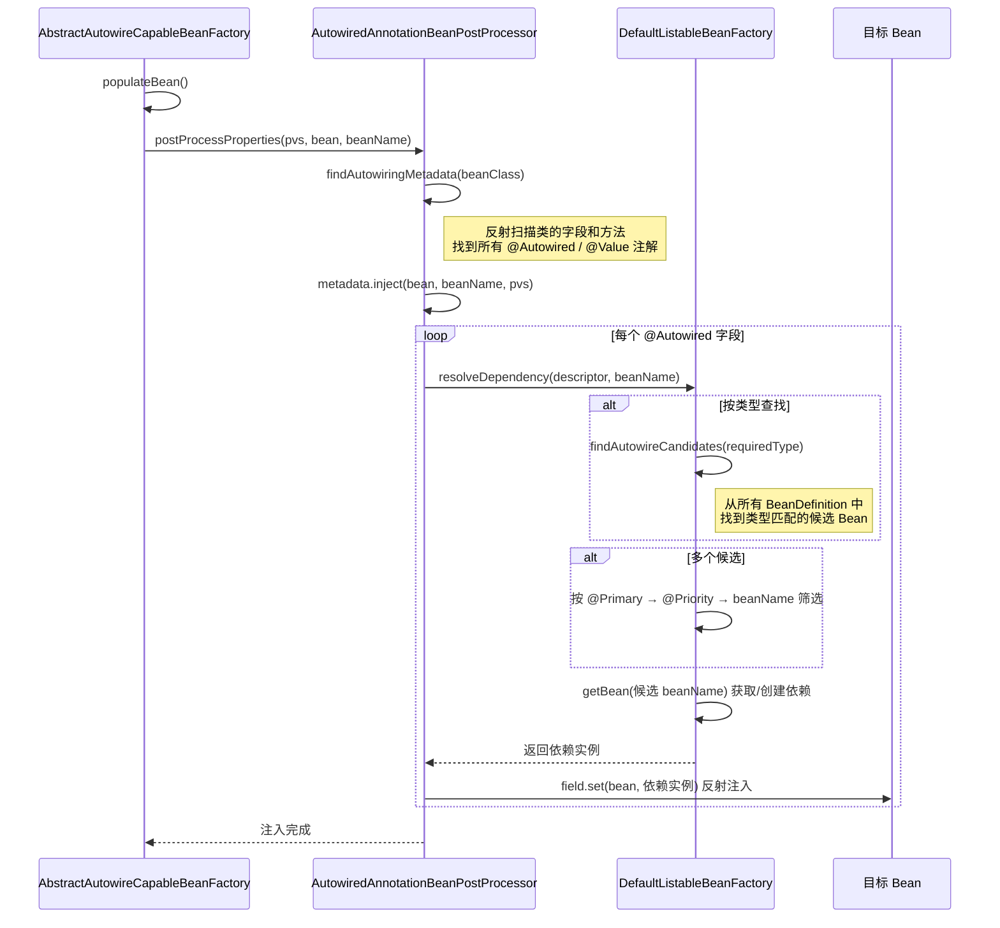

# Spring 核心链路时序图集

> 用 Mermaid 时序图直观展示 Spring 各核心模块的方法调用链路。
> 建议在 IDE 或 Markdown 预览器中查看，断点调试时对照阅读。

---

## 一、IoC 容器启动（refresh）

---

## 二、Bean 创建全链路（getBean → doCreateBean）

---

## 三、循环依赖解决（三级缓存）

---

## 四、AOP 代理执行（拦截器链）

---

## 五、@Transactional 事务执行

---

## 六、Spring MVC 请求处理

---

## 七、@Autowired 依赖注入

---

## 使用建议

1. **断点调试时对照**：在 IDE 中打开对应源码，时序图作为「地图」，知道当前在链路的哪个位置
2. **面试复述**：用时序图的步骤编号来组织回答，例如「@Transactional 的执行分为 6 步...」
3. **画自己的图**：遇到新场景时，模仿这些图的格式画自己的时序图
