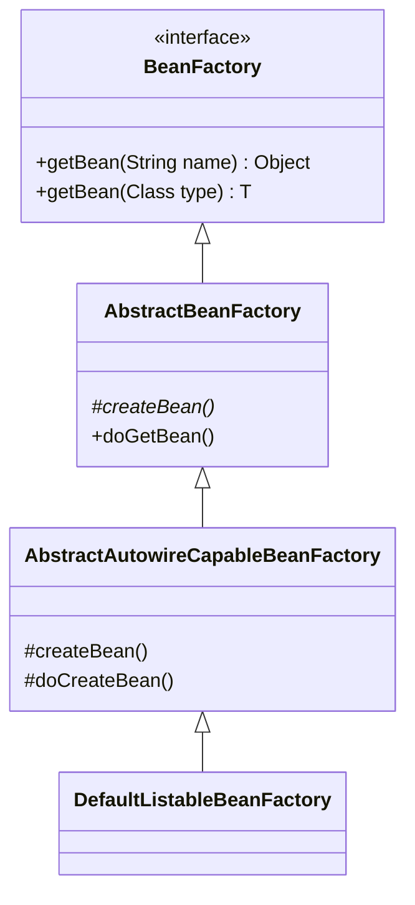
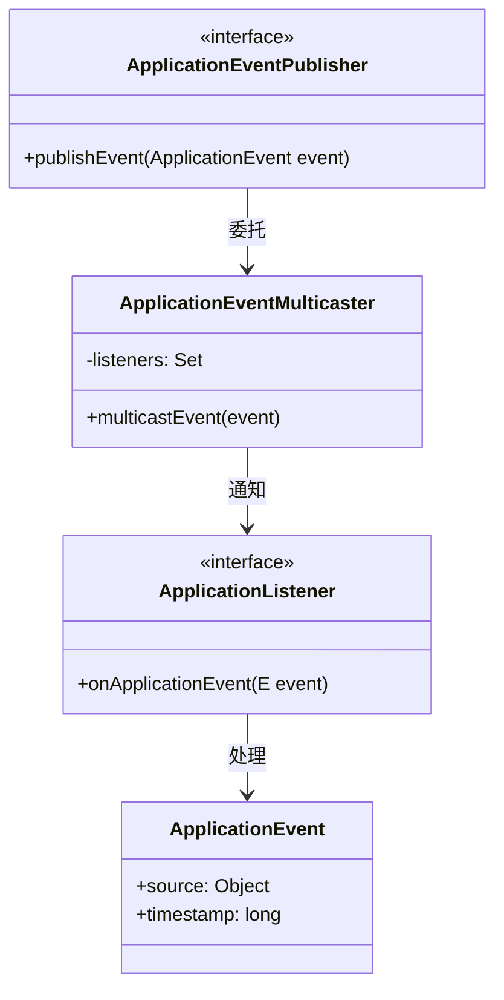

# Spring 源码中的设计模式

> Spring Framework 是设计模式的百科全书。本文将每个模式与源码位置精确关联，
> 帮助你在阅读源码时识别设计思想，在面试时信手拈来。

---

## 总览表

| 设计模式 | Spring 中的应用 | 核心类/接口 |
|----------|---------------|------------|
| 模板方法 | IoC 容器启动、事务管理、MVC 分发 | AbstractApplicationContext、AbstractPlatformTransactionManager |
| 工厂方法 | BeanFactory、FactoryBean | DefaultListableBeanFactory、FactoryBean |
| 抽象工厂 | AOP 代理创建 | AopProxyFactory |
| 单例模式 | Bean 的默认作用域 | DefaultSingletonBeanRegistry |
| 策略模式 | 资源加载、代理选择、HandlerMapping | ResourceLoader、AopProxy、HandlerMapping |
| 观察者模式 | 事件机制 | ApplicationEvent、ApplicationListener |
| 责任链模式 | AOP 拦截器链、MVC 拦截器 | ReflectiveMethodInvocation、HandlerInterceptor |
| 代理模式 | AOP、事务、懒加载 | JdkDynamicAopProxy、CglibAopProxy |
| 适配器模式 | MVC HandlerAdapter、Advice 适配 | HandlerAdapter、AdvisorAdapter |
| 装饰器模式 | BeanWrapper、TransactionAwareCacheDecorator | BeanWrapperImpl |
| 委托模式 | DispatcherServlet 委托各组件 | DispatcherServlet |
| 建造者模式 | BeanDefinitionBuilder | BeanDefinitionBuilder |

---

## 一、模板方法模式（Template Method）

### 定义
定义算法骨架，将某些步骤延迟到子类实现。

### Spring 中的应用

#### 1. AbstractApplicationContext.refresh()（IoC 容器启动）

```
refresh() 定义了容器启动的 13 个步骤，子类重写部分步骤：
```

| 步骤 | 方法 | 是否模板方法 | 子类实现示例 |
|------|------|------------|------------|
| 准备环境 | prepareRefresh() | 可重写 | — |
| 获取 BeanFactory | obtainFreshBeanFactory() | **模板** | GenericApplicationContext 返回已有的 |
| 后处理 | postProcessBeanFactory() | **模板** | Web 容器注册 Web scope |
| 完成刷新 | onRefresh() | **模板** | ServletWebServerApplicationContext 启动 Tomcat |

> 📍 源码：[AbstractApplicationContext.refresh()](file:///Users/hefei/github/java/spring-framework/spring-context/src/main/java/org/springframework/context/support/AbstractApplicationContext.java#L590)

#### 2. AbstractPlatformTransactionManager（事务管理）

```
getTransaction() / commit() / rollback() 定义事务管理骨架，
子类实现具体的数据库操作：
```

| 模板方法 | 子类实现 | 作用 |
|---------|---------|------|
| doGetTransaction() | DataSourceTransactionManager | 从 ThreadLocal 获取连接 |
| doBegin() | DataSourceTransactionManager | 获取连接、关闭 autoCommit |
| doCommit() | DataSourceTransactionManager | connection.commit() |
| doRollback() | DataSourceTransactionManager | connection.rollback() |
| doSuspend() | DataSourceTransactionManager | 从 ThreadLocal 解绑连接 |

> 📍 源码：[AbstractPlatformTransactionManager](file:///Users/hefei/github/java/spring-framework/spring-tx/src/main/java/org/springframework/transaction/support/AbstractPlatformTransactionManager.java)

---

## 二、工厂模式（Factory）

### 工厂方法：BeanFactory



- `getBean()` 是工厂方法的入口
- `createBean()` 是抽象方法，由子类实现具体的创建逻辑

### FactoryBean：用户自定义的工厂

```java
// 用户实现 FactoryBean 来自定义 Bean 创建逻辑
public class MyConnectionFactory implements FactoryBean<Connection> {
    @Override
    public Connection getObject() {
        return DriverManager.getConnection(url, user, password);
    }
    @Override
    public Class<?> getObjectType() {
        return Connection.class;
    }
}
```

| 获取方式 | 返回值 |
|---------|-------|
| `getBean("myConnectionFactory")` | Connection 实例 |
| `getBean("&myConnectionFactory")` | MyConnectionFactory 实例本身 |

---

## 三、单例模式（Singleton）

### Spring 的单例 ≠ GoF 单例

| 维度 | GoF 单例 | Spring 单例 |
|------|---------|------------|
| 范围 | JVM 全局 | IoC 容器内 |
| 实现 | 私有构造器 + 静态方法 | 容器管理 + 缓存 Map |
| 灵活性 | 不可替换 | 可通过容器替换 |

### 核心实现

> 📍 [DefaultSingletonBeanRegistry](file:///Users/hefei/github/java/spring-framework/spring-beans/src/main/java/org/springframework/beans/factory/support/DefaultSingletonBeanRegistry.java)

```java
// 一级缓存 —— 存放完全初始化的单例
private final Map<String, Object> singletonObjects = new ConcurrentHashMap<>(256);

public Object getSingleton(String beanName) {
    Object singletonObject = this.singletonObjects.get(beanName);
    // 缓存命中直接返回，保证全容器唯一
    return singletonObject;
}
```

---

## 四、策略模式（Strategy）

### 定义
定义一系列算法，把它们封装起来，使它们可以互换。

### Spring 中的应用

#### 1. 资源加载策略

| 策略接口 | 实现类 | 策略 |
|---------|-------|------|
| ResourceLoader | ClassPathResourceLoader | classpath:xxx |
| ResourceLoader | FileSystemResourceLoader | file:xxx |
| ResourceLoader | UrlResourceLoader | http://xxx |

#### 2. AOP 代理策略

| 策略接口 | 实现类 | 选择条件 |
|---------|-------|---------|
| AopProxy | JdkDynamicAopProxy | 目标实现了接口 |
| AopProxy | CglibAopProxy | 目标未实现接口或强制 CGLIB |

```java
// DefaultAopProxyFactory.createAopProxy()
if (目标实现了接口 && 未强制 proxyTargetClass) {
    return new JdkDynamicAopProxy(config);  // 策略 A
} else {
    return new CglibAopProxy(config);       // 策略 B
}
```

#### 3. HandlerMapping 策略

| 实现类 | 匹配策略 |
|-------|---------|
| RequestMappingHandlerMapping | 匹配 @RequestMapping 注解 |
| BeanNameUrlHandlerMapping | 匹配 Bean 名称 = URL |
| SimpleUrlHandlerMapping | 匹配 Properties 配置的 URL |

---

## 五、观察者模式（Observer）

### Spring 事件机制



### 内置事件

| 事件 | 触发时机 |
|------|---------|
| ContextRefreshedEvent | 容器刷新完成（refresh 结束） |
| ContextStartedEvent | 容器启动（start 调用） |
| ContextStoppedEvent | 容器停止（stop 调用） |
| ContextClosedEvent | 容器关闭（close 调用） |

### 自定义事件示例

```java
// 事件定义
public class OrderCreatedEvent extends ApplicationEvent {
    private final Order order;
    // ...
}

// 监听方式 1：实现接口
@Component
public class EmailListener implements ApplicationListener<OrderCreatedEvent> {
    @Override
    public void onApplicationEvent(OrderCreatedEvent event) {
        // 发送邮件
    }
}

// 监听方式 2：注解（推荐）
@Component
public class SmsListener {
    @EventListener
    public void onOrderCreated(OrderCreatedEvent event) {
        // 发送短信
    }
}
```

---

## 六、责任链模式（Chain of Responsibility）

### 1. AOP 拦截器链

> 📍 [ReflectiveMethodInvocation.proceed()](file:///Users/hefei/github/java/spring-framework/spring-aop/src/main/java/org/springframework/aop/framework/ReflectiveMethodInvocation.java#L168)

```
请求 → Around → Before → 目标方法 → AfterReturning → Around（后半段）
                                   ↘ AfterThrowing（异常时）
```

每个拦截器调用 `proceed()` 推进到下一个，形成链式递归。

### 2. MVC HandlerInterceptor 链

```
请求 → Interceptor1.preHandle → Interceptor2.preHandle → Controller
      ← Interceptor2.postHandle ← Interceptor1.postHandle ←
      ← Interceptor2.afterCompletion ← Interceptor1.afterCompletion ←
```

注意：`preHandle` 顺序执行，`postHandle` 和 `afterCompletion` **逆序**执行。

### 3. Filter 链（Servlet 规范，非 Spring 独有）

```
请求 → Filter1 → Filter2 → Filter3 → DispatcherServlet
      ← Filter3 ← Filter2 ← Filter1 ← 响应
```

---

## 七、代理模式（Proxy）

### Spring 中的三种代理场景

| 场景 | 代理方式 | 目的 |
|------|---------|------|
| AOP 切面 | JDK / CGLIB | 方法增强（日志、事务、缓存） |
| @Lazy 注入 | CGLIB | 延迟加载依赖 |
| @Configuration | CGLIB | 保证 @Bean 方法返回单例 |

### 代理对象的结构

```
                    ┌──────────────────────┐
                    │   Proxy（代理对象）   │
                    │                      │
调用方 ──────────►  │  拦截器链（Advisor[]） │
                    │       ↓              │
                    │  目标对象（target）    │
                    └──────────────────────┘
```

---

## 八、适配器模式（Adapter）

### 1. HandlerAdapter（MVC 核心）

不同类型的 Handler 需要不同的调用方式，HandlerAdapter 统一了调用接口：

| Handler 类型 | HandlerAdapter | 调用方式 |
|-------------|---------------|---------|
| @Controller 方法 | RequestMappingHandlerAdapter | 参数解析 + 反射调用 |
| HttpRequestHandler | HttpRequestHandlerAdapter | handleRequest() |
| Controller 接口 | SimpleControllerHandlerAdapter | handleRequest() |

### 2. AdvisorAdapter（AOP）

把不同类型的 Advice 适配为统一的 MethodInterceptor：

| Advice 类型 | Adapter | 适配后 |
|------------|---------|-------|
| MethodBeforeAdvice | MethodBeforeAdviceAdapter | MethodBeforeAdviceInterceptor |
| AfterReturningAdvice | AfterReturningAdviceAdapter | AfterReturningAdviceInterceptor |
| ThrowsAdvice | ThrowsAdviceAdapter | ThrowsAdviceInterceptor |

---

## 九、装饰器模式（Decorator）

### BeanWrapper

`BeanWrapper` 包装原始 Bean 对象，提供类型转换和属性访问功能：

```
BeanWrapper 包装 Bean 实例
   ├── 提供 setPropertyValue() 反射设置属性
   ├── 提供 getPropertyValue() 反射获取属性
   └── 集成 TypeConverter 自动类型转换
```

### TransactionAware 系列装饰器

```java
// 装饰器：让普通 DataSource 感知事务
TransactionAwareDataSourceProxy(原始 DataSource)
   └── getConnection() 时优先返回 ThreadLocal 中事务绑定的连接
```

---

## 十、建造者模式（Builder）

### BeanDefinitionBuilder

```java
BeanDefinition bd = BeanDefinitionBuilder
    .genericBeanDefinition(UserService.class)        // 设置类
    .setScope(BeanDefinition.SCOPE_SINGLETON)         // 设置作用域
    .addPropertyReference("userDao", "userDao")       // 设置属性引用
    .addPropertyValue("maxRetry", 3)                  // 设置属性值
    .setInitMethodName("init")                        // 设置初始化方法
    .setDestroyMethodName("cleanup")                  // 设置销毁方法
    .getBeanDefinition();                             // 构建
```

---

## 设计模式在源码阅读中的应用建议

1. **识别骨架**：看到 `abstract class + 模板方法` → 模板方法模式，先看骨架再看实现
2. **识别扩展点**：看到 `List<接口>` 被遍历调用 → 策略/责任链模式
3. **识别解耦**：看到 `publishEvent` / `listener` → 观察者模式
4. **识别间接调用**：看到 `$$CGLIB$$` / `$Proxy` → 代理模式
