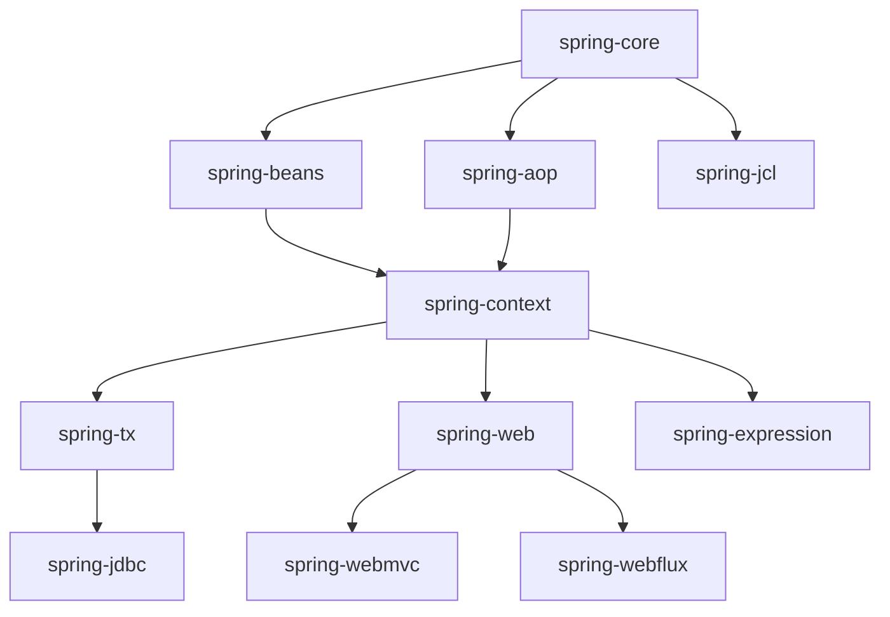

# 准备阶段

## 目标

确保项目可以导航、搜索、编译和调试。

## 环境配置

- 项目根目录：`/Users/hefei/github/java/spring-framework`
- Project SDK：JDK 17
- Gradle JVM：JDK 17
- 测试运行方式：Gradle

## 常用命令

### 生成资源（如果 IDEA 中缺少）

```bash
./gradlew :spring-oxm:compileTestJava
```

### 日常编译验证

```bash
./gradlew assemble -x test
```

### 小范围测试

```bash
./gradlew :spring-core:test --tests "*ResolvableTypeTests"
./gradlew :spring-beans:test --tests "*DefaultListableBeanFactoryTests"
./gradlew :spring-context:test --tests "*AnnotationConfigApplicationContextTests"
./gradlew :spring-webmvc:test --tests "*DispatcherServletTests"
```

## 模块依赖关系



## IDEA 调试技巧

### 常用快捷键

| 快捷键 | 功能 |
|--------|------|
| `Ctrl+Shift+F` / `Cmd+Shift+F` | 全局搜索 |
| `Ctrl+Alt+H` / `Cmd+Alt+H` | 查看调用层级 |
| `Ctrl+H` / `Cmd+H` | 查看类继承关系 |
| `Ctrl+Alt+B` / `Cmd+Alt+B` | 查看接口实现 |
| `Alt+F7` | 查看引用 |
| `Ctrl+F12` / `Cmd+F12` | 查看文件结构 |

### 断点技巧

1. **条件断点**：右键断点，添加 Condition（如 `"myBean".equals(beanName)`）
2. **日志断点**：勾选 "Evaluate and log"，不暂停但输出信息
3. **方法断点**：在方法签名处设置，追踪方法入口和出口
4. **异常断点**：Run → View Breakpoints → 添加 Java Exception Breakpoint

### 推荐配置

```text
IDEA Settings:
  → Build, Execution, Deployment
    → Build Tools → Gradle
      → Build and run using: IntelliJ IDEA（编译更快）
      → Run tests using: Gradle（兼容性好）
  → Editor → General → Auto Import
      → 勾选 Add unambiguous imports on the fly
```

## Spring 源码目录结构

```text
spring-framework/
├── spring-core          # 核心工具：类型转换、资源加载、反射工具等
├── spring-beans         # IoC 容器核心：BeanFactory、BeanDefinition、依赖注入
├── spring-context       # 应用上下文：ApplicationContext、事件、注解配置
├── spring-aop           # AOP 框架：代理、切面、通知
├── spring-tx            # 事务管理：声明式事务、事务传播
├── spring-jdbc          # JDBC 支持：JdbcTemplate、DataSource 事务管理
├── spring-web           # Web 基础：HTTP 抽象、编解码、参数绑定
├── spring-webmvc        # Spring MVC：DispatcherServlet、Controller
├── spring-webflux       # WebFlux：响应式 Web 框架
├── spring-expression    # SpEL 表达式引擎
├── spring-jcl           # 日志门面（Jakarta Commons Logging）
├── spring-test          # 测试支持
└── ...
```

## 验收标准

- [ ] IDEA 能正常识别所有主要模块
- [ ] 能跳转源码、查看调用层级、运行单个测试
- [ ] 小范围测试可以通过
- [ ] 能在 `AbstractApplicationContext.refresh()` 上打断点并命中

## 学习笔记

<!-- 在这里记录你的环境配置过程和遇到的问题 -->
