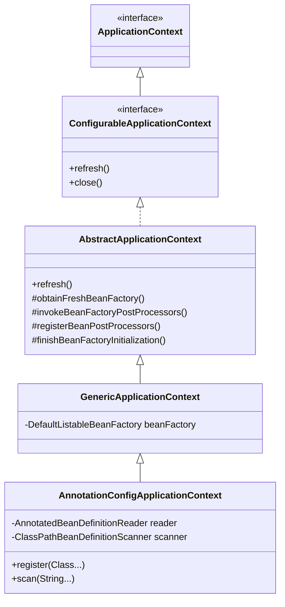
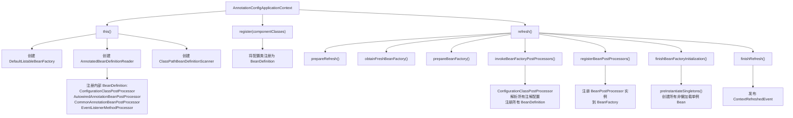

# 容器启动主流程

## 目标

理解 `ApplicationContext` 如何启动，以及 Spring IoC 容器如何准备。

## 核心类

- [AnnotationConfigApplicationContext.java](../../spring-context/src/main/java/org/springframework/context/annotation/AnnotationConfigApplicationContext.java)
- [AbstractApplicationContext.java](../../spring-context/src/main/java/org/springframework/context/support/AbstractApplicationContext.java)
- [PostProcessorRegistrationDelegate.java](../../spring-context/src/main/java/org/springframework/context/support/PostProcessorRegistrationDelegate.java)
- [GenericApplicationContext.java](../../spring-context/src/main/java/org/springframework/context/support/GenericApplicationContext.java)

## 类继承关系



## 设计模式

| 模式 | 应用位置 | 说明 |
|------|---------|------|
| **模板方法** | `AbstractApplicationContext.refresh()` | 定义启动骨架，子类实现具体步骤 |
| **委托模式** | `PostProcessorRegistrationDelegate` | 将后置处理器的调用逻辑委托到单独的类 |
| **策略模式** | `BeanFactory` 的不同实现 | 不同的 BeanFactory 支持不同的功能 |
| **观察者模式** | `ApplicationEvent` / `ApplicationListener` | 容器事件发布与监听 |

## 核心源码分析

### AnnotationConfigApplicationContext 构造器

```java
// AnnotationConfigApplicationContext.java
public AnnotationConfigApplicationContext(Class<?>... componentClasses) {
    this();  // 1. 调用无参构造
    register(componentClasses);  // 2. 注册配置类
    refresh();  // 3. 刷新容器
}

public AnnotationConfigApplicationContext() {
    // 父类 GenericApplicationContext 构造器中创建了 DefaultListableBeanFactory
    // super() -> this.beanFactory = new DefaultListableBeanFactory();

    // 创建注解 Bean 定义读取器
    this.reader = new AnnotatedBeanDefinitionReader(this);
    // 创建类路径 Bean 定义扫描器
    this.scanner = new ClassPathBeanDefinitionScanner(this);
}
```

**关键点**：
- `this()` 会触发父类 `GenericApplicationContext` 构造器，创建 `DefaultListableBeanFactory`
- `AnnotatedBeanDefinitionReader` 构造时会注册一些内部 BeanDefinition（如 `ConfigurationClassPostProcessor`）

### AbstractApplicationContext.refresh() 详解

```java
// AbstractApplicationContext.java
public void refresh() throws BeansException, IllegalStateException {
    // 加锁，避免并发 refresh
    this.startupShutdownLock.lock();
    try {
        this.startupShutdownThread = Thread.currentThread();
        StartupStep contextRefresh = this.applicationStartup.start("spring.context.refresh");

        // 1. 准备刷新：设置启动时间、活动标志、初始化属性源
        prepareRefresh();

        // 2. 获取 BeanFactory
        //    对于 GenericApplicationContext，直接返回已有的 DefaultListableBeanFactory
        //    对于 ClassPathXmlApplicationContext，会重新创建并加载 XML
        ConfigurableListableBeanFactory beanFactory = obtainFreshBeanFactory();

        // 3. 配置 BeanFactory：注册 ClassLoader、表达式解析器、属性编辑器等
        prepareBeanFactory(beanFactory);

        try {
            // 4. 子类扩展点：允许子类对 BeanFactory 做额外处理
            //    如 Web 环境下注册 request/session scope
            postProcessBeanFactory(beanFactory);

            // 5. 调用所有 BeanFactoryPostProcessor
            //    重点：ConfigurationClassPostProcessor 在这里解析 @Configuration
            invokeBeanFactoryPostProcessors(beanFactory);

            // 6. 注册 BeanPostProcessor（此时只是注册，还没调用）
            registerBeanPostProcessors(beanFactory);

            // 7. 初始化 MessageSource（国际化）
            initMessageSource();

            // 8. 初始化事件广播器
            initApplicationEventMulticaster();

            // 9. 子类扩展点：如 SpringBoot 在这里创建嵌入式 Web 服务器
            onRefresh();

            // 10. 注册事件监听器
            registerListeners();

            // 11. 实例化所有非懒加载的单例 Bean（核心！）
            finishBeanFactoryInitialization(beanFactory);

            // 12. 完成刷新：清除缓存、发布 ContextRefreshedEvent
            finishRefresh();
        } catch (RuntimeException | Error ex) {
            // 异常时销毁已创建的 Bean 并取消 refresh
            destroyBeans();
            cancelRefresh(ex);
            throw ex;
        } finally {
            contextRefresh.end();
        }
    } finally {
        this.startupShutdownThread = null;
        this.startupShutdownLock.unlock();
    }
}
```

### prepareBeanFactory() 注册了什么

```java
// AbstractApplicationContext.java
protected void prepareBeanFactory(ConfigurableListableBeanFactory beanFactory) {
    // 设置类加载器
    beanFactory.setBeanClassLoader(getClassLoader());

    // 设置 SpEL 表达式解析器
    beanFactory.setBeanExpressionResolver(new StandardBeanExpressionResolver(...));

    // 注册属性编辑器
    beanFactory.addPropertyEditorRegistrar(new ResourceEditorRegistrar(this, getEnvironment()));

    // 注册 Aware 回调处理器（重要！）
    beanFactory.addBeanPostProcessor(new ApplicationContextAwareProcessor(this));

    // 忽略这些 Aware 接口的自动装配（因为由 ApplicationContextAwareProcessor 统一处理）
    beanFactory.ignoreDependencyInterface(EnvironmentAware.class);
    beanFactory.ignoreDependencyInterface(ApplicationContextAware.class);
    // ... 更多 Aware 接口

    // 注册可解析的依赖：让 @Autowired BeanFactory 能注入容器自身
    beanFactory.registerResolvableDependency(BeanFactory.class, beanFactory);
    beanFactory.registerResolvableDependency(ApplicationContext.class, this);

    // 注册 ApplicationListenerDetector（监听器检测器）
    beanFactory.addBeanPostProcessor(new ApplicationListenerDetector(this));

    // 注册环境相关的单例 Bean
    beanFactory.registerSingleton("environment", getEnvironment());
    beanFactory.registerSingleton("systemProperties", getEnvironment().getSystemProperties());
    beanFactory.registerSingleton("systemEnvironment", getEnvironment().getSystemEnvironment());
}
```

### invokeBeanFactoryPostProcessors() 的执行顺序

```java
// PostProcessorRegistrationDelegate.java
// 调用顺序严格按照优先级排列：
//
// 1. 先调用 BeanDefinitionRegistryPostProcessor（可注册新的 BeanDefinition）
//    a. 实现了 PriorityOrdered 的
//    b. 实现了 Ordered 的
//    c. 其余的
//
// 2. 再调用 BeanFactoryPostProcessor（只能修改已有 BeanDefinition）
//    a. 实现了 PriorityOrdered 的
//    b. 实现了 Ordered 的
//    c. 其余的
```

**重点**：`ConfigurationClassPostProcessor` 实现了 `BeanDefinitionRegistryPostProcessor` + `PriorityOrdered`，所以它是**第一个**被调用的，负责解析所有 `@Configuration`、`@ComponentScan`、`@Bean` 注解。

## refresh() 流程图



## 容器启动前注册的基础设施 Bean

在 `AnnotatedBeanDefinitionReader` 构造时，会注册以下内部处理器：

| Bean 名称 | 类名 | 作用 |
|-----------|------|------|
| `internalConfigurationAnnotationProcessor` | `ConfigurationClassPostProcessor` | 解析 @Configuration 类 |
| `internalAutowiredAnnotationProcessor` | `AutowiredAnnotationBeanPostProcessor` | 处理 @Autowired 注入 |
| `internalCommonAnnotationProcessor` | `CommonAnnotationBeanPostProcessor` | 处理 @PostConstruct、@PreDestroy、@Resource |
| `internalEventListenerProcessor` | `EventListenerMethodProcessor` | 处理 @EventListener |
| `internalEventListenerFactory` | `DefaultEventListenerFactory` | 创建 ApplicationListener 适配器 |

## 常见面试题

### 1. Spring 容器启动时做了什么？

答：核心是 `refresh()` 方法，按顺序完成：
1. 准备环境和属性源
2. 获取/创建 BeanFactory
3. 调用 `BeanFactoryPostProcessor`（解析注解配置、注册 BeanDefinition）
4. 注册 `BeanPostProcessor`
5. 实例化所有非懒加载的单例 Bean
6. 发布容器刷新完成事件

### 2. BeanFactoryPostProcessor 和 BeanPostProcessor 的区别？

| 对比项 | BeanFactoryPostProcessor | BeanPostProcessor |
|--------|--------------------------|-------------------|
| 作用阶段 | Bean 实例化之前 | Bean 实例化之后 |
| 操作对象 | BeanDefinition（元数据） | Bean 实例 |
| 典型实现 | ConfigurationClassPostProcessor | AutowiredAnnotationBeanPostProcessor |
| 注册时机 | `invokeBeanFactoryPostProcessors()` | `registerBeanPostProcessors()` |

### 3. 为什么 refresh() 要加锁？

因为 `refresh()` 不是幂等操作。如果并发调用可能导致 BeanFactory 状态不一致，比如重复注册 BeanDefinition 或重复创建单例 Bean。

## 实战应用场景

### 场景 1：自定义 BeanFactoryPostProcessor 修改 Bean 属性

```java
@Component
public class DataSourceUrlPostProcessor implements BeanFactoryPostProcessor {
    @Override
    public void postProcessBeanFactory(ConfigurableListableBeanFactory beanFactory) {
        BeanDefinition bd = beanFactory.getBeanDefinition("dataSource");
        // 动态修改数据源 URL（比如从配置中心获取）
        bd.getPropertyValues().add("url", fetchUrlFromConfigCenter());
    }
}
```

### 场景 2：监听容器启动完成事件

```java
@Component
public class StartupListener implements ApplicationListener<ContextRefreshedEvent> {
    @Override
    public void onApplicationEvent(ContextRefreshedEvent event) {
        // 容器启动完成后执行初始化逻辑
        // 如：预热缓存、检查数据库连接、注册到注册中心
        System.out.println("容器启动完成，开始预热...");
    }
}
```

### 更多业务场景（低代码 & 审批流）

> 详见 [实战场景-低代码与审批流](../00-13-实战场景-低代码与审批流.md)

- **低代码 — 运行时动态注册数据源**：利用 `BeanDefinitionRegistry` 在用户创建应用时动态注册 DataSource Bean
- **低代码 — 组件插件自动发现**：通过 `BeanDefinitionRegistryPostProcessor` 扫描 `@LowCodeComponent` 注解自动注册平台组件
- **审批流 — 动态注册审批处理器**：根据审批节点配置动态注册不同类型的 Handler Bean（单人审批/会签/自动审批）

## 建议断点

- `AnnotationConfigApplicationContext(Class<?>... componentClasses)`
- `AbstractApplicationContext.refresh()`
- `PostProcessorRegistrationDelegate.invokeBeanFactoryPostProcessors(...)`
- `PostProcessorRegistrationDelegate.registerBeanPostProcessors(...)`
- `DefaultListableBeanFactory.preInstantiateSingletons()`

## 阶段目标

- [ ] 能说明普通 Bean 创建之前 Spring 做了哪些准备
- [ ] 能知道 `BeanFactoryPostProcessor` 和 `BeanPostProcessor` 在哪里被调用和注册
- [ ] 能把 `refresh()` 这条主线画成流程图
- [ ] 能列出容器启动时预注册的基础设施 Bean

## 学习笔记

<!-- 在这里记录你的阅读收获 -->
