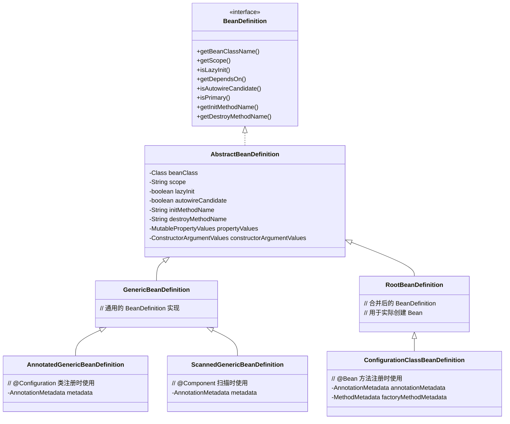
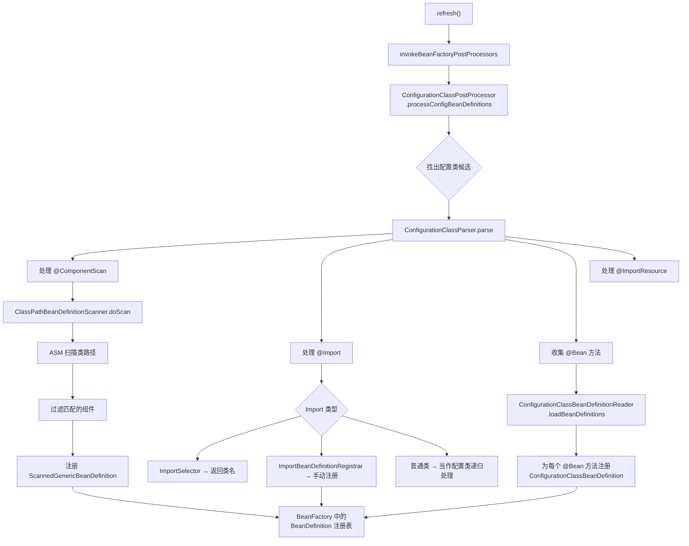

# BeanDefinition 注册

## 目标

理解注解如何被解析成 `BeanDefinition`。

## 核心类

- [AnnotatedBeanDefinitionReader.java](../../spring-context/src/main/java/org/springframework/context/annotation/AnnotatedBeanDefinitionReader.java)
- [ClassPathBeanDefinitionScanner.java](../../spring-context/src/main/java/org/springframework/context/annotation/ClassPathBeanDefinitionScanner.java)
- [ConfigurationClassPostProcessor.java](../../spring-context/src/main/java/org/springframework/context/annotation/ConfigurationClassPostProcessor.java)
- [ConfigurationClassParser.java](../../spring-context/src/main/java/org/springframework/context/annotation/ConfigurationClassParser.java)
- [ConfigurationClassBeanDefinitionReader.java](../../spring-context/src/main/java/org/springframework/context/annotation/ConfigurationClassBeanDefinitionReader.java)
- [BeanDefinition.java](../../spring-beans/src/main/java/org/springframework/beans/factory/config/BeanDefinition.java)

## BeanDefinition 类体系



## 设计模式

| 模式 | 应用位置 | 说明 |
|------|---------|------|
| **职责链** | `ConfigurationClassParser` 处理多种注解 | 按顺序处理 @PropertySource → @ComponentScan → @Import → @Bean |
| **访问者模式** | `ConfigurationClassParser` + `ConfigurationClass` | Parser 遍历配置类结构，Reader 负责注册 |
| **工厂方法** | `@Bean` 方法 | Bean 实例由工厂方法（@Bean 方法）创建 |
| **递归组合** | `@Import` 导入链 | 配置类可以递归导入其他配置类 |

## 核心源码分析

### ConfigurationClassPostProcessor — 注解配置的总入口

```java
// ConfigurationClassPostProcessor.java
public void postProcessBeanDefinitionRegistry(BeanDefinitionRegistry registry) {
    // 生成唯一 ID，防止重复处理
    int registryId = System.identityHashCode(registry);
    this.registriesPostProcessed.add(registryId);
    // 核心方法
    processConfigBeanDefinitions(registry);
}

public void processConfigBeanDefinitions(BeanDefinitionRegistry registry) {
    List<BeanDefinitionHolder> configCandidates = new ArrayList<>();

    // 1. 从已注册的 BeanDefinition 中找出配置类候选
    String[] candidateNames = registry.getBeanDefinitionNames();
    for (String beanName : candidateNames) {
        BeanDefinition beanDef = registry.getBeanDefinition(beanName);
        // 判断是否是 Full 配置类（@Configuration）或 Lite 配置类（@Component 等）
        if (ConfigurationClassUtils.checkConfigurationClassCandidate(beanDef, ...)) {
            configCandidates.add(new BeanDefinitionHolder(beanDef, beanName));
        }
    }

    // 没有配置类就直接返回
    if (configCandidates.isEmpty()) return;

    // 2. 按 @Order 排序
    configCandidates.sort((bd1, bd2) -> ...);

    // 3. 创建 ConfigurationClassParser 并解析
    ConfigurationClassParser parser = new ConfigurationClassParser(...);
    Set<BeanDefinitionHolder> candidates = new LinkedHashSet<>(configCandidates);

    do {
        // 解析配置类（递归处理 @Import、@ComponentScan 等）
        parser.parse(candidates);
        parser.validate();

        // 4. 获取解析结果并注册 BeanDefinition
        Set<ConfigurationClass> configClasses = parser.getConfigurationClasses();
        this.reader.loadBeanDefinitions(configClasses);

        // 5. 检查是否有新的配置类被注册，如果有则继续循环
        candidates.clear();
        // ... 检查新注册的 BeanDefinition 是否是配置类
    } while (!candidates.isEmpty());
}
```

### ConfigurationClassParser.parse() — 解析配置类结构

```java
// ConfigurationClassParser.java
protected void processConfigurationClass(ConfigurationClass configClass, ...) {
    // 条件评估：@Conditional
    if (this.conditionEvaluator.shouldSkip(configClass.getMetadata(), ...)) {
        return;
    }

    // 递归处理（由内向外）
    SourceClass sourceClass = asSourceClass(configClass, ...);
    do {
        sourceClass = doProcessConfigurationClass(configClass, sourceClass, ...);
    } while (sourceClass != null);
}

protected final SourceClass doProcessConfigurationClass(ConfigurationClass configClass, ...) {
    // 1. 处理内部类（@Component 内部类也可能是配置类）
    processMemberClasses(configClass, sourceClass, ...);

    // 2. 处理 @PropertySource
    for (AnnotationAttributes propertySource : ...) {
        processPropertySource(propertySource);
    }

    // 3. 处理 @ComponentScan（触发包扫描！）
    Set<AnnotationAttributes> componentScans = ...;
    for (AnnotationAttributes componentScan : componentScans) {
        // 实际执行扫描，返回扫描到的 BeanDefinition
        Set<BeanDefinitionHolder> scannedBeanDefinitions =
            this.componentScanParser.parse(componentScan, ...);

        // 扫描到的类如果也是配置类，递归解析
        for (BeanDefinitionHolder holder : scannedBeanDefinitions) {
            if (ConfigurationClassUtils.checkConfigurationClassCandidate(...)) {
                parse(bdCand.getBeanClassName(), holder.getBeanName());
            }
        }
    }

    // 4. 处理 @Import
    processImports(configClass, sourceClass, getImports(sourceClass), ...);

    // 5. 处理 @ImportResource
    // ...

    // 6. 处理 @Bean 方法
    Set<MethodMetadata> beanMethods = sourceClass.getMetadata().getAnnotatedMethods(Bean.class.getName());
    for (MethodMetadata methodMetadata : beanMethods) {
        configClass.addBeanMethod(new BeanMethod(methodMetadata, configClass));
    }

    // 7. 处理接口中的默认方法（如果有 @Bean）
    processInterfaces(configClass, sourceClass);

    // 8. 处理父类（递归）
    if (sourceClass.getMetadata().hasSuperClass()) {
        String superclass = sourceClass.getMetadata().getSuperClassName();
        if (superclass != null && !superclass.startsWith("java")) {
            return sourceClass.getSuperClass();  // 继续处理父类
        }
    }
    return null;  // 处理完毕
}
```

### ClassPathBeanDefinitionScanner.doScan() — 包扫描

```java
// ClassPathBeanDefinitionScanner.java
protected Set<BeanDefinitionHolder> doScan(String... basePackages) {
    Set<BeanDefinitionHolder> beanDefinitions = new LinkedHashSet<>();

    for (String basePackage : basePackages) {
        // 1. 扫描类路径下匹配的类（使用 ASM 读取类信息，不加载类）
        Set<BeanDefinition> candidates = findCandidateComponents(basePackage);

        for (BeanDefinition candidate : candidates) {
            // 2. 解析 scope（@Scope 注解）
            ScopeMetadata scopeMetadata = this.scopeMetadataResolver.resolveScopeMetadata(candidate);
            candidate.setScope(scopeMetadata.getScopeName());

            // 3. 生成 Bean 名称
            String beanName = this.beanNameGenerator.generateBeanName(candidate, this.registry);

            // 4. 设置默认值：lazyInit、autowireMode 等
            if (candidate instanceof AbstractBeanDefinition abd) {
                postProcessBeanDefinition(abd, beanName);
            }

            // 5. 处理通用注解：@Lazy、@Primary、@DependsOn、@Description
            if (candidate instanceof AnnotatedBeanDefinition abd) {
                AnnotationConfigUtils.processCommonDefinitionAnnotations(abd);
            }

            // 6. 检查是否已注册（避免重复）
            if (checkCandidate(beanName, candidate)) {
                BeanDefinitionHolder definitionHolder = new BeanDefinitionHolder(candidate, beanName);
                beanDefinitions.add(definitionHolder);
                // 7. 注册到 BeanFactory
                registerBeanDefinition(definitionHolder, this.registry);
            }
        }
    }
    return beanDefinitions;
}
```

**关键点**：扫描使用 **ASM** 读取 `.class` 文件的元数据，而不是用反射加载类。这样避免了类的静态初始化块执行，性能更好。

### Full 配置类 vs Lite 配置类

```java
// ConfigurationClassUtils.java
// Full 配置类：@Configuration(proxyBeanMethods = true)
// - 会被 CGLIB 代理增强
// - @Bean 方法之间的互相调用会走代理，保证单例
//
// Lite 配置类：@Component、@ComponentScan、@Import 等标注的类，或含有 @Bean 方法的类
// - 不会被 CGLIB 代理
// - @Bean 方法之间互相调用不会走代理（每次调用会创建新实例！）
```

## 注册流程图



## `@Component` 扫描注册 vs `@Bean` 方法注册

| 对比项 | @Component 扫描 | @Bean 方法 |
|--------|----------------|-----------|
| 注册入口 | `ClassPathBeanDefinitionScanner.doScan()` | `ConfigurationClassBeanDefinitionReader.loadBeanDefinitions()` |
| BeanDefinition 类型 | `ScannedGenericBeanDefinition` | `ConfigurationClassBeanDefinition` |
| Bean 名称来源 | 类名首字母小写或 `@Component("name")` | 方法名或 `@Bean("name")` |
| 依赖信息来源 | 类上的 `@Autowired` 注解 | 方法参数（自动作为依赖注入） |
| 元数据读取方式 | ASM 读取 `.class` 文件 | 反射读取方法元数据 |
| 实例化方式 | 构造器实例化 | 工厂方法（调用 @Bean 方法） |
| 类的可见性 | 必须是具体类（非抽象） | 方法可以返回接口类型 |

## @Import 的三种用法

```java
// 1. 导入普通类 → 当作配置类处理
@Import(SomeConfig.class)

// 2. 导入 ImportSelector → 返回要导入的类名数组
@Import(MyImportSelector.class)
public class MyImportSelector implements ImportSelector {
    @Override
    public String[] selectImports(AnnotationMetadata importingClassMetadata) {
        // 可以根据条件动态决定导入哪些类
        return new String[] { "com.example.ServiceA", "com.example.ServiceB" };
    }
}

// 3. 导入 ImportBeanDefinitionRegistrar → 手动注册 BeanDefinition
@Import(MyRegistrar.class)
public class MyRegistrar implements ImportBeanDefinitionRegistrar {
    @Override
    public void registerBeanDefinitions(AnnotationMetadata metadata, BeanDefinitionRegistry registry) {
        // 可以完全自定义 BeanDefinition
        RootBeanDefinition bd = new RootBeanDefinition(MyService.class);
        registry.registerBeanDefinition("myService", bd);
    }
}
```

## 常见面试题

### 1. @Configuration 和 @Component 的区别？

- `@Configuration` 是 Full 配置类，会被 CGLIB 代理。`@Bean` 方法之间互相调用会走代理，保证返回的是同一个单例。
- `@Component` 是 Lite 配置类，不会被代理。`@Bean` 方法互相调用时，每次都会执行方法体，创建新实例。

### 2. Spring 如何处理 @ComponentScan？

1. `ConfigurationClassParser` 解析配置类时发现 `@ComponentScan`
2. 委托 `ClassPathBeanDefinitionScanner` 执行扫描
3. 扫描器使用 ASM 读取指定包下所有 `.class` 文件的元数据
4. 通过 `TypeFilter` 过滤出匹配的组件（默认过滤 `@Component` 及其派生注解）
5. 为每个匹配的类创建 `ScannedGenericBeanDefinition` 并注册

### 3. BeanDefinition 是什么？它包含哪些信息？

`BeanDefinition` 是 Bean 的元数据描述，类似于 Java 中 Class 与 Object 的关系。它包含：
- Bean 的类名 / 工厂方法名
- 作用域（singleton / prototype / request / session）
- 是否懒加载
- 依赖的其他 Bean
- 构造器参数值
- 属性值
- 初始化方法 / 销毁方法
- 是否为自动装配候选

### 4. ConfigurationClassPostProcessor 为什么要循环处理？

因为在解析过程中，`@ComponentScan` 可能扫描到新的配置类，`@Import` 可能导入新的配置类，这些新配置类也需要被解析。所以用 do-while 循环，直到没有新的配置类被发现。

## 实战应用场景

### 场景 1：自定义 ImportSelector 实现条件装配

```java
// 类似 Spring Boot 的 @EnableAutoConfiguration 原理
public class DatabaseImportSelector implements ImportSelector {
    @Override
    public String[] selectImports(AnnotationMetadata metadata) {
        // 根据 classpath 中是否存在某些类来决定装配哪个实现
        if (ClassUtils.isPresent("com.mysql.cj.jdbc.Driver", null)) {
            return new String[] { "com.example.MysqlConfig" };
        } else if (ClassUtils.isPresent("org.postgresql.Driver", null)) {
            return new String[] { "com.example.PostgresConfig" };
        }
        return new String[0];
    }
}
```

### 场景 2：自定义 BeanDefinitionRegistrar 动态注册 Bean

```java
// 类似 MyBatis 的 @MapperScan 原理
public class MapperRegistrar implements ImportBeanDefinitionRegistrar {
    @Override
    public void registerBeanDefinitions(AnnotationMetadata metadata, BeanDefinitionRegistry registry) {
        AnnotationAttributes attrs = AnnotationAttributes.fromMap(
            metadata.getAnnotationAttributes(MapperScan.class.getName()));
        String basePackage = attrs.getString("basePackage");

        // 扫描指定包下的所有接口，为每个接口注册一个 FactoryBean
        ClassPathBeanDefinitionScanner scanner = new ClassPathBeanDefinitionScanner(registry);
        scanner.addIncludeFilter(new AnnotationTypeFilter(Mapper.class));
        // ... 注册 MapperFactoryBean
    }
}
```

### 更多业务场景（低代码 & 审批流）

> 详见 [实战场景-低代码与审批流](../00-13-实战场景-低代码与审批流.md)

- **低代码 — 组件插件自动发现**：通过自定义 `BeanDefinitionRegistryPostProcessor`，在启动时扫描 `@LowCodeComponent` 注解，自动注册表单组件、图表组件等
- **审批流 — 动态注册审批处理器**：利用 `BeanDefinitionBuilder` 运行时注册不同类型的审批节点处理器（单人审批、会签、自动审批、脚本审批）
- **低代码 — 运行时动态注册数据源**：用户创建新应用时，通过 `DefaultListableBeanFactory.registerBeanDefinition()` 动态注册 HikariDataSource

## 建议断点

- `ConfigurationClassPostProcessor.processConfigBeanDefinitions(...)`
- `ConfigurationClassParser.parse(...)`
- `ConfigurationClassParser.doProcessConfigurationClass(...)`
- `ClassPathBeanDefinitionScanner.doScan(...)`
- `ConfigurationClassBeanDefinitionReader.loadBeanDefinitions(...)`

## 阶段目标

- [ ] 能追踪 `@Configuration` 类如何变成 Bean 元数据
- [ ] 能理解组件扫描如何把类路径下的类注册成 Bean
- [ ] 能说明为什么 `ConfigurationClassPostProcessor` 是注解配置的关键入口
- [ ] 能区分 Full 配置类和 Lite 配置类
- [ ] 能说明 @Import 的三种用法

## 学习笔记

<!-- 在这里记录你的阅读收获 -->
