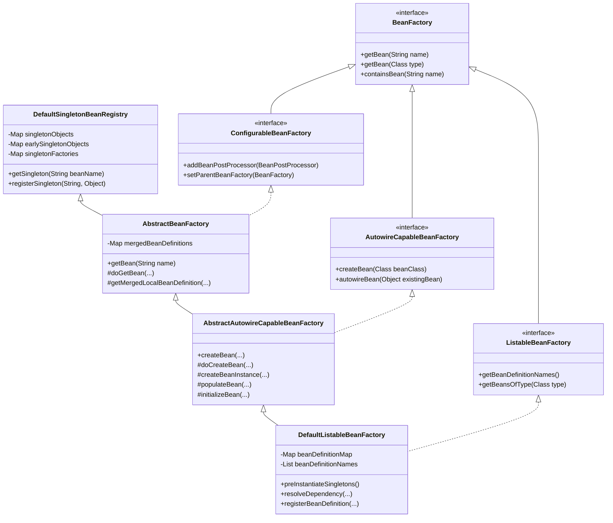
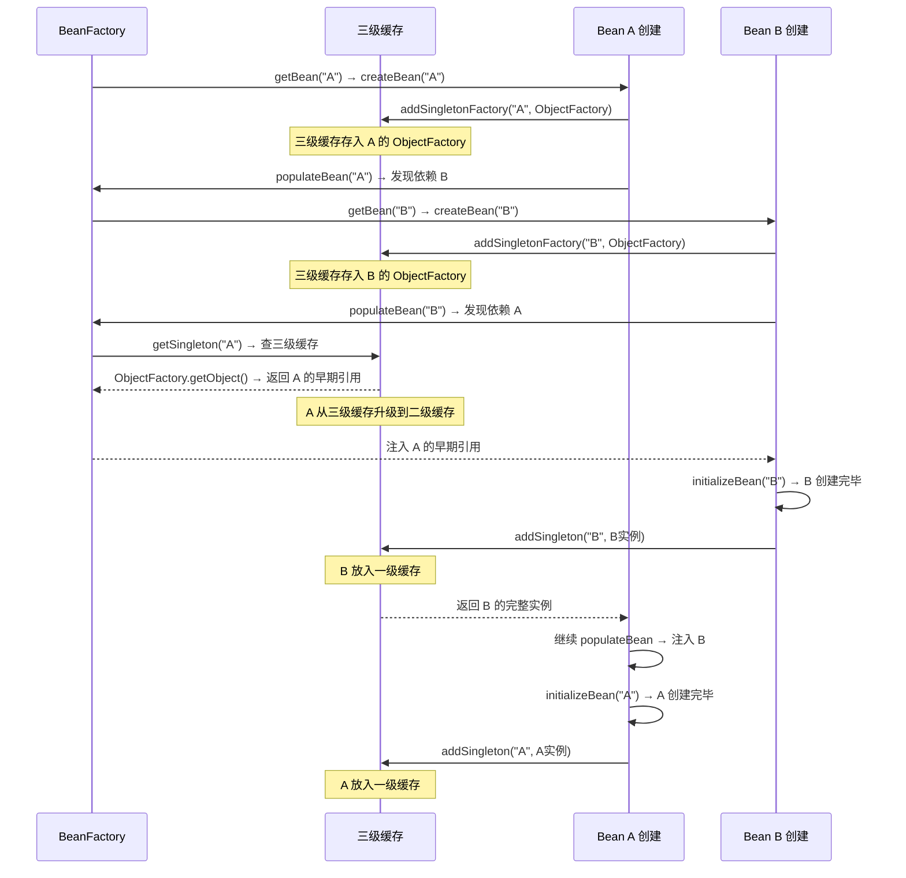
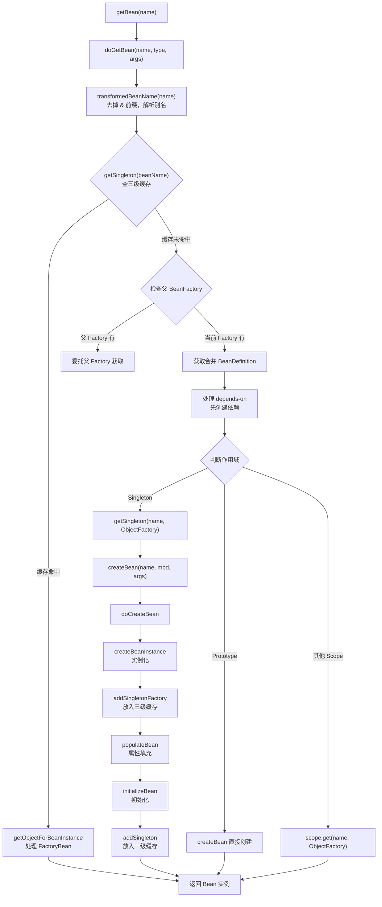

# BeanFactory 核心

## 目标

理解 Spring 默认 IoC 容器的核心实现。

## 核心类

- [BeanFactory.java](../../spring-beans/src/main/java/org/springframework/beans/factory/BeanFactory.java)
- [DefaultListableBeanFactory.java](../../spring-beans/src/main/java/org/springframework/beans/factory/support/DefaultListableBeanFactory.java)
- [AbstractBeanFactory.java](../../spring-beans/src/main/java/org/springframework/beans/factory/support/AbstractBeanFactory.java)
- [AbstractAutowireCapableBeanFactory.java](../../spring-beans/src/main/java/org/springframework/beans/factory/support/AbstractAutowireCapableBeanFactory.java)
- [DefaultSingletonBeanRegistry.java](../../spring-beans/src/main/java/org/springframework/beans/factory/support/DefaultSingletonBeanRegistry.java)
- [RootBeanDefinition.java](../../spring-beans/src/main/java/org/springframework/beans/factory/support/RootBeanDefinition.java)

## 类继承关系



## 设计模式

| 模式 | 应用位置 | 说明 |
|------|---------|------|
| **模板方法** | `AbstractBeanFactory.doGetBean()` | 定义获取 Bean 的骨架，子类实现 `createBean()` |
| **策略模式** | `InstantiationStrategy` | 选择不同的实例化策略（反射/CGLIB） |
| **代理模式** | `ObjectFactory` 回调 | 三级缓存通过 ObjectFactory 延迟创建代理 |
| **单例注册表** | `DefaultSingletonBeanRegistry` | 集中管理所有单例对象 |
| **门面模式** | `DefaultListableBeanFactory` | 整合多个接口功能为统一入口 |

## 核心源码分析

### DefaultListableBeanFactory 的核心数据结构

```java
// DefaultListableBeanFactory.java
public class DefaultListableBeanFactory extends AbstractAutowireCapableBeanFactory
        implements ConfigurableListableBeanFactory, BeanDefinitionRegistry {

    // BeanDefinition 注册表（核心！）
    // key: beanName, value: BeanDefinition
    private final Map<String, BeanDefinition> beanDefinitionMap = new ConcurrentHashMap<>(256);

    // 维护注册顺序
    private volatile List<String> beanDefinitionNames = new ArrayList<>(256);

    // 按类型索引：type -> beanNames（加速按类型查找）
    private final Map<Class<?>, String[]> allBeanNamesByType = new ConcurrentHashMap<>(64);
    private final Map<Class<?>, String[]> singletonBeanNamesByType = new ConcurrentHashMap<>(64);
}
```

### DefaultSingletonBeanRegistry — 三级缓存

```java
// DefaultSingletonBeanRegistry.java
public class DefaultSingletonBeanRegistry {

    // 一级缓存：存放完全初始化好的 Bean 实例
    private final Map<String, Object> singletonObjects = new ConcurrentHashMap<>(256);

    // 二级缓存：存放提前暴露的 Bean 实例（可能是代理对象）
    // 用于解决循环依赖
    private final Map<String, Object> earlySingletonObjects = new ConcurrentHashMap<>(16);

    // 三级缓存：存放 ObjectFactory 回调
    // 当需要提前暴露时，通过 ObjectFactory 创建早期引用（可能触发 AOP 代理创建）
    private final Map<String, ObjectFactory<?>> singletonFactories = new HashMap<>(16);

    // 正在创建中的 Bean 名称（用于检测循环依赖）
    private final Set<String> singletonsCurrentlyInCreation =
            Collections.newSetFromMap(new ConcurrentHashMap<>(16));

    // 已注册的单例名称（按注册顺序）
    private final Set<String> registeredSingletons = new LinkedHashSet<>(256);
}
```

### doGetBean() — Bean 获取主流程

```java
// AbstractBeanFactory.java
protected <T> T doGetBean(String name, Class<T> requiredType, Object[] args, boolean typeCheckOnly) {
    // 1. 转换 Bean 名称（去掉 & 前缀，解析别名）
    String beanName = transformedBeanName(name);
    Object beanInstance;

    // 2. 尝试从缓存获取单例（先查一级 → 二级 → 三级缓存）
    Object sharedInstance = getSingleton(beanName);
    if (sharedInstance != null && args == null) {
        // 缓存命中
        // 如果是 FactoryBean，需要调用 getObject() 获取实际对象
        beanInstance = getObjectForBeanInstance(sharedInstance, name, beanName, null);
    }
    else {
        // 3. 检查是否存在循环依赖（prototype 作用域不允许循环依赖）
        if (isPrototypeCurrentlyInCreation(beanName)) {
            throw new BeanCurrentlyInCreationException(beanName);
        }

        // 4. 检查父 BeanFactory（如果当前 Factory 没有该 BeanDefinition）
        BeanFactory parentBeanFactory = getParentBeanFactory();
        if (parentBeanFactory != null && !containsBeanDefinition(beanName)) {
            return parentBeanFactory.getBean(originalBeanName, requiredType);
        }

        // 5. 标记 Bean 已开始创建
        if (!typeCheckOnly) {
            markBeanAsCreated(beanName);
        }

        try {
            // 6. 获取合并后的 BeanDefinition（处理 parent 继承）
            RootBeanDefinition mbd = getMergedLocalBeanDefinition(beanName);
            checkMergedBeanDefinition(mbd, beanName, args);

            // 7. 处理 depends-on 依赖（先创建依赖的 Bean）
            String[] dependsOn = mbd.getDependsOn();
            if (dependsOn != null) {
                for (String dep : dependsOn) {
                    registerDependentBean(dep, beanName);
                    getBean(dep);  // 递归获取依赖
                }
            }

            // 8. 根据作用域创建 Bean
            if (mbd.isSingleton()) {
                // 单例：通过 getSingleton(beanName, ObjectFactory) 创建
                sharedInstance = getSingleton(beanName, () -> {
                    return createBean(beanName, mbd, args);
                });
                beanInstance = getObjectForBeanInstance(sharedInstance, name, beanName, mbd);
            }
            else if (mbd.isPrototype()) {
                // 原型：每次创建新实例
                Object prototypeInstance = createBean(beanName, mbd, args);
                beanInstance = getObjectForBeanInstance(prototypeInstance, name, beanName, mbd);
            }
            else {
                // 其他作用域（request、session 等）
                String scopeName = mbd.getScope();
                Scope scope = this.scopes.get(scopeName);
                Object scopedInstance = scope.get(beanName, () -> createBean(beanName, mbd, args));
                beanInstance = getObjectForBeanInstance(scopedInstance, name, beanName, mbd);
            }
        } catch (BeansException ex) {
            // 创建失败时清理标记
            beanCreation.tag("exception", ex.getClass().toString());
            cleanupAfterBeanCreationFailure(beanName);
            throw ex;
        }
    }

    // 9. 类型检查和转换
    return adaptBeanInstance(name, beanInstance, requiredType);
}
```

### getSingleton() — 三级缓存查询

```java
// DefaultSingletonBeanRegistry.java
protected Object getSingleton(String beanName, boolean allowEarlyReference) {
    // 1. 先查一级缓存（完整 Bean）
    Object singletonObject = this.singletonObjects.get(beanName);

    if (singletonObject == null && isSingletonCurrentlyInCreation(beanName)) {
        // 2. 再查二级缓存（提前暴露的 Bean）
        singletonObject = this.earlySingletonObjects.get(beanName);

        if (singletonObject == null && allowEarlyReference) {
            // 需要加锁保证线程安全
            synchronized (this.singletonObjects) {
                // 双重检查
                singletonObject = this.singletonObjects.get(beanName);
                if (singletonObject == null) {
                    singletonObject = this.earlySingletonObjects.get(beanName);
                    if (singletonObject == null) {
                        // 3. 查三级缓存（ObjectFactory）
                        ObjectFactory<?> singletonFactory = this.singletonFactories.get(beanName);
                        if (singletonFactory != null) {
                            // 调用 ObjectFactory 创建早期引用
                            // 这里可能触发 AOP 代理创建！
                            singletonObject = singletonFactory.getObject();
                            // 升级到二级缓存
                            this.earlySingletonObjects.put(beanName, singletonObject);
                            // 移除三级缓存
                            this.singletonFactories.remove(beanName);
                        }
                    }
                }
            }
        }
    }
    return singletonObject;
}
```

### getSingleton(beanName, ObjectFactory) — 创建新单例

```java
// DefaultSingletonBeanRegistry.java
public Object getSingleton(String beanName, ObjectFactory<?> singletonFactory) {
    synchronized (this.singletonObjects) {
        Object singletonObject = this.singletonObjects.get(beanName);
        if (singletonObject == null) {
            // 标记为正在创建
            beforeSingletonCreation(beanName);
            // -> singletonsCurrentlyInCreation.add(beanName)

            boolean newSingleton = false;
            try {
                // 调用传入的 ObjectFactory（即 createBean()）
                singletonObject = singletonFactory.getObject();
                newSingleton = true;
            } finally {
                // 移除创建中标记
                afterSingletonCreation(beanName);
                // -> singletonsCurrentlyInCreation.remove(beanName)
            }

            if (newSingleton) {
                // 放入一级缓存，清除二三级缓存
                addSingleton(beanName, singletonObject);
            }
        }
        return singletonObject;
    }
}

protected void addSingleton(String beanName, Object singletonObject) {
    synchronized (this.singletonObjects) {
        this.singletonObjects.put(beanName, singletonObject);      // 放入一级
        this.singletonFactories.remove(beanName);                   // 移除三级
        this.earlySingletonObjects.remove(beanName);                // 移除二级
        this.registeredSingletons.add(beanName);                    // 记录已注册
    }
}
```

## 循环依赖解决流程



### 循环依赖的限制

| 场景 | 是否支持 | 原因 |
|------|---------|------|
| 单例 + 字段/setter 注入 | ✅ 支持 | 三级缓存提前暴露 |
| 单例 + 构造器注入 | ❌ 不支持 | 构造器执行时 Bean 还未实例化，无法提前暴露 |
| Prototype 作用域 | ❌ 不支持 | Prototype 不缓存，无法提前暴露 |
| 单例 + `@Lazy` 构造器注入 | ✅ 支持 | 注入的是代理对象，延迟解析 |

## FactoryBean 的特殊处理

```java
// AbstractBeanFactory.java
protected Object getObjectForBeanInstance(Object beanInstance, String name, String beanName, RootBeanDefinition mbd) {
    // 如果请求名以 & 开头，直接返回 FactoryBean 本身
    if (BeanFactoryUtils.isFactoryDereference(name)) {
        return beanInstance;
    }

    // 如果不是 FactoryBean，直接返回
    if (!(beanInstance instanceof FactoryBean<?> factoryBean)) {
        return beanInstance;
    }

    // 是 FactoryBean 且请求名不以 & 开头 → 调用 getObject() 获取产出对象
    Object object = getCachedObjectForFactoryBean(beanName);
    if (object == null) {
        object = getObjectFromFactoryBean(factoryBean, beanName, !mbd.isSynthetic());
    }
    return object;
}
```

**规则**：
- `getBean("myFactoryBean")` → 返回 `FactoryBean.getObject()` 产出的对象
- `getBean("&myFactoryBean")` → 返回 FactoryBean 本身

## Bean 获取流程图



## 常见面试题

### 1. Spring 三级缓存分别存什么？为什么需要三级？

| 缓存 | 内容 | 作用 |
|------|------|------|
| 一级 `singletonObjects` | 完整 Bean | 正常获取 Bean |
| 二级 `earlySingletonObjects` | 提前暴露的 Bean（可能是代理） | 解决循环依赖时其他 Bean 拿到的引用 |
| 三级 `singletonFactories` | `ObjectFactory` 回调 | 延迟决定是否需要创建代理 |

为什么不能只用两级？因为如果只用一二级缓存，在有 AOP 的情况下，需要在 Bean 实例化后立即创建代理放入二级缓存。但 Spring 的设计原则是代理应该在初始化后创建（由 `AbstractAutoProxyCreator` 在 `postProcessAfterInitialization` 中完成）。三级缓存通过 `ObjectFactory` 延迟了代理创建的时机——只有在真正发生循环依赖时才提前创建代理。

### 2. 为什么构造器注入不能解决循环依赖？

因为三级缓存的 `addSingletonFactory()` 发生在 `createBeanInstance()` 之后。而构造器注入发生在 `createBeanInstance()` 过程中。此时 Bean 还没被实例化，无法放入缓存供对方引用。

### 3. getBean() 获取 FactoryBean 产出的对象时，会走缓存吗？

会。`FactoryBean.getObject()` 的返回值会被缓存在 `factoryBeanObjectCache` 中（如果 `isSingleton()` 返回 true）。只有第一次调用 `getObject()`，后续直接从缓存获取。

### 4. DefaultListableBeanFactory 和 ApplicationContext 的关系？

`ApplicationContext` 内部持有一个 `DefaultListableBeanFactory` 实例。`ApplicationContext` 是对 `BeanFactory` 的增强，提供了事件、国际化、AOP 等企业级功能。调用 `applicationContext.getBean(...)` 最终会委托给内部的 `DefaultListableBeanFactory`。

## 实战应用场景

### 场景 1：手动使用 BeanFactory 创建 Bean

```java
// 在测试或特殊场景下直接使用 BeanFactory
DefaultListableBeanFactory factory = new DefaultListableBeanFactory();
RootBeanDefinition bd = new RootBeanDefinition(MyService.class);
bd.setScope(BeanDefinition.SCOPE_SINGLETON);
factory.registerBeanDefinition("myService", bd);

MyService service = factory.getBean("myService", MyService.class);
```

### 场景 2：利用 FactoryBean 创建复杂对象

```java
// 当对象创建逻辑复杂时（如需要连接池、代理等）
public class HttpClientFactoryBean implements FactoryBean<HttpClient> {
    private int connectTimeout = 5000;
    private int readTimeout = 10000;

    @Override
    public HttpClient getObject() {
        return HttpClient.newBuilder()
            .connectTimeout(Duration.ofMillis(connectTimeout))
            .build();
    }

    @Override
    public Class<?> getObjectType() {
        return HttpClient.class;
    }

    @Override
    public boolean isSingleton() {
        return true;  // 产出对象是否为单例
    }
}
```

### 场景 3：解决循环依赖的实际做法

```java
// 方式 1：使用 @Lazy 延迟注入
@Component
public class ServiceA {
    @Autowired
    @Lazy  // 注入的是代理对象，实际使用时才解析
    private ServiceB serviceB;
}

// 方式 2：改用 setter 注入
@Component
public class ServiceA {
    private ServiceB serviceB;

    @Autowired
    public void setServiceB(ServiceB serviceB) {
        this.serviceB = serviceB;
    }
}

// 方式 3：重构设计，提取共同依赖到第三个类（推荐）
```

### 更多业务场景（低代码 & 审批流）

> 详见 [实战场景-低代码与审批流](../00-13-实战场景-低代码与审批流.md)

- **低代码 — 运行时动态注册数据源**：用户创建新应用时，通过 `DefaultListableBeanFactory` 运行时注册/销毁 DataSource Bean
- **审批流 — Prototype 作用域审批处理器**：审批节点处理器使用 Prototype 作用域，每次审批操作创建独立实例，避免状态污染
- **低代码 — FactoryBean 创建脚本引擎**：用 FactoryBean 封装 Groovy/JavaScript 脚本引擎的复杂创建逻辑

## 建议断点

- `DefaultListableBeanFactory.preInstantiateSingletons()`
- `AbstractBeanFactory.doGetBean(...)`
- `DefaultSingletonBeanRegistry.getSingleton(String, boolean)` — 缓存查询
- `DefaultSingletonBeanRegistry.getSingleton(String, ObjectFactory)` — 创建单例
- `AbstractAutowireCapableBeanFactory.doCreateBean(...)`
- `DefaultSingletonBeanRegistry.addSingletonFactory(...)` — 放入三级缓存

## 阶段目标

- [ ] 能解释 Bean 从 `getBean()` 到初始化完成的完整过程
- [ ] 能理解单例 Bean 的三级缓存机制
- [ ] 能找到循环依赖处理的位置并解释原理
- [ ] 能区分 BeanDefinition、BeanWrapper、最终 Bean 实例
- [ ] 能说明 FactoryBean 的获取逻辑

## 学习笔记

<!-- 在这里记录你的阅读收获 -->
