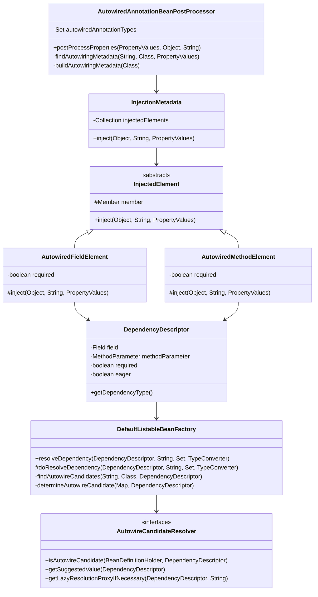
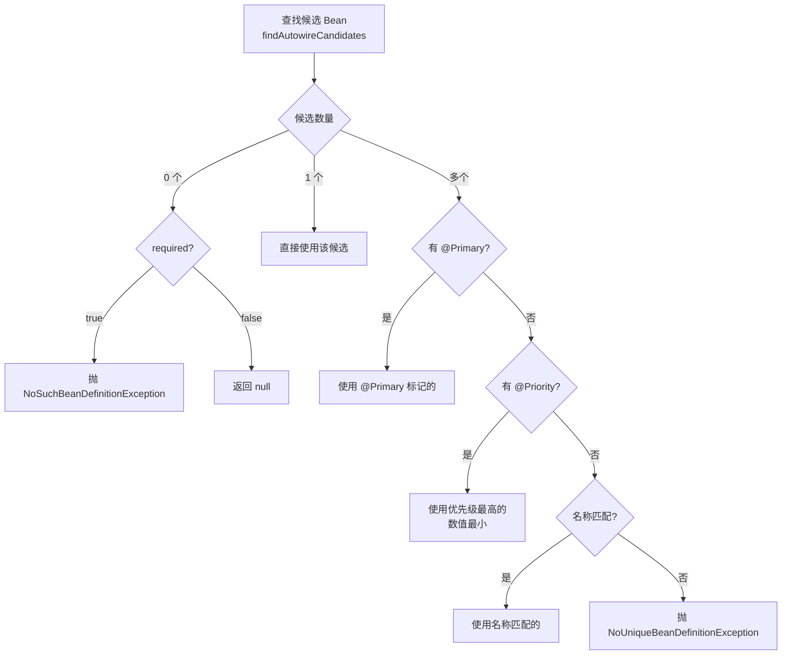

# 依赖注入

## 目标

理解构造器注入、字段注入、方法注入以及 `@Autowired` 的处理流程。

## 核心类

- [ConstructorResolver.java](../../spring-beans/src/main/java/org/springframework/beans/factory/support/ConstructorResolver.java)
- [AutowiredAnnotationBeanPostProcessor.java](../../spring-beans/src/main/java/org/springframework/beans/factory/annotation/AutowiredAnnotationBeanPostProcessor.java)
- [DependencyDescriptor.java](../../spring-beans/src/main/java/org/springframework/beans/factory/config/DependencyDescriptor.java)
- [AutowireCandidateResolver.java](../../spring-beans/src/main/java/org/springframework/beans/factory/support/AutowireCandidateResolver.java)
- [QualifierAnnotationAutowireCandidateResolver.java](../../spring-beans/src/main/java/org/springframework/beans/factory/annotation/QualifierAnnotationAutowireCandidateResolver.java)
- [DefaultListableBeanFactory.java](../../spring-beans/src/main/java/org/springframework/beans/factory/support/DefaultListableBeanFactory.java)
- [InjectionMetadata.java](../../spring-beans/src/main/java/org/springframework/beans/factory/annotation/InjectionMetadata.java)

## 类关系图



## 设计模式

| 模式 | 应用位置 | 说明 |
|------|---------|------|
| **策略模式** | `AutowireCandidateResolver` | 不同的候选解析策略（支持 @Qualifier、@Value 等） |
| **元数据缓存** | `InjectionMetadata` 缓存 | 避免每次创建 Bean 都重新扫描注解 |
| **模板方法** | `InjectedElement.inject()` | 字段注入和方法注入共享注入框架 |
| **描述符模式** | `DependencyDescriptor` | 封装依赖信息，传递给解析器 |

## 核心源码分析

### AutowiredAnnotationBeanPostProcessor — 入口

```java
// AutowiredAnnotationBeanPostProcessor.java
public AutowiredAnnotationBeanPostProcessor() {
    // 支持的注解类型
    this.autowiredAnnotationTypes.add(Autowired.class);
    this.autowiredAnnotationTypes.add(Value.class);
    // 如果 JSR-330 可用，还支持 @Inject
    try {
        this.autowiredAnnotationTypes.add(jakarta.inject.Inject.class);
    } catch (ClassNotFoundException ex) {
        // JSR-330 不可用
    }
}

// 在 populateBean() 阶段被调用
@Override
public PropertyValues postProcessProperties(PropertyValues pvs, Object bean, String beanName) {
    // 1. 查找/构建注入元数据（带缓存）
    InjectionMetadata metadata = findAutowiringMetadata(beanName, bean.getClass(), pvs);

    // 2. 执行注入
    metadata.inject(bean, beanName, pvs);

    return pvs;
}
```

### findAutowiringMetadata() — 扫描并缓存注入点

```java
// AutowiredAnnotationBeanPostProcessor.java
private InjectionMetadata findAutowiringMetadata(String beanName, Class<?> clazz, PropertyValues pvs) {
    String cacheKey = (beanName != null ? beanName : clazz.getName());

    // 双重检查缓存
    InjectionMetadata metadata = this.injectionMetadataCache.get(cacheKey);
    if (InjectionMetadata.needsRefresh(metadata, clazz)) {
        synchronized (this.injectionMetadataCache) {
            metadata = this.injectionMetadataCache.get(cacheKey);
            if (InjectionMetadata.needsRefresh(metadata, clazz)) {
                // 构建注入元数据
                metadata = buildAutowiringMetadata(clazz);
                this.injectionMetadataCache.put(cacheKey, metadata);
            }
        }
    }
    return metadata;
}

private InjectionMetadata buildAutowiringMetadata(Class<?> clazz) {
    List<InjectionMetadata.InjectedElement> elements = new ArrayList<>();
    Class<?> targetClass = clazz;

    do {
        List<InjectionMetadata.InjectedElement> currElements = new ArrayList<>();

        // 扫描字段
        ReflectionUtils.doWithLocalFields(targetClass, field -> {
            MergedAnnotation<?> ann = findAutowiredAnnotation(field);
            if (ann != null) {
                // static 字段不支持注入
                if (Modifier.isStatic(field.getModifiers())) {
                    return;
                }
                boolean required = determineRequiredStatus(ann);
                currElements.add(new AutowiredFieldElement(field, required));
            }
        });

        // 扫描方法
        ReflectionUtils.doWithLocalMethods(targetClass, method -> {
            Method bridgedMethod = BridgeMethodResolver.findBridgedMethod(method);
            if (BridgeMethodResolver.isVisibilityBridgeMethodPair(method, bridgedMethod)) {
                MergedAnnotation<?> ann = findAutowiredAnnotation(bridgedMethod);
                if (ann != null && !Modifier.isStatic(method.getModifiers())) {
                    boolean required = determineRequiredStatus(ann);
                    currElements.add(new AutowiredMethodElement(method, required, ...));
                }
            }
        });

        elements.addAll(0, currElements);
        // 向上遍历父类！
        targetClass = targetClass.getSuperclass();
    } while (targetClass != null && targetClass != Object.class);

    return InjectionMetadata.forElements(elements, clazz);
}
```

**关键点**：
- 扫描会从当前类向上遍历到所有父类
- `static` 字段不支持 `@Autowired`
- 结果会被缓存，同一个 Bean 类型只扫描一次

### AutowiredFieldElement.inject() — 字段注入

```java
// AutowiredAnnotationBeanPostProcessor.AutowiredFieldElement
@Override
protected void inject(Object bean, String beanName, PropertyValues pvs) throws Throwable {
    Field field = (Field) this.member;
    Object value;

    if (this.cached) {
        // 缓存命中：快速解析（跳过查找过程）
        value = resolveCachedArgument(beanName, this.cachedFieldValue);
    } else {
        // 创建 DependencyDescriptor
        DependencyDescriptor desc = new DependencyDescriptor(field, this.required);
        desc.setContainingClass(bean.getClass());

        Set<String> autowiredBeanNames = new LinkedHashSet<>(1);

        TypeConverter typeConverter = beanFactory.getTypeConverter();
        // 核心：委托 BeanFactory 解析依赖
        value = beanFactory.resolveDependency(desc, beanName, autowiredBeanNames, typeConverter);

        // 缓存解析结果
        synchronized (this) {
            if (!this.cached) {
                if (value != null || this.required) {
                    this.cachedFieldValue = desc;
                    // 记录依赖关系
                    registerDependentBeans(beanName, autowiredBeanNames);
                    if (autowiredBeanNames.size() == 1) {
                        String autowiredBeanName = autowiredBeanNames.iterator().next();
                        if (beanFactory.containsBean(autowiredBeanName) &&
                                beanFactory.isTypeMatch(autowiredBeanName, field.getType())) {
                            // 缓存 ShortcutDependencyDescriptor（下次直接按名获取）
                            this.cachedFieldValue = new ShortcutDependencyDescriptor(desc, autowiredBeanName);
                        }
                    }
                }
                this.cached = true;
            }
        }
    }

    // 反射设置字段值
    if (value != null) {
        ReflectionUtils.makeAccessible(field);
        field.set(bean, value);
    }
}
```

### DefaultListableBeanFactory.doResolveDependency() — 依赖解析核心

```java
// DefaultListableBeanFactory.java
public Object doResolveDependency(DependencyDescriptor descriptor, String beanName,
        Set<String> autowiredBeanNames, TypeConverter typeConverter) {

    // 1. 处理 @Value 注解（SpEL 表达式或占位符）
    Object value = getAutowireCandidateResolver().getSuggestedValue(descriptor);
    if (value != null) {
        if (value instanceof String strValue) {
            // 解析占位符 ${...}
            String resolvedValue = resolveEmbeddedValue(strValue);
            // 解析 SpEL 表达式 #{...}
            value = evaluateBeanDefinitionString(resolvedValue, ...);
        }
        // 类型转换
        return typeConverter.convertIfNecessary(value, descriptor.getDependencyType());
    }

    // 2. 处理集合类型注入（List、Map、数组等）
    Object multipleBeans = resolveMultipleBeans(descriptor, beanName, autowiredBeanNames, typeConverter);
    if (multipleBeans != null) {
        return multipleBeans;
    }

    // 3. 查找候选 Bean
    Map<String, Object> matchingBeans = findAutowireCandidates(beanName, type, descriptor);

    if (matchingBeans.isEmpty()) {
        if (isRequired(descriptor)) {
            // 没有候选且 required=true → 抛异常
            raiseNoMatchingBeanFound(type, descriptor.getResolvableType(), descriptor);
        }
        return null;
    }

    String autowiredBeanName;
    Object instanceCandidate;

    if (matchingBeans.size() > 1) {
        // 4. 多个候选 Bean → 按优先级筛选
        autowiredBeanName = determineAutowireCandidate(matchingBeans, descriptor);
        if (autowiredBeanName == null) {
            if (isRequired(descriptor) || !indicatesMultipleBeans(type)) {
                // 无法确定唯一候选 → 抛 NoUniqueBeanDefinitionException
                return descriptor.resolveNotUnique(descriptor.getResolvableType(), matchingBeans);
            }
            return null;
        }
        instanceCandidate = matchingBeans.get(autowiredBeanName);
    } else {
        // 唯一匹配
        Map.Entry<String, Object> entry = matchingBeans.entrySet().iterator().next();
        autowiredBeanName = entry.getKey();
        instanceCandidate = entry.getValue();
    }

    autowiredBeanNames.add(autowiredBeanName);

    // 5. 如果候选是 Class（还未实例化），通过 getBean() 获取实例
    if (instanceCandidate instanceof Class) {
        instanceCandidate = descriptor.resolveCandidate(autowiredBeanName, type, this);
    }
    return instanceCandidate;
}
```

### determineAutowireCandidate() — 多候选筛选规则

```java
// DefaultListableBeanFactory.java
protected String determineAutowireCandidate(Map<String, Object> candidates, DependencyDescriptor descriptor) {
    Class<?> requiredType = descriptor.getDependencyType();

    // 规则 1：@Primary 标记的 Bean 优先
    String primaryCandidate = determinePrimaryCandidate(candidates, requiredType);
    if (primaryCandidate != null) {
        return primaryCandidate;
    }

    // 规则 2：@Priority（jakarta.annotation.Priority）值最小的优先
    String priorityCandidate = determineHighestPriorityCandidate(candidates, requiredType);
    if (priorityCandidate != null) {
        return priorityCandidate;
    }

    // 规则 3：名称匹配（字段名/参数名与 beanName 相同）
    for (Map.Entry<String, Object> entry : candidates.entrySet()) {
        String candidateName = entry.getKey();
        Object beanInstance = entry.getValue();
        if ((beanInstance != null && this.resolvableDependencies.containsValue(beanInstance)) ||
                matchesBeanName(candidateName, descriptor.getDependencyName())) {
            return candidateName;
        }
    }

    return null;  // 无法确定
}
```

## 依赖解析优先级总结



## 构造器注入 vs 字段注入 vs 方法注入

### 构造器注入流程

```java
// ConstructorResolver.java
public BeanWrapper autowireConstructor(String beanName, RootBeanDefinition mbd,
        Constructor<?>[] chosenCtors, Object[] explicitArgs) {

    // 1. 确定使用哪个构造器
    //    - 如果只有一个构造器且有参数 → 使用它
    //    - 如果有 @Autowired 标注的构造器 → 使用它
    //    - 如果有多个 @Autowired(required=false) → 选参数最多的那个

    // 2. 解析构造器参数
    //    每个参数都通过 resolveDependency() 解析

    // 3. 反射调用构造器
    bw.setBeanInstance(instantiate(beanName, mbd, constructorToUse, argsToUse));
    return bw;
}
```

### 三种注入方式对比

| 对比项 | 构造器注入 | 字段注入 | 方法(Setter)注入 |
|--------|-----------|---------|-----------------|
| 执行阶段 | `createBeanInstance()` | `populateBean()` | `populateBean()` |
| 处理类 | `ConstructorResolver` | `AutowiredAnnotationBeanPostProcessor` | `AutowiredAnnotationBeanPostProcessor` |
| 不可变性 | ✅ 支持 final | ❌ 不支持 | ❌ 不支持 |
| 必须性 | 天然必须 | 可选（`required=false`） | 可选 |
| 循环依赖 | ❌ 不支持 | ✅ 三级缓存支持 | ✅ 三级缓存支持 |
| 测试友好 | ✅ 容易 Mock | ❌ 需要反射 | ✅ 可以直接调用 |
| Spring 推荐 | ✅ 推荐 | ⚠️ 不推荐 | 可选依赖时使用 |

### 构造器选择规则

```text
1. 只有一个构造器 → 直接使用
2. 有且仅有一个 @Autowired(required=true) 构造器 → 使用它
3. 有多个 @Autowired(required=false) 构造器 → 选能满足参数最多的
4. 有无参构造器 + 有参构造器，都没有 @Autowired → 使用无参构造器
5. 只有一个有参构造器，没有无参构造器 → 使用该有参构造器
```

## @Value 处理流程

```java
// 在 doResolveDependency() 中
// @Value("${server.port:8080}")

// 1. AutowireCandidateResolver.getSuggestedValue()
//    返回 "${server.port:8080}" 字符串

// 2. resolveEmbeddedValue() 
//    通过 PropertySourcesPlaceholderConfigurer 解析占位符
//    "${server.port:8080}" → "8080"（或环境变量中的值）

// 3. evaluateBeanDefinitionString()
//    如果包含 #{...} SpEL 表达式，在这里计算
//    如 @Value("#{T(java.lang.Math).PI}") → 3.14159...

// 4. TypeConverter.convertIfNecessary()
//    字符串 "8080" → int 8080
```

## 集合类型注入

```java
// 当注入类型是集合时，Spring 会注入所有匹配的 Bean

@Autowired
private List<MyService> services;  // 注入所有 MyService 类型的 Bean

@Autowired
private Map<String, MyService> serviceMap;  // key=beanName, value=bean

// 支持 @Order 或 Ordered 接口排序
@Autowired
private List<MyService> orderedServices;  // 按 @Order 值排序
```

## 常见面试题

### 1. @Autowired 的完整工作流程是什么？

1. Bean 实例化后，进入 `populateBean()` 阶段
2. `AutowiredAnnotationBeanPostProcessor.postProcessProperties()` 被调用
3. 扫描 Bean 类及其父类的所有字段和方法，找到 `@Autowired` 注解
4. 为每个注入点创建 `DependencyDescriptor`
5. 调用 `DefaultListableBeanFactory.resolveDependency()` 解析依赖
6. 查找类型匹配的候选 Bean，按规则筛选
7. 通过反射将解析到的 Bean 实例注入到字段/方法参数

### 2. @Autowired 和 @Resource 的区别？

| 对比项 | @Autowired | @Resource |
|--------|-----------|-----------|
| 来源 | Spring 框架 | JSR-250 标准 |
| 匹配方式 | 默认**按类型**匹配 | 默认**按名称**匹配 |
| 处理器 | `AutowiredAnnotationBeanPostProcessor` | `CommonAnnotationBeanPostProcessor` |
| required 属性 | 支持 `@Autowired(required=false)` | 不支持（总是必须） |
| 配合使用 | `@Qualifier` 限定 | `@Resource(name="xxx")` 指定 |

### 3. 如何解决 NoUniqueBeanDefinitionException？

```java
// 方式 1：@Primary 标记首选
@Primary
@Component
public class MysqlDataSource implements DataSource { }

// 方式 2：@Qualifier 指定名称
@Autowired
@Qualifier("mysqlDataSource")
private DataSource dataSource;

// 方式 3：字段名与 Bean 名称一致
@Autowired
private DataSource mysqlDataSource;  // 名称匹配 beanName

// 方式 4：使用集合注入
@Autowired
private List<DataSource> dataSources;  // 注入所有
```

### 4. @Autowired 为什么不推荐字段注入？

- 无法声明 final 字段，破坏不可变性
- 隐藏依赖关系，从外部看不出需要哪些依赖
- 单元测试困难，必须用反射或 Spring 容器
- 可能导致 NPE（容器外使用时字段为 null）
- 容易堆积过多依赖（违反单一职责原则）

## 实战应用场景

### 场景 1：自定义 AutowireCandidateResolver

```java
// 实现基于自定义注解的依赖选择逻辑
public class ProfileAutowireCandidateResolver extends QualifierAnnotationAutowireCandidateResolver {
    @Override
    public boolean isAutowireCandidate(BeanDefinitionHolder bdHolder, DependencyDescriptor descriptor) {
        if (!super.isAutowireCandidate(bdHolder, descriptor)) {
            return false;
        }
        // 自定义逻辑：根据当前环境 profile 过滤候选
        return matchesActiveProfile(bdHolder);
    }
}
```

### 场景 2：Optional 和 ObjectProvider 注入

```java
@Component
public class MyService {
    // 使用 Optional：Bean 不存在时为 Optional.empty()
    @Autowired
    private Optional<CacheService> cacheService;

    // 使用 ObjectProvider：延迟解析 + 安全获取
    @Autowired
    private ObjectProvider<NotificationService> notificationProvider;

    public void doSomething() {
        // 安全获取，不存在时使用默认值
        NotificationService ns = notificationProvider.getIfAvailable(NoOpNotification::new);
    }
}
```

### 更多业务场景（低代码 & 审批流）

> 详见 [实战场景-低代码与审批流](../00-13-实战场景-低代码与审批流.md)

- **低代码 — 自定义 Aware 接口**：通过 `LowCodeContextAware` + `BeanPostProcessor` 自动为组件注入平台上下文（租户、应用、用户信息）
- **审批流 — 集合注入审批策略**：通过 `@Autowired List<ApprovalStrategy>` 注入所有策略，配合 `@Order` 控制优先级
- **低代码 — ObjectProvider 延迟注入**：可选插件通过 `ObjectProvider` 注入，插件不存在时优雅降级

## 建议断点

- `AutowiredAnnotationBeanPostProcessor.postProcessProperties(...)`
- `AutowiredAnnotationBeanPostProcessor.buildAutowiringMetadata(...)`
- `AutowiredFieldElement.inject(...)`
- `DefaultListableBeanFactory.resolveDependency(...)`
- `DefaultListableBeanFactory.doResolveDependency(...)`
- `DefaultListableBeanFactory.findAutowireCandidates(...)`
- `DefaultListableBeanFactory.determineAutowireCandidate(...)`
- `ConstructorResolver.autowireConstructor(...)`

## 阶段目标

- [ ] 能说明 Spring 如何选择注入哪个 Bean
- [ ] 能追踪 `@Autowired` 从元数据扫描到实际赋值的过程
- [ ] 能理解构造器注入和字段注入分别发生在哪个阶段
- [ ] 能说明多候选 Bean 时的筛选优先级
- [ ] 能理解 @Value 的解析流程

## 学习笔记

<!-- 在这里记录你的阅读收获 -->
