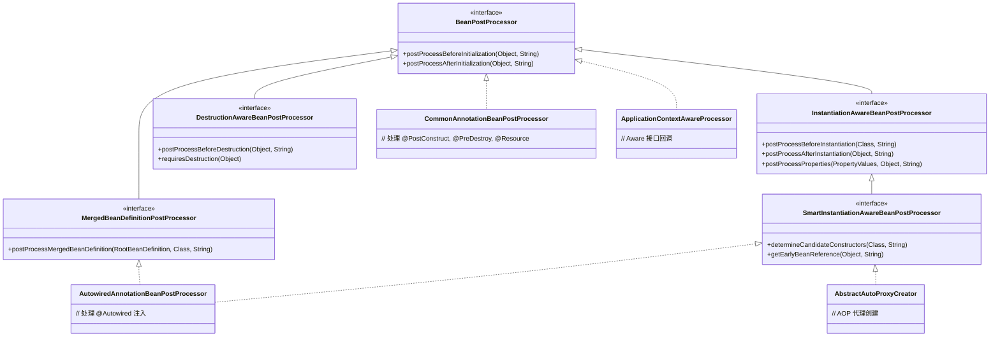

# Bean 生命周期扩展点

## 目标

理解 Spring 的扩展机制。

## 核心接口和类

- [BeanFactoryPostProcessor.java](../../spring-beans/src/main/java/org/springframework/beans/factory/config/BeanFactoryPostProcessor.java)
- [BeanDefinitionRegistryPostProcessor.java](../../spring-beans/src/main/java/org/springframework/beans/factory/support/BeanDefinitionRegistryPostProcessor.java)
- [BeanPostProcessor.java](../../spring-beans/src/main/java/org/springframework/beans/factory/config/BeanPostProcessor.java)
- [InstantiationAwareBeanPostProcessor.java](../../spring-beans/src/main/java/org/springframework/beans/factory/config/InstantiationAwareBeanPostProcessor.java)
- [DestructionAwareBeanPostProcessor.java](../../spring-beans/src/main/java/org/springframework/beans/factory/config/DestructionAwareBeanPostProcessor.java)
- [InitializingBean.java](../../spring-beans/src/main/java/org/springframework/beans/factory/InitializingBean.java)
- [DisposableBean.java](../../spring-beans/src/main/java/org/springframework/beans/factory/DisposableBean.java)
- [FactoryBean.java](../../spring-beans/src/main/java/org/springframework/beans/factory/FactoryBean.java)
- [ApplicationContextAware.java](../../spring-context/src/main/java/org/springframework/context/ApplicationContextAware.java)
- [ApplicationContextAwareProcessor.java](../../spring-context/src/main/java/org/springframework/context/support/ApplicationContextAwareProcessor.java)

## BeanPostProcessor 体系



## 设计模式

| 模式 | 应用位置 | 说明 |
|------|---------|------|
| **观察者/事件** | `BeanPostProcessor` 回调链 | Bean 创建过程中的多个观察点 |
| **责任链** | 多个 `BeanPostProcessor` 顺序执行 | 按注册顺序链式调用 |
| **模板方法** | `AbstractAutowireCapableBeanFactory.initializeBean()` | 定义初始化骨架 |
| **适配器** | `ApplicationContextAwareProcessor` | 将 Aware 接口适配为 BeanPostProcessor |
| **抽象工厂** | `FactoryBean` | 生产特定类型的对象 |

## Bean 完整生命周期时间线

```mermaid
flowchart TD
    subgraph BeanDefinition阶段
        A1[BeanDefinitionRegistryPostProcessor<br>.postProcessBeanDefinitionRegistry#40;#41;]
        A2[BeanFactoryPostProcessor<br>.postProcessBeanFactory#40;#41;]
        A1 --> A2
    end

    subgraph Bean实例化阶段
        B1[InstantiationAwareBeanPostProcessor<br>.postProcessBeforeInstantiation#40;#41;]
        B2[构造器实例化]
        B3[MergedBeanDefinitionPostProcessor<br>.postProcessMergedBeanDefinition#40;#41;]
        B4[放入三级缓存<br>SmartInstantiationAwareBeanPostProcessor<br>.getEarlyBeanReference#40;#41;]
        B1 --> B2
        B2 --> B3
        B3 --> B4
    end

    subgraph 属性填充阶段
        C1[InstantiationAwareBeanPostProcessor<br>.postProcessAfterInstantiation#40;#41;]
        C2[InstantiationAwareBeanPostProcessor<br>.postProcessProperties#40;#41;<br>即 @Autowired 注入]
        C1 --> C2
    end

    subgraph 初始化阶段
        D1[BeanPostProcessor<br>.postProcessBeforeInitialization#40;#41;]
        D1a[Aware 接口回调]
        D1b[@PostConstruct]
        D2[InitializingBean.afterPropertiesSet#40;#41;]
        D3[自定义 init-method]
        D4[BeanPostProcessor<br>.postProcessAfterInitialization#40;#41;]
        D4a[AOP 代理创建]
        D1 --> D1a --> D1b --> D2 --> D3 --> D4 --> D4a
    end

    subgraph 销毁阶段
        E1[@PreDestroy]
        E2[DisposableBean.destroy#40;#41;]
        E3[自定义 destroy-method]
        E1 --> E2 --> E3
    end

    A2 --> B1
    B4 --> C1
    C2 --> D1
    D4a --> E1
```

## 核心源码分析

### initializeBean() — 初始化阶段入口

```java
// AbstractAutowireCapableBeanFactory.java
protected Object initializeBean(String beanName, Object bean, RootBeanDefinition mbd) {

    // 1. Aware 接口回调（BeanNameAware, BeanClassLoaderAware, BeanFactoryAware）
    invokeAwareMethods(beanName, bean);

    // 2. BeanPostProcessor 前置处理
    //    包括：ApplicationContextAwareProcessor（处理 ApplicationContextAware 等）
    //    包括：CommonAnnotationBeanPostProcessor（处理 @PostConstruct）
    Object wrappedBean = bean;
    if (mbd == null || !mbd.isSynthetic()) {
        wrappedBean = applyBeanPostProcessorsBeforeInitialization(wrappedBean, beanName);
    }

    // 3. 调用初始化方法
    //    - InitializingBean.afterPropertiesSet()
    //    - 自定义 init-method
    invokeInitMethods(beanName, wrappedBean, mbd);

    // 4. BeanPostProcessor 后置处理
    //    包括：AbstractAutoProxyCreator（AOP 代理创建）
    if (mbd == null || !mbd.isSynthetic()) {
        wrappedBean = applyBeanPostProcessorsAfterInitialization(wrappedBean, beanName);
    }

    return wrappedBean;
}
```

### invokeAwareMethods() — 直接 Aware 回调

```java
// AbstractAutowireCapableBeanFactory.java
private void invokeAwareMethods(String beanName, Object bean) {
    if (bean instanceof Aware) {
        // 这三个 Aware 直接由 BeanFactory 处理（不经过 BeanPostProcessor）
        if (bean instanceof BeanNameAware beanNameAware) {
            beanNameAware.setBeanName(beanName);
        }
        if (bean instanceof BeanClassLoaderAware beanClassLoaderAware) {
            beanClassLoaderAware.setBeanClassLoader(getBeanClassLoader());
        }
        if (bean instanceof BeanFactoryAware beanFactoryAware) {
            beanFactoryAware.setBeanFactory(this);
        }
    }
}
```

### ApplicationContextAwareProcessor — 更多 Aware 回调

```java
// ApplicationContextAwareProcessor.java
// 通过 BeanPostProcessor.postProcessBeforeInitialization() 处理以下 Aware：
@Override
public Object postProcessBeforeInitialization(Object bean, String beanName) {
    if (bean instanceof Aware) {
        invokeAwareInterfaces(bean);
    }
    return bean;
}

private void invokeAwareInterfaces(Object bean) {
    if (bean instanceof EnvironmentAware environmentAware) {
        environmentAware.setEnvironment(this.applicationContext.getEnvironment());
    }
    if (bean instanceof EmbeddedValueResolverAware resolverAware) {
        resolverAware.setEmbeddedValueResolver(this.embeddedValueResolver);
    }
    if (bean instanceof ResourceLoaderAware resourceLoaderAware) {
        resourceLoaderAware.setResourceLoader(this.applicationContext);
    }
    if (bean instanceof ApplicationEventPublisherAware eventPublisherAware) {
        eventPublisherAware.setApplicationEventPublisher(this.applicationContext);
    }
    if (bean instanceof MessageSourceAware messageSourceAware) {
        messageSourceAware.setMessageSource(this.applicationContext);
    }
    if (bean instanceof ApplicationStartupAware startupAware) {
        startupAware.setApplicationStartup(this.applicationContext.getApplicationStartup());
    }
    if (bean instanceof ApplicationContextAware applicationContextAware) {
        applicationContextAware.setApplicationContext(this.applicationContext);
    }
}
```

**关键点**：
- `BeanNameAware`、`BeanFactoryAware` 等由 `AbstractAutowireCapableBeanFactory` 直接调用
- `ApplicationContextAware`、`EnvironmentAware` 等由 `ApplicationContextAwareProcessor`（BeanPostProcessor）处理
- 这也是为什么如果只用 `BeanFactory` 而不用 `ApplicationContext`，后者那些 Aware 不会被回调

### invokeInitMethods() — 初始化方法调用

```java
// AbstractAutowireCapableBeanFactory.java
protected void invokeInitMethods(String beanName, Object bean, RootBeanDefinition mbd) {
    // 1. InitializingBean.afterPropertiesSet()
    boolean isInitializingBean = (bean instanceof InitializingBean);
    if (isInitializingBean && (mbd == null || !mbd.hasAnyExternallyManagedInitMethod("afterPropertiesSet"))) {
        ((InitializingBean) bean).afterPropertiesSet();
    }

    // 2. 自定义 init-method（@Bean(initMethod="xxx") 或 XML 配置）
    if (mbd != null && bean.getClass() != NullBean.class) {
        String[] initMethodNames = mbd.getInitMethodNames();
        if (initMethodNames != null) {
            for (String initMethodName : initMethodNames) {
                if (StringUtils.hasLength(initMethodName) &&
                        !(isInitializingBean && "afterPropertiesSet".equals(initMethodName))) {
                    invokeCustomInitMethod(beanName, bean, mbd, initMethodName);
                }
            }
        }
    }
}
```

### BeanFactoryPostProcessor vs BeanDefinitionRegistryPostProcessor

```java
// BeanFactoryPostProcessor — 修改已有 BeanDefinition
@FunctionalInterface
public interface BeanFactoryPostProcessor {
    void postProcessBeanFactory(ConfigurableListableBeanFactory beanFactory) throws BeansException;
}

// BeanDefinitionRegistryPostProcessor — 可以新增 BeanDefinition（更强大）
public interface BeanDefinitionRegistryPostProcessor extends BeanFactoryPostProcessor {
    void postProcessBeanDefinitionRegistry(BeanDefinitionRegistry registry) throws BeansException;
}
```

调用顺序：
```text
1. BeanDefinitionRegistryPostProcessor.postProcessBeanDefinitionRegistry()  → 可以注册新 BD
2. BeanDefinitionRegistryPostProcessor.postProcessBeanFactory()             → 修改已有 BD
3. BeanFactoryPostProcessor.postProcessBeanFactory()                        → 修改已有 BD
```

### FactoryBean 详解

```java
// FactoryBean.java
public interface FactoryBean<T> {
    // 返回由这个工厂创建的对象实例
    T getObject() throws Exception;

    // 返回产出对象的类型
    Class<?> getObjectType();

    // 产出的对象是否为单例（默认 true）
    default boolean isSingleton() {
        return true;
    }
}
```

```java
// 使用示例：MyBatis 的 SqlSessionFactoryBean
public class SqlSessionFactoryBean implements FactoryBean<SqlSessionFactory> {
    private DataSource dataSource;
    private Resource[] mapperLocations;

    @Override
    public SqlSessionFactory getObject() throws Exception {
        // 复杂的创建逻辑...
        SqlSessionFactoryBuilder builder = new SqlSessionFactoryBuilder();
        Configuration configuration = new Configuration();
        configuration.setEnvironment(new Environment("development",
            new JdbcTransactionFactory(), dataSource));
        // 解析 Mapper XML...
        return builder.build(configuration);
    }

    @Override
    public Class<?> getObjectType() {
        return SqlSessionFactory.class;
    }
}
```

## Aware 接口全家族

| Aware 接口 | 回调内容 | 处理位置 |
|-----------|---------|---------|
| `BeanNameAware` | Bean 名称 | `invokeAwareMethods()` 直接调用 |
| `BeanClassLoaderAware` | 类加载器 | `invokeAwareMethods()` 直接调用 |
| `BeanFactoryAware` | BeanFactory 实例 | `invokeAwareMethods()` 直接调用 |
| `EnvironmentAware` | Environment | `ApplicationContextAwareProcessor` |
| `ResourceLoaderAware` | ResourceLoader | `ApplicationContextAwareProcessor` |
| `ApplicationEventPublisherAware` | 事件发布器 | `ApplicationContextAwareProcessor` |
| `MessageSourceAware` | 国际化资源 | `ApplicationContextAwareProcessor` |
| `ApplicationContextAware` | ApplicationContext | `ApplicationContextAwareProcessor` |

## 扩展点完整对比

| 扩展点 | 作用对象 | 执行时机 | 可做什么 | 典型实现 |
|--------|---------|---------|---------|---------|
| `BeanDefinitionRegistryPostProcessor` | BeanDefinition 注册表 | 所有 BD 加载后 | 注册新的 BD | `ConfigurationClassPostProcessor` |
| `BeanFactoryPostProcessor` | BeanDefinition | 所有 BD 加载后 | 修改 BD 属性 | `PropertySourcesPlaceholderConfigurer` |
| `InstantiationAwareBPP.beforeInstantiation` | Bean Class | 实例化前 | 返回代理替代原始 Bean | AOP 短路 |
| `SmartInstantiationAwareBPP.determineCandidateConstructors` | 构造器 | 实例化时 | 选择构造器 | `AutowiredAnnotationBPP` |
| `MergedBeanDefinitionPostProcessor` | 合并后的 BD | 实例化后 | 收集元数据（如注入点） | `AutowiredAnnotationBPP` |
| `InstantiationAwareBPP.afterInstantiation` | Bean 实例 | 属性填充前 | 控制是否继续填充 | — |
| `InstantiationAwareBPP.postProcessProperties` | PropertyValues | 属性填充时 | 自动注入 | `AutowiredAnnotationBPP` |
| `BPP.postProcessBeforeInitialization` | Bean 实例 | 初始化前 | Aware 回调、@PostConstruct | `ApplicationContextAwareProcessor` |
| `InitializingBean.afterPropertiesSet` | Bean 实例 | 初始化时 | 自定义初始化 | — |
| `BPP.postProcessAfterInitialization` | Bean 实例 | 初始化后 | 创建代理 | `AbstractAutoProxyCreator` |
| `DestructionAwareBPP.beforeDestruction` | Bean 实例 | 销毁前 | @PreDestroy 等 | `CommonAnnotationBPP` |
| `DisposableBean.destroy` | Bean 实例 | 销毁时 | 释放资源 | — |

## 初始化回调执行顺序

```text
三种初始化方式的优先级（从先到后）：

1. @PostConstruct             → CommonAnnotationBeanPostProcessor (BPP before)
2. InitializingBean.afterPropertiesSet()  → invokeInitMethods()
3. @Bean(initMethod="xxx")    → invokeInitMethods()

三种销毁方式的优先级（从先到后）：

1. @PreDestroy                → CommonAnnotationBeanPostProcessor (DestructionAwareBPP)
2. DisposableBean.destroy()   → DisposableBeanAdapter
3. @Bean(destroyMethod="xxx") → DisposableBeanAdapter
```

## 常见面试题

### 1. Bean 的完整生命周期是什么？

```text
1. 实例化（构造器）
2. 属性填充（@Autowired）
3. Aware 接口回调（BeanNameAware → BeanFactoryAware → ApplicationContextAware）
4. BeanPostProcessor.postProcessBeforeInitialization（@PostConstruct 在此执行）
5. InitializingBean.afterPropertiesSet()
6. 自定义 init-method
7. BeanPostProcessor.postProcessAfterInitialization（AOP 代理在此创建）
8. Bean 可用
9. @PreDestroy
10. DisposableBean.destroy()
11. 自定义 destroy-method
```

### 2. BeanPostProcessor 和 BeanFactoryPostProcessor 的区别？

| 对比项 | BeanFactoryPostProcessor | BeanPostProcessor |
|--------|--------------------------|-------------------|
| 操作对象 | BeanDefinition（元数据） | Bean 实例 |
| 执行时机 | 所有 BD 注册完后，Bean 实例化前 | 每个 Bean 初始化前后 |
| 执行次数 | 只调用一次 | 每个 Bean 都调用 |
| 典型用途 | 修改配置属性、注册新 BD | @Autowired、@PostConstruct、AOP |

### 3. @PostConstruct、InitializingBean、init-method 有什么区别？用哪个？

| 方式 | 标准 | 侵入性 | 使用场景 |
|------|------|--------|---------|
| `@PostConstruct` | JSR-250 | 低（注解） | 推荐：通用初始化逻辑 |
| `InitializingBean` | Spring | 中（实现接口） | 框架级组件 |
| `init-method` | 配置 | 无（纯配置） | 第三方库的 Bean |

### 4. FactoryBean 有什么用？和普通 Bean 有什么区别？

`FactoryBean` 用于创建**复杂对象**，当一个对象的创建过程不适合用简单构造器/属性注入描述时。

| 对比项 | 普通 Bean | FactoryBean |
|--------|----------|-------------|
| getBean() 返回 | Bean 本身 | `getObject()` 的产出 |
| 获取 Factory 本身 | — | `getBean("&beanName")` |
| 适用场景 | 简单 POJO | 代理对象、连接池、ORM 工厂 |
| 典型使用 | 业务类 | MyBatis `SqlSessionFactoryBean`、Spring `ProxyFactoryBean` |

### 5. 如何让自定义逻辑在所有 Bean 创建后执行？

```java
// 方式 1：SmartInitializingSingleton（推荐）
@Component
public class AfterAllBeansReady implements SmartInitializingSingleton {
    @Override
    public void afterSingletonsInstantiated() {
        // 所有非懒加载单例 Bean 创建完毕后调用
    }
}

// 方式 2：监听 ContextRefreshedEvent
@Component
public class AfterContextRefresh implements ApplicationListener<ContextRefreshedEvent> {
    @Override
    public void onApplicationEvent(ContextRefreshedEvent event) {
        // 容器刷新完成后调用
    }
}

// 方式 3：CommandLineRunner（Spring Boot）
@Component
public class AppStartRunner implements CommandLineRunner {
    @Override
    public void run(String... args) {
        // 应用启动完成后调用
    }
}
```

## 实战应用场景

### 场景 1：自定义 BeanPostProcessor 实现自动日志

```java
@Component
public class LoggingBeanPostProcessor implements BeanPostProcessor {
    @Override
    public Object postProcessAfterInitialization(Object bean, String beanName) {
        // 为标注了 @Loggable 的 Bean 创建代理
        if (bean.getClass().isAnnotationPresent(Loggable.class)) {
            return Proxy.newProxyInstance(
                bean.getClass().getClassLoader(),
                bean.getClass().getInterfaces(),
                (proxy, method, args) -> {
                    log.info("调用 {}.{}", beanName, method.getName());
                    long start = System.currentTimeMillis();
                    Object result = method.invoke(bean, args);
                    log.info("{}.{} 耗时 {}ms", beanName, method.getName(),
                        System.currentTimeMillis() - start);
                    return result;
                });
        }
        return bean;
    }
}
```

### 场景 2：BeanFactoryPostProcessor 加密配置解密

```java
@Component
public class EncryptedPropertyPostProcessor implements BeanFactoryPostProcessor {
    @Override
    public void postProcessBeanFactory(ConfigurableListableBeanFactory beanFactory) {
        // 遍历所有 BeanDefinition，解密 ENC(...) 包裹的属性值
        for (String beanName : beanFactory.getBeanDefinitionNames()) {
            BeanDefinition bd = beanFactory.getBeanDefinition(beanName);
            MutablePropertyValues pvs = bd.getPropertyValues();
            for (PropertyValue pv : pvs.getPropertyValueList()) {
                Object value = pv.getValue();
                if (value instanceof String str && str.startsWith("ENC(")) {
                    String decrypted = decrypt(str.substring(4, str.length() - 1));
                    pvs.addPropertyValue(pv.getName(), decrypted);
                }
            }
        }
    }
}
```

### 场景 3：FactoryBean 创建动态代理

```java
// 类似 Feign 客户端的原理
public class HttpClientFactoryBean<T> implements FactoryBean<T> {
    private Class<T> interfaceType;
    private String baseUrl;

    @Override
    public T getObject() {
        return (T) Proxy.newProxyInstance(
            interfaceType.getClassLoader(),
            new Class<?>[] { interfaceType },
            (proxy, method, args) -> {
                // 根据方法注解发送 HTTP 请求
                RequestMapping mapping = method.getAnnotation(RequestMapping.class);
                String url = baseUrl + mapping.value()[0];
                return httpClient.execute(url, method.getReturnType());
            });
    }

    @Override
    public Class<?> getObjectType() {
        return interfaceType;
    }
}
```

### 更多业务场景（低代码 & 审批流）

> 详见 [实战场景-低代码与审批流](../00-13-实战场景-低代码与审批流.md)

- **低代码 — BeanPostProcessor 自动注册校验器**：通过 `postProcessAfterInitialization` 发现所有 `FieldValidator` 实现并注册到校验器注册表
- **审批流 — SmartLifecycle 管理引擎启停**：流程定义管理器实现 `SmartLifecycle`，容器启动后加载流程定义，关闭前优雅等待进行中的审批
- **低代码 — 自定义 Aware 注入平台上下文**：通过 `LowCodeContextAware` + 自定义 `BeanPostProcessor` 实现组件自动感知租户、应用等上下文

## 建议断点

- `PostProcessorRegistrationDelegate.invokeBeanFactoryPostProcessors(...)`
- `AbstractAutowireCapableBeanFactory.initializeBean(...)`
- `AbstractAutowireCapableBeanFactory.invokeAwareMethods(...)`
- `AbstractAutowireCapableBeanFactory.applyBeanPostProcessorsBeforeInitialization(...)`
- `AbstractAutowireCapableBeanFactory.invokeInitMethods(...)`
- `AbstractAutowireCapableBeanFactory.applyBeanPostProcessorsAfterInitialization(...)`
- `ApplicationContextAwareProcessor.postProcessBeforeInitialization(...)`
- `CommonAnnotationBeanPostProcessor.postProcessBeforeInitialization(...)` — @PostConstruct
- `AbstractAutoProxyCreator.postProcessAfterInitialization(...)` — AOP 代理

## 阶段目标

- [ ] 能区分 `BeanFactoryPostProcessor` 和 `BeanPostProcessor`
- [ ] 能说明初始化前、初始化后分别有哪些扩展点
- [ ] 能理解 Spring 大量功能为什么都可以通过后置处理器接入
- [ ] 能画出 Bean 完整生命周期时间线
- [ ] 能说明 FactoryBean 的工作原理和使用场景

## 学习笔记

<!-- 在这里记录你的阅读收获 -->
