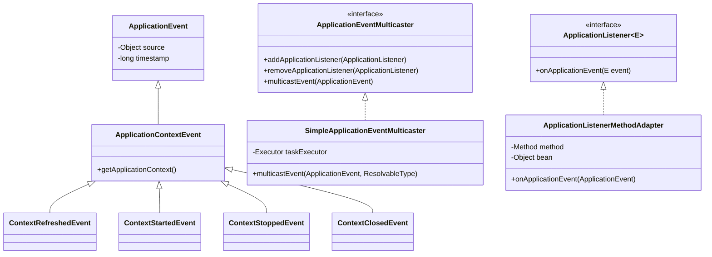
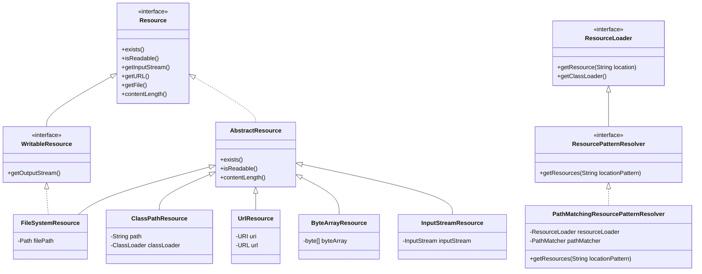
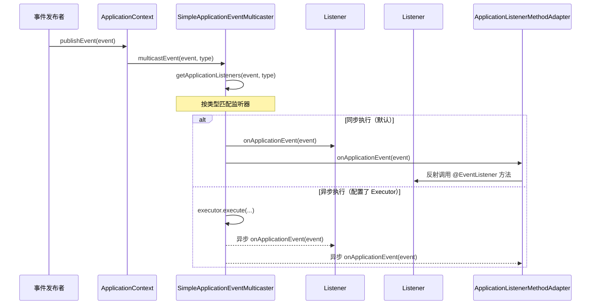

# 事件与资源加载

## 目标

理解 `ApplicationContext` 内部常用基础设施。

## 核心类

### 事件机制

- [ApplicationEvent.java](../../spring-context/src/main/java/org/springframework/context/ApplicationEvent.java)
- [ApplicationListener.java](../../spring-context/src/main/java/org/springframework/context/ApplicationListener.java)
- [ApplicationEventMulticaster.java](../../spring-context/src/main/java/org/springframework/context/event/ApplicationEventMulticaster.java)
- [SimpleApplicationEventMulticaster.java](../../spring-context/src/main/java/org/springframework/context/event/SimpleApplicationEventMulticaster.java)
- [ApplicationListenerMethodAdapter.java](../../spring-context/src/main/java/org/springframework/context/event/ApplicationListenerMethodAdapter.java)
- [EventListenerMethodProcessor.java](../../spring-context/src/main/java/org/springframework/context/event/EventListenerMethodProcessor.java)

### 资源加载

- [Resource.java](../../spring-core/src/main/java/org/springframework/core/io/Resource.java)
- [ResourceLoader.java](../../spring-core/src/main/java/org/springframework/core/io/ResourceLoader.java)
- [ResourcePatternResolver.java](../../spring-core/src/main/java/org/springframework/core/io/support/ResourcePatternResolver.java)
- [PathMatchingResourcePatternResolver.java](../../spring-core/src/main/java/org/springframework/core/io/support/PathMatchingResourcePatternResolver.java)

## 事件机制类图



## 设计模式

| 模式 | 应用位置 | 说明 |
|------|---------|------|
| **观察者模式** | 事件发布/监听 | 发布者与监听者解耦 |
| **适配器模式** | `ApplicationListenerMethodAdapter` | 将 `@EventListener` 方法适配为 `ApplicationListener` |
| **策略模式** | `Resource` 不同实现 | 统一接口，不同加载策略 |
| **模板方法** | `AbstractApplicationContext.publishEvent()` | 事件发布的标准流程 |

## 核心源码分析

### 事件发布流程

```java
// AbstractApplicationContext.java
protected void publishEvent(Object event, ResolvableType eventType) {
    ApplicationEvent applicationEvent;

    // 1. 包装事件对象
    if (event instanceof ApplicationEvent ae) {
        applicationEvent = ae;
    } else {
        // 非 ApplicationEvent 类型会被包装为 PayloadApplicationEvent
        applicationEvent = new PayloadApplicationEvent<>(this, event);
        if (eventType == null) {
            eventType = ((PayloadApplicationEvent<?>) applicationEvent).getResolvableType();
        }
    }

    // 2. 如果容器还在刷新中，先缓存事件
    if (this.earlyApplicationEvents != null) {
        this.earlyApplicationEvents.add(applicationEvent);
    } else {
        // 3. 通过事件广播器分发
        getApplicationEventMulticaster().multicastEvent(applicationEvent, eventType);
    }

    // 4. 如果有父容器，也向父容器发布
    if (this.parent != null) {
        if (this.parent instanceof AbstractApplicationContext aac) {
            aac.publishEvent(event, eventType);
        } else {
            this.parent.publishEvent(event);
        }
    }
}
```

### SimpleApplicationEventMulticaster — 事件广播

```java
// SimpleApplicationEventMulticaster.java
@Override
public void multicastEvent(ApplicationEvent event, ResolvableType eventType) {
    ResolvableType type = (eventType != null ? eventType : ResolvableType.forInstance(event));

    // 获取任务执行器（如果设置了 Executor，则异步执行）
    Executor executor = getTaskExecutor();

    // 遍历匹配的监听器
    for (ApplicationListener<?> listener : getApplicationListeners(event, type)) {
        if (executor != null) {
            // 异步执行
            executor.execute(() -> invokeListener(listener, event));
        } else {
            // 同步执行（默认）
            invokeListener(listener, event);
        }
    }
}

protected void invokeListener(ApplicationListener<?> listener, ApplicationEvent event) {
    // 错误处理器
    ErrorHandler errorHandler = getErrorHandler();
    if (errorHandler != null) {
        try {
            doInvokeListener(listener, event);
        } catch (Throwable err) {
            errorHandler.handleError(err);
        }
    } else {
        doInvokeListener(listener, event);
    }
}

private void doInvokeListener(ApplicationListener listener, ApplicationEvent event) {
    listener.onApplicationEvent(event);
}
```

### @EventListener 的注册过程

```java
// EventListenerMethodProcessor.java（实现了 SmartInitializingSingleton）
@Override
public void afterSingletonsInstantiated() {
    // 在所有单例 Bean 创建完毕后执行

    // 遍历所有 Bean
    String[] beanNames = this.applicationContext.getBeanNamesForType(Object.class);
    for (String beanName : beanNames) {
        Class<?> type = ...;  // 获取 Bean 类型

        // 查找标注了 @EventListener 的方法
        Map<Method, EventListener> annotatedMethods =
            MethodIntrospector.selectMethods(type,
                (Method method) -> AnnotatedElementUtils.findMergedAnnotation(method, EventListener.class));

        for (Map.Entry<Method, EventListener> entry : annotatedMethods.entrySet()) {
            Method method = entry.getKey();

            // 使用 EventListenerFactory 创建 ApplicationListener 适配器
            for (EventListenerFactory factory : factories) {
                if (factory.supportsMethod(method)) {
                    ApplicationListener<?> applicationListener =
                        factory.createApplicationListener(beanName, type, method);
                    // 注册到事件广播器
                    this.applicationContext.addApplicationListener(applicationListener);
                    break;
                }
            }
        }
    }
}
```

### ApplicationListenerMethodAdapter — @EventListener 适配器

```java
// ApplicationListenerMethodAdapter.java
public class ApplicationListenerMethodAdapter implements GenericApplicationListener {
    private final String beanName;
    private final Method method;
    private final Class<?> targetClass;
    private final List<ResolvableType> declaredEventTypes;

    @Override
    public void onApplicationEvent(ApplicationEvent event) {
        processEvent(event);
    }

    public void processEvent(ApplicationEvent event) {
        // 1. 解析方法参数
        Object[] args = resolveArguments(event);

        // 2. 检查条件（@EventListener 的 condition 属性，SpEL 表达式）
        if (shouldHandle(event, args)) {
            // 3. 反射调用方法
            Object result = doInvoke(args);

            // 4. 如果方法有返回值，将返回值作为新事件发布
            if (result != null) {
                handleResult(result);
            }
        }
    }

    protected Object doInvoke(Object... args) {
        Object bean = this.applicationContext.getBean(this.beanName);
        ReflectionUtils.makeAccessible(this.method);
        return this.method.invoke(bean, args);
    }
}
```

## 资源加载体系



### 资源路径前缀

| 前缀 | 示例 | 解析为 |
|------|------|--------|
| `classpath:` | `classpath:config/app.xml` | `ClassPathResource` |
| `classpath*:` | `classpath*:META-INF/spring.factories` | 多个 `ClassPathResource`（含 jar 包内） |
| `file:` | `file:/opt/config/app.xml` | `FileSystemResource` |
| `http:` / `https:` | `https://example.com/config.xml` | `UrlResource` |
| 无前缀 | `config/app.xml` | 取决于 `ApplicationContext` 类型 |

### PathMatchingResourcePatternResolver 核心逻辑

```java
// PathMatchingResourcePatternResolver.java
@Override
public Resource[] getResources(String locationPattern) throws IOException {
    if (locationPattern.startsWith(CLASSPATH_ALL_URL_PREFIX)) {
        // classpath*: 前缀 → 搜索所有 classpath（含 jar）
        if (getPathMatcher().isPattern(locationPattern.substring(CLASSPATH_ALL_URL_PREFIX.length()))) {
            // 包含通配符：classpath*:com/example/**/*.xml
            return findPathMatchingResources(locationPattern);
        } else {
            // 无通配符：classpath*:META-INF/spring.factories
            return findAllClassPathResources(
                locationPattern.substring(CLASSPATH_ALL_URL_PREFIX.length()));
        }
    } else {
        // 非 classpath*: 前缀
        int prefixEnd = (locationPattern.startsWith("war:") ? 
            locationPattern.indexOf("*/") + 1 :
            locationPattern.indexOf(':') + 1);
        if (getPathMatcher().isPattern(locationPattern.substring(prefixEnd))) {
            // 有通配符
            return findPathMatchingResources(locationPattern);
        } else {
            // 无通配符，直接加载单个资源
            return new Resource[] { getResourceLoader().getResource(locationPattern) };
        }
    }
}
```

## 事件发布流程图



## 常见面试题

### 1. Spring 事件机制的原理是什么？

基于**观察者模式**实现：
- `ApplicationEventMulticaster` 维护监听器列表
- `publishEvent()` 时遍历匹配的监听器并调用
- 默认同步执行，可配置 `Executor` 实现异步
- `@EventListener` 通过 `ApplicationListenerMethodAdapter` 适配为标准监听器

### 2. @EventListener 和实现 ApplicationListener 接口的区别？

| 对比项 | 实现接口 | @EventListener |
|--------|---------|----------------|
| 侵入性 | 高（实现接口） | 低（注解） |
| 条件过滤 | 手动 instanceof | `condition` 属性（SpEL） |
| 多事件 | 一个类一个事件 | 一个方法一个事件，一个类可多个方法 |
| 返回值 | 无 | 返回值可作为新事件发布 |
| 注册时机 | 容器启动时自动检测 | `SmartInitializingSingleton` 阶段 |

### 3. 如何实现异步事件？

```java
// 方式 1：全局配置异步执行器
@Configuration
public class AsyncEventConfig {
    @Bean
    public SimpleApplicationEventMulticaster applicationEventMulticaster() {
        SimpleApplicationEventMulticaster multicaster = new SimpleApplicationEventMulticaster();
        multicaster.setTaskExecutor(Executors.newFixedThreadPool(5));
        return multicaster;
    }
}

// 方式 2：单个监听器异步（推荐，更精细）
@EventListener
@Async
public void handleOrderEvent(OrderCreatedEvent event) {
    // 在异步线程中执行
}
```

### 4. classpath: 和 classpath*: 的区别？

- `classpath:` — 只在当前 ClassLoader 下找**第一个**匹配的资源
- `classpath*:` — 搜索**所有** ClassLoader 路径（含 jar 包内），返回所有匹配资源

## 实战应用场景

### 场景 1：基于事件的解耦——订单创建后发送通知

```java
// 事件定义
public class OrderCreatedEvent extends ApplicationEvent {
    private final Order order;
    public OrderCreatedEvent(Object source, Order order) {
        super(source);
        this.order = order;
    }
    public Order getOrder() { return order; }
}

// 发布事件
@Service
public class OrderService {
    @Autowired
    private ApplicationEventPublisher eventPublisher;

    @Transactional
    public Order createOrder(OrderRequest request) {
        Order order = orderRepository.save(new Order(request));
        // 发布事件，与通知逻辑解耦
        eventPublisher.publishEvent(new OrderCreatedEvent(this, order));
        return order;
    }
}

// 监听事件
@Component
public class NotificationListener {
    @EventListener
    @Async
    public void onOrderCreated(OrderCreatedEvent event) {
        // 发送短信、邮件、推送等
        notificationService.sendOrderConfirmation(event.getOrder());
    }
}

@Component
public class InventoryListener {
    @EventListener
    @Async
    public void onOrderCreated(OrderCreatedEvent event) {
        // 扣减库存
        inventoryService.deductStock(event.getOrder().getItems());
    }
}
```

### 场景 2：条件事件监听

```java
@Component
public class ConditionalListener {
    // 只处理金额超过 1000 的订单
    @EventListener(condition = "#event.order.amount > 1000")
    public void handleLargeOrder(OrderCreatedEvent event) {
        riskService.checkOrder(event.getOrder());
    }

    // 返回值作为新事件发布
    @EventListener
    public AuditEvent onOrderCreated(OrderCreatedEvent event) {
        return new AuditEvent("ORDER_CREATED", event.getOrder().getId());
    }
}
```

### 场景 3：@TransactionalEventListener — 事务提交后执行

```java
@Component
public class AfterCommitListener {
    // 只在事务提交后执行（避免事务回滚但消息已发送的问题）
    @TransactionalEventListener(phase = TransactionPhase.AFTER_COMMIT)
    public void onOrderCommitted(OrderCreatedEvent event) {
        messageBroker.send(new OrderMessage(event.getOrder()));
    }
}
```

### 更多业务场景（低代码 & 审批流）

> 详见 [实战场景-低代码与审批流](../00-13-实战场景-低代码与审批流.md)

- **审批流 — 事件驱动通知体系**：审批发起/通过/驳回/完成分别定义事件，消息通知、审计日志、业务回写三个监听器完全解耦
- **低代码 — 表单字段联动事件**：字段值变更触发 `FieldValueChangedEvent`，联动规则处理器监听并返回 UI 动作
- **审批流 — @TransactionalEventListener**：审批通过且事务提交后才发送通知，避免事务回滚但通知已发出的不一致

## 建议断点

- `AbstractApplicationContext.publishEvent(...)`
- `SimpleApplicationEventMulticaster.multicastEvent(...)`
- `SimpleApplicationEventMulticaster.invokeListener(...)`
- `ApplicationListenerMethodAdapter.processEvent(...)`
- `EventListenerMethodProcessor.afterSingletonsInstantiated()`
- `PathMatchingResourcePatternResolver.getResources(...)`

## 阶段目标

- [ ] 能说明事件如何发布和消费
- [ ] 能理解 `@EventListener` 如何适配成监听器
- [ ] 能理解 classpath 资源是如何解析的
- [ ] 能说明同步事件和异步事件的配置方式
- [ ] 能区分 `classpath:` 和 `classpath*:` 的行为

## 学习笔记

<!-- 在这里记录你的阅读收获 -->
