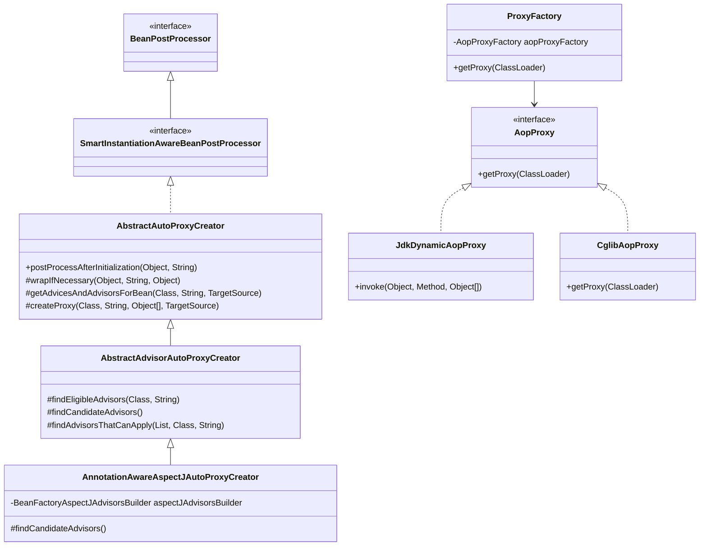
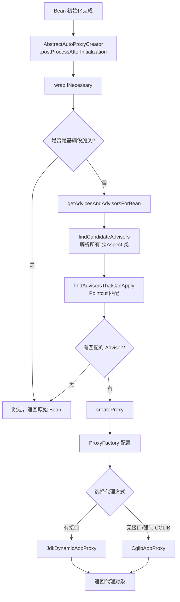

# AOP（面向切面编程）

## 目标

理解 Spring AOP 代理创建机制和拦截器链的执行流程。

## 核心类

- [EnableAspectJAutoProxy.java](../../spring-context/src/main/java/org/springframework/context/annotation/EnableAspectJAutoProxy.java)
- [AnnotationAwareAspectJAutoProxyCreator.java](../../spring-aop/src/main/java/org/springframework/aop/aspectj/annotation/AnnotationAwareAspectJAutoProxyCreator.java)
- [AbstractAutoProxyCreator.java](../../spring-aop/src/main/java/org/springframework/aop/framework/autoproxy/AbstractAutoProxyCreator.java)
- [ProxyFactory.java](../../spring-aop/src/main/java/org/springframework/aop/framework/ProxyFactory.java)
- [JdkDynamicAopProxy.java](../../spring-aop/src/main/java/org/springframework/aop/framework/JdkDynamicAopProxy.java)
- [CglibAopProxy.java](../../spring-aop/src/main/java/org/springframework/aop/framework/CglibAopProxy.java)
- [ReflectiveMethodInvocation.java](../../spring-aop/src/main/java/org/springframework/aop/framework/ReflectiveMethodInvocation.java)
- [AspectJExpressionPointcut.java](../../spring-aop/src/main/java/org/springframework/aop/aspectj/AspectJExpressionPointcut.java)
- [MethodInterceptor.java](../../spring-aop/src/main/java/org/aopalliance/intercept/MethodInterceptor.java)

## 核心概念

| 概念 | 接口/类 | 说明 |
|------|---------|------|
| **Joinpoint** | 方法执行点 | 被拦截的方法调用 |
| **Pointcut** | `Pointcut` | 定义哪些方法需要被拦截 |
| **Advice** | `MethodInterceptor` 等 | 切面逻辑（环绕/前置/后置/异常/最终） |
| **Advisor** | `Advisor` | Pointcut + Advice 的组合 |
| **Aspect** | `@Aspect` 类 | 包含多个 Advisor 的切面类 |
| **Weaving** | 代理创建 | 将切面织入目标对象 |

## 类继承关系



## 设计模式

| 模式 | 应用位置 | 说明 |
|------|---------|------|
| **代理模式** | JDK 动态代理 / CGLIB | 创建目标对象的代理 |
| **责任链** | `ReflectiveMethodInvocation` | 拦截器链顺序执行 |
| **策略模式** | `AopProxyFactory` | 选择 JDK 代理或 CGLIB 代理 |
| **适配器** | `MethodBeforeAdviceAdapter` 等 | 将 Advice 适配为 MethodInterceptor |
| **模板方法** | `AbstractAutoProxyCreator` | 代理创建的标准流程 |

## 核心源码分析

### @EnableAspectJAutoProxy 的作用

```java
// EnableAspectJAutoProxy.java
@Import(AspectJAutoProxyRegistrar.class)
public @interface EnableAspectJAutoProxy {
    boolean proxyTargetClass() default false;  // true=强制 CGLIB
    boolean exposeProxy() default false;       // true=暴露代理到 ThreadLocal
}

// AspectJAutoProxyRegistrar.java → 注册 AnnotationAwareAspectJAutoProxyCreator
```

### AbstractAutoProxyCreator.postProcessAfterInitialization() — 代理创建入口

```java
// AbstractAutoProxyCreator.java
@Override
public Object postProcessAfterInitialization(Object bean, String beanName) {
    if (bean != null) {
        Object cacheKey = getCacheKey(bean.getClass(), beanName);
        // 检查是否已经在循环依赖时提前创建了代理
        if (this.earlyProxyReferences.remove(cacheKey) != bean) {
            return wrapIfNecessary(bean, beanName, cacheKey);
        }
    }
    return bean;
}

protected Object wrapIfNecessary(Object bean, String beanName, Object cacheKey) {
    // 1. 已经处理过的，跳过
    if (this.targetSourcedBeans.contains(beanName)) return bean;
    if (this.advisedBeans.containsKey(cacheKey) && !this.advisedBeans.get(cacheKey)) return bean;

    // 2. 基础设施类（Advice、Pointcut、Advisor 等）跳过
    if (isInfrastructureClass(bean.getClass())) {
        this.advisedBeans.put(cacheKey, Boolean.FALSE);
        return bean;
    }

    // 3. 查找适用于当前 Bean 的 Advisor（核心！）
    Object[] specificInterceptors = getAdvicesAndAdvisorsForBean(bean.getClass(), beanName, null);

    if (specificInterceptors != DO_NOT_PROXY) {
        this.advisedBeans.put(cacheKey, Boolean.TRUE);
        // 4. 创建代理
        Object proxy = createProxy(bean.getClass(), beanName, specificInterceptors, new SingletonTargetSource(bean));
        this.proxyTypes.put(cacheKey, proxy.getClass());
        return proxy;  // 返回代理对象替代原始 Bean！
    }

    this.advisedBeans.put(cacheKey, Boolean.FALSE);
    return bean;
}
```

### findEligibleAdvisors() — 查找匹配的增强器

```java
// AbstractAdvisorAutoProxyCreator.java
protected List<Advisor> findEligibleAdvisors(Class<?> beanClass, String beanName) {
    // 1. 获取所有候选 Advisor
    //    AnnotationAwareAspectJAutoProxyCreator 会解析 @Aspect 类
    List<Advisor> candidateAdvisors = findCandidateAdvisors();

    // 2. 过滤出能应用到当前 Bean 的 Advisor
    //    通过 Pointcut 匹配类和方法
    List<Advisor> eligibleAdvisors = findAdvisorsThatCanApply(candidateAdvisors, beanClass, beanName);

    // 3. 扩展（如添加 ExposeInvocationInterceptor）
    extendAdvisors(eligibleAdvisors);

    // 4. 排序
    if (!eligibleAdvisors.isEmpty()) {
        eligibleAdvisors = sortAdvisors(eligibleAdvisors);
    }
    return eligibleAdvisors;
}
```

### @Aspect 类解析过程

```java
// BeanFactoryAspectJAdvisorsBuilder.java
public List<Advisor> buildAspectJAdvisors() {
    List<String> aspectNames = this.aspectBeanNames;
    if (aspectNames == null) {
        synchronized (this) {
            aspectNames = this.aspectBeanNames;
            if (aspectNames == null) {
                List<Advisor> advisors = new ArrayList<>();
                aspectNames = new ArrayList<>();

                // 获取所有 Bean 名称
                String[] beanNames = this.beanFactory.getBeanNamesForType(Object.class, true, false);
                for (String beanName : beanNames) {
                    Class<?> beanType = this.beanFactory.getType(beanName, false);
                    // 判断是否是 @Aspect 类
                    if (this.advisorFactory.isAspect(beanType)) {
                        aspectNames.add(beanName);
                        AspectMetadata amd = new AspectMetadata(beanType, beanName);

                        // 获取 @Aspect 类中的所有 Advisor
                        MetadataAwareAspectInstanceFactory factory =
                            new BeanFactoryAspectInstanceFactory(this.beanFactory, beanName);
                        List<Advisor> classAdvisors = this.advisorFactory.getAdvisors(factory);
                        // 解析 @Before, @After, @Around, @AfterReturning, @AfterThrowing
                        advisors.addAll(classAdvisors);
                    }
                }
                this.aspectBeanNames = aspectNames;
                return advisors;
            }
        }
    }
    // ... 缓存命中逻辑
}
```

### createProxy() — 代理创建

```java
// AbstractAutoProxyCreator.java
protected Object createProxy(Class<?> beanClass, String beanName,
        Object[] specificInterceptors, TargetSource targetSource) {

    ProxyFactory proxyFactory = new ProxyFactory();
    proxyFactory.copyFrom(this);  // 复制配置

    // 决定是否使用 CGLIB
    if (proxyFactory.isProxyTargetClass()) {
        // 已配置强制使用 CGLIB
    } else {
        // 检查 BeanDefinition 是否指定了 proxyTargetClass
        if (shouldProxyTargetClass(beanClass, beanName)) {
            proxyFactory.setProxyTargetClass(true);
        } else {
            // 检查是否有合适的接口
            evaluateProxyInterfaces(beanClass, proxyFactory);
        }
    }

    // 构建 Advisor 数组
    Advisor[] advisors = buildAdvisors(beanName, specificInterceptors);
    proxyFactory.addAdvisors(advisors);
    proxyFactory.setTargetSource(targetSource);

    // 扩展点：子类可定制 ProxyFactory
    customizeProxyFactory(proxyFactory);

    return proxyFactory.getProxy(classLoader);
}
```

### ProxyFactory — 选择代理类型

```java
// DefaultAopProxyFactory.java
@Override
public AopProxy createAopProxy(AdvisedSupport config) {
    if (config.isOptimize() || config.isProxyTargetClass() || hasNoUserSuppliedProxyInterfaces(config)) {
        Class<?> targetClass = config.getTargetClass();
        if (targetClass.isInterface() || Proxy.isProxyClass(targetClass)) {
            // 目标是接口或已经是代理 → 使用 JDK 动态代理
            return new JdkDynamicAopProxy(config);
        }
        // 使用 CGLIB
        return new ObjenesisCglibAopProxy(config);
    } else {
        // 有接口 → 使用 JDK 动态代理
        return new JdkDynamicAopProxy(config);
    }
}
```

**代理选择规则**：
```text
1. proxyTargetClass=true → CGLIB
2. 目标类是接口 → JDK
3. 目标类没有实现任何接口 → CGLIB
4. 目标类实现了接口 → JDK
```

### JdkDynamicAopProxy.invoke() — 拦截器链执行

```java
// JdkDynamicAopProxy.java
@Override
public Object invoke(Object proxy, Method method, Object[] args) throws Throwable {
    Object oldProxy = null;
    boolean setProxyContext = false;
    TargetSource targetSource = this.advised.targetSource;
    Object target = null;

    try {
        // equals() 和 hashCode() 特殊处理
        if (method.getDeclaringClass() == Object.class) { ... }

        // exposeProxy=true 时，将代理暴露到 ThreadLocal
        if (this.advised.exposeProxy) {
            oldProxy = AopContext.setCurrentProxy(proxy);
            setProxyContext = true;
        }

        target = targetSource.getTarget();
        Class<?> targetClass = (target != null ? target.getClass() : null);

        // 获取匹配当前方法的拦截器链
        List<Object> chain = this.advised.getInterceptorsAndDynamicInterceptionAdvice(method, targetClass);

        Object retVal;
        if (chain.isEmpty()) {
            // 没有拦截器，直接调用目标方法
            retVal = AopUtils.invokeJoinpointUsingReflection(target, method, args);
        } else {
            // 创建 MethodInvocation 并执行拦截器链
            MethodInvocation invocation = new ReflectiveMethodInvocation(
                proxy, target, method, args, targetClass, chain);
            retVal = invocation.proceed();
        }
        return retVal;
    } finally {
        if (target != null) targetSource.releaseTarget(target);
        if (setProxyContext) AopContext.setCurrentProxy(oldProxy);
    }
}
```

### ReflectiveMethodInvocation.proceed() — 责任链执行

```java
// ReflectiveMethodInvocation.java
@Override
public Object proceed() throws Throwable {
    // 所有拦截器执行完毕，调用目标方法
    if (this.currentInterceptorIndex == this.interceptorsAndDynamicMethodMatchers.size() - 1) {
        return invokeJoinpoint();  // 反射调用原始方法
    }

    // 获取下一个拦截器
    Object interceptorOrInterceptionAdvice =
        this.interceptorsAndDynamicMethodMatchers.get(++this.currentInterceptorIndex);

    if (interceptorOrInterceptionAdvice instanceof InterceptorAndDynamicMethodMatcher dm) {
        // 动态匹配（运行时判断参数是否匹配）
        Class<?> targetClass = (this.targetClass != null ? this.targetClass : this.method.getDeclaringClass());
        if (dm.matcher().matches(this.method, targetClass, this.arguments)) {
            return dm.interceptor().invoke(this);
        } else {
            // 不匹配，跳过当前拦截器
            return proceed();
        }
    } else {
        // 直接调用拦截器
        return ((MethodInterceptor) interceptorOrInterceptionAdvice).invoke(this);
    }
}
```

## 五种通知类型的执行顺序

```mermaid
flowchart TD
    A[方法调用] --> B[ExposeInvocationInterceptor]
    B --> C[@Around - 前半部分]
    C --> D[@Before]
    D --> E[目标方法执行]

    E -->|正常返回| F[@AfterReturning]
    E -->|抛出异常| G[@AfterThrowing]

    F --> H[@After / Finally]
    G --> H
    H --> I[@Around - 后半部分]
    I --> J[返回结果]
```

### 通知类型到 MethodInterceptor 的适配

```java
// @Before → MethodBeforeAdviceInterceptor
public class MethodBeforeAdviceInterceptor implements MethodInterceptor {
    @Override
    public Object invoke(MethodInvocation mi) throws Throwable {
        this.advice.before(mi.getMethod(), mi.getArguments(), mi.getThis());
        return mi.proceed();  // 先执行前置逻辑，再继续链
    }
}

// @After → AspectJAfterAdvice
public class AspectJAfterAdvice implements MethodInterceptor {
    @Override
    public Object invoke(MethodInvocation mi) throws Throwable {
        try {
            return mi.proceed();
        } finally {
            invokeAdviceMethod(...);  // 无论是否异常都执行
        }
    }
}

// @AfterReturning → AfterReturningAdviceInterceptor
public class AfterReturningAdviceInterceptor implements MethodInterceptor {
    @Override
    public Object invoke(MethodInvocation mi) throws Throwable {
        Object retVal = mi.proceed();
        this.advice.afterReturning(retVal, mi.getMethod(), mi.getArguments(), mi.getThis());
        return retVal;  // 正常返回后执行
    }
}

// @AfterThrowing → AspectJAfterThrowingAdvice
public class AspectJAfterThrowingAdvice implements MethodInterceptor {
    @Override
    public Object invoke(MethodInvocation mi) throws Throwable {
        try {
            return mi.proceed();
        } catch (Throwable ex) {
            if (shouldInvokeOnThrowing(ex)) {
                invokeAdviceMethod(...);  // 异常时执行
            }
            throw ex;
        }
    }
}

// @Around → 直接实现 MethodInterceptor
// 用户自己控制 proceed() 的调用时机
```

## AOP 代理创建流程图



## JDK 动态代理 vs CGLIB 代理

| 对比项 | JDK 动态代理 | CGLIB 代理 |
|--------|-------------|-----------|
| 原理 | 基于接口，实现 `InvocationHandler` | 基于继承，生成子类 |
| 要求 | 目标类必须实现接口 | 目标类不能是 final |
| 性能 | 生成代理快，调用稍慢 | 生成代理慢，调用略快 |
| final 方法 | 接口方法都能代理 | final 方法无法代理 |
| 代理类型 | `$Proxy0` | `Xxx$$EnhancerByCGLIB$$xxx` |
| Spring 默认 | 有接口时使用 | Spring Boot 2.x+ 默认使用 |

## 常见面试题

### 1. Spring AOP 的实现原理？

Spring AOP 通过 `BeanPostProcessor` 在 Bean 初始化后创建代理对象：
1. `AnnotationAwareAspectJAutoProxyCreator` 在 `postProcessAfterInitialization` 阶段介入
2. 解析所有 `@Aspect` 类，提取 Advisor
3. 通过 Pointcut 匹配判断哪些 Advisor 应用于当前 Bean
4. 如果有匹配，使用 `ProxyFactory` 创建 JDK 动态代理或 CGLIB 代理
5. 返回代理对象替代原始 Bean 放入容器

### 2. @Around 通知中不调用 proceed() 会怎样？

目标方法不会执行，后续通知（@Before 除外）也不会执行。这实际上"短路"了整个调用链。可以利用这一点实现缓存（命中缓存时直接返回，不调用目标方法）。

### 3. 同一个 Aspect 中多个通知的执行顺序？

```text
正常流程：@Around(前) → @Before → 目标方法 → @AfterReturning → @After → @Around(后)
异常流程：@Around(前) → @Before → 目标方法(异常) → @AfterThrowing → @After
```

### 4. 为什么 this 调用不会触发 AOP？

```java
@Service
public class UserService {
    @Transactional
    public void createUser() { ... }

    public void batchCreate() {
        this.createUser();  // ❌ 不走代理！AOP 不生效
    }
}
```

因为 `this` 指向的是原始对象，而不是代理对象。AOP 拦截只发生在通过代理对象调用方法时。

**解决方案**：
```java
// 方式 1：注入自身代理
@Autowired
private UserService self;  // 注入的是代理对象

// 方式 2：从 AopContext 获取
UserService proxy = (UserService) AopContext.currentProxy();
proxy.createUser();  // 走代理

// 方式 3：重构设计（推荐），将方法拆到不同的 Service
```

### 5. Spring AOP 和 AspectJ 的区别？

| 对比项 | Spring AOP | AspectJ |
|--------|-----------|---------|
| 织入时机 | 运行时（动态代理） | 编译时/加载时 |
| 功能范围 | 只支持方法级别拦截 | 支持字段、构造器、方法等 |
| 性能 | 有代理开销 | 无额外运行时开销 |
| 使用方式 | 简单，注解配置 | 需要特殊编译器/Agent |
| 适用场景 | 大多数企业应用 | 性能敏感或需要更细粒度拦截 |

## 实战应用场景

### 场景 1：方法耗时统计

```java
@Aspect
@Component
public class PerformanceAspect {
    @Around("@annotation(com.example.annotation.Timed)")
    public Object measureTime(ProceedingJoinPoint pjp) throws Throwable {
        long start = System.nanoTime();
        try {
            return pjp.proceed();
        } finally {
            long duration = System.nanoTime() - start;
            String method = pjp.getSignature().toShortString();
            log.info("{} 耗时 {}ms", method, duration / 1_000_000);
            metricsRegistry.timer(method).record(duration, TimeUnit.NANOSECONDS);
        }
    }
}
```

### 场景 2：声明式权限校验

```java
@Aspect
@Component
public class PermissionAspect {
    @Before("@annotation(requiresPermission)")
    public void checkPermission(JoinPoint jp, RequiresPermission requiresPermission) {
        String[] permissions = requiresPermission.value();
        User currentUser = SecurityContext.getCurrentUser();
        if (!currentUser.hasAnyPermission(permissions)) {
            throw new AccessDeniedException("权限不足: " + Arrays.toString(permissions));
        }
    }
}
```

### 场景 3：声明式重试

```java
@Aspect
@Component
public class RetryAspect {
    @Around("@annotation(retryable)")
    public Object retry(ProceedingJoinPoint pjp, Retryable retryable) throws Throwable {
        int maxAttempts = retryable.maxAttempts();
        long delay = retryable.delay();
        Throwable lastException = null;

        for (int attempt = 1; attempt <= maxAttempts; attempt++) {
            try {
                return pjp.proceed();
            } catch (Throwable ex) {
                lastException = ex;
                if (attempt < maxAttempts) {
                    log.warn("第 {} 次重试 {}", attempt, pjp.getSignature().toShortString());
                    Thread.sleep(delay * attempt);  // 指数退避
                }
            }
        }
        throw lastException;
    }
}
```

### 更多业务场景（低代码 & 审批流）

> 详见 [实战场景-低代码与审批流](../00-13-实战场景-低代码与审批流.md)

- **审批流 — AOP 权限校验**：`@RequireApprovalPermission` + AOP 自动校验当前用户是否有权审批/驳回/转办/撤回
- **低代码 — AOP 操作审计日志**：`@AuditLog` + AOP 自动记录所有数据变更的前后快照、操作人、耗时等信息
- **低代码 — AOP 多租户数据隔离**：拦截所有 Repository 方法，自动设置 `TenantContextHolder`（ThreadLocal），确保 SQL 带租户过滤

## 建议断点

- `AbstractAutoProxyCreator.postProcessAfterInitialization(...)`
- `AbstractAutoProxyCreator.wrapIfNecessary(...)`
- `AbstractAdvisorAutoProxyCreator.findEligibleAdvisors(...)`
- `AbstractAutoProxyCreator.createProxy(...)`
- `DefaultAopProxyFactory.createAopProxy(...)`
- `JdkDynamicAopProxy.invoke(...)`
- `ReflectiveMethodInvocation.proceed()`
- `CglibAopProxy.DynamicAdvisedInterceptor.intercept(...)`

## 阶段目标

- [ ] 能说明 AOP 代理在什么时候、由谁创建
- [ ] 能理解拦截器链的递归执行机制
- [ ] 能区分 JDK 动态代理和 CGLIB 代理的适用场景
- [ ] 能说明五种通知类型的执行顺序
- [ ] 能解释 this 调用为什么不触发 AOP

## 学习笔记

<!-- 在这里记录你的阅读收获 -->
