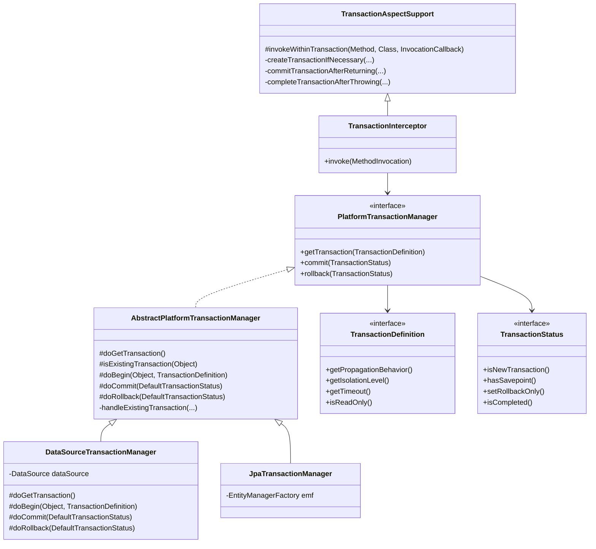
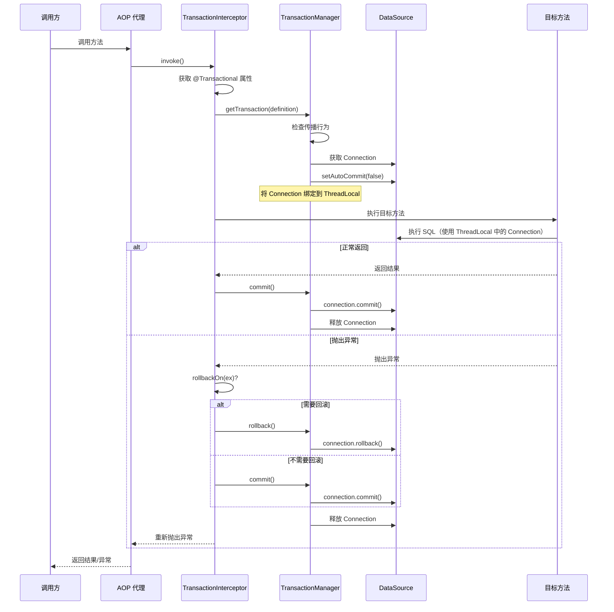
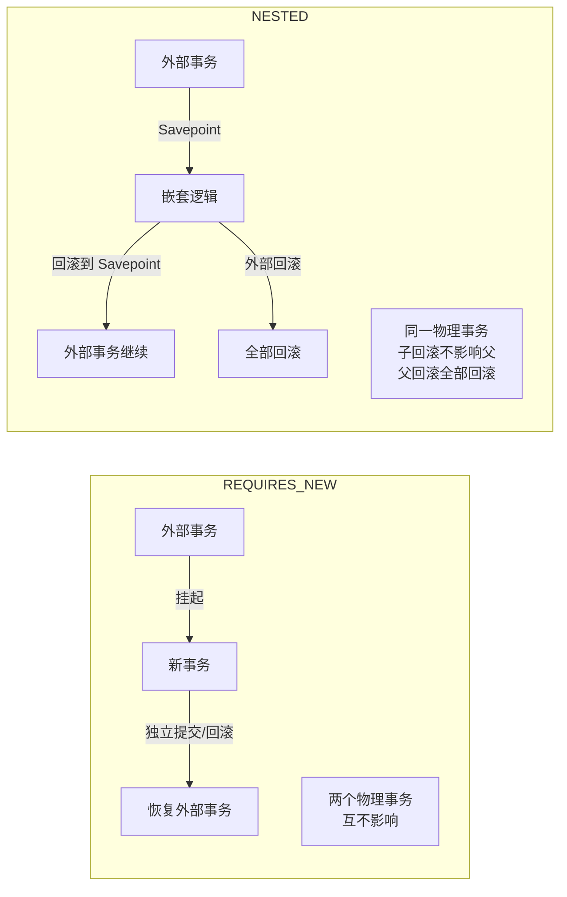

# 事务管理

## 目标

理解 `@Transactional` 的底层实现：事务拦截器、事务管理器、传播行为。

## 核心类

- [EnableTransactionManagement.java](../../spring-tx/src/main/java/org/springframework/transaction/annotation/EnableTransactionManagement.java)
- [TransactionInterceptor.java](../../spring-tx/src/main/java/org/springframework/transaction/interceptor/TransactionInterceptor.java)
- [TransactionAspectSupport.java](../../spring-tx/src/main/java/org/springframework/transaction/interceptor/TransactionAspectSupport.java)
- [PlatformTransactionManager.java](../../spring-tx/src/main/java/org/springframework/transaction/PlatformTransactionManager.java)
- [AbstractPlatformTransactionManager.java](../../spring-tx/src/main/java/org/springframework/transaction/support/AbstractPlatformTransactionManager.java)
- [DataSourceTransactionManager.java](../../spring-jdbc/src/main/java/org/springframework/jdbc/datasource/DataSourceTransactionManager.java)
- [TransactionSynchronizationManager.java](../../spring-tx/src/main/java/org/springframework/transaction/support/TransactionSynchronizationManager.java)
- [TransactionDefinition.java](../../spring-tx/src/main/java/org/springframework/transaction/TransactionDefinition.java)
- [TransactionStatus.java](../../spring-tx/src/main/java/org/springframework/transaction/TransactionStatus.java)

## 类继承关系



## 设计模式

| 模式 | 应用位置 | 说明 |
|------|---------|------|
| **模板方法** | `AbstractPlatformTransactionManager` | 定义事务管理骨架，子类实现具体操作 |
| **策略模式** | `PlatformTransactionManager` 多实现 | 不同数据源使用不同的事务管理器 |
| **代理模式** | `TransactionInterceptor` + AOP | 事务通过 AOP 代理实现 |
| **ThreadLocal** | `TransactionSynchronizationManager` | 事务信息绑定到当前线程 |
| **观察者** | `TransactionSynchronization` | 事务生命周期回调 |

## 核心源码分析

### @EnableTransactionManagement 的作用

```java
// EnableTransactionManagement.java
@Import(TransactionManagementConfigurationSelector.class)
public @interface EnableTransactionManagement {
    boolean proxyTargetClass() default false;
    AdviceMode mode() default AdviceMode.PROXY;  // PROXY 模式使用 AOP
    int order() default Ordered.LOWEST_PRECEDENCE;
}

// TransactionManagementConfigurationSelector 导入：
// 1. AutoProxyRegistrar → 注册 InfrastructureAdvisorAutoProxyCreator
// 2. ProxyTransactionManagementConfiguration → 注册 TransactionInterceptor + Advisor
```

### ProxyTransactionManagementConfiguration — 核心配置

```java
// ProxyTransactionManagementConfiguration.java
@Configuration
public class ProxyTransactionManagementConfiguration {

    // 事务 Advisor（绑定 Pointcut + Advice）
    @Bean
    public BeanFactoryTransactionAttributeSourceAdvisor transactionAdvisor(...) {
        BeanFactoryTransactionAttributeSourceAdvisor advisor = new BeanFactoryTransactionAttributeSourceAdvisor();
        advisor.setTransactionAttributeSource(transactionAttributeSource);
        advisor.setAdvice(transactionInterceptor);
        advisor.setOrder(this.enableTx.getNumber("order"));
        return advisor;
    }

    // 事务属性源（解析 @Transactional 注解）
    @Bean
    public TransactionAttributeSource transactionAttributeSource() {
        return new AnnotationTransactionAttributeSource();
    }

    // 事务拦截器（核心 Advice）
    @Bean
    public TransactionInterceptor transactionInterceptor(TransactionAttributeSource source) {
        TransactionInterceptor interceptor = new TransactionInterceptor();
        interceptor.setTransactionAttributeSource(source);
        return interceptor;
    }
}
```

### TransactionInterceptor.invoke() — 拦截入口

```java
// TransactionInterceptor.java
@Override
public Object invoke(MethodInvocation invocation) throws Throwable {
    Class<?> targetClass = (invocation.getThis() != null ?
        AopUtils.getTargetClass(invocation.getThis()) : null);

    // 委托给父类 TransactionAspectSupport
    return invokeWithinTransaction(invocation.getMethod(), targetClass, new CoroutinesInvocationCallback() {
        @Override
        public Object proceedWithInvocation() throws Throwable {
            return invocation.proceed();  // 执行目标方法
        }
    });
}
```

### TransactionAspectSupport.invokeWithinTransaction() — 事务核心逻辑

```java
// TransactionAspectSupport.java
protected Object invokeWithinTransaction(Method method, Class<?> targetClass,
        InvocationCallback invocation) throws Throwable {

    // 1. 获取事务属性（解析 @Transactional 注解）
    TransactionAttributeSource tas = getTransactionAttributeSource();
    TransactionAttribute txAttr = (tas != null ? tas.getTransactionAttribute(method, targetClass) : null);

    // 2. 获取事务管理器
    TransactionManager tm = determineTransactionManager(txAttr);
    PlatformTransactionManager ptm = asPlatformTransactionManager(tm);

    // 3. 获取方法标识（用于日志）
    String joinpointIdentification = methodIdentification(method, targetClass, txAttr);

    // 4. 创建事务（如果需要）
    TransactionInfo txInfo = createTransactionIfNecessary(ptm, txAttr, joinpointIdentification);

    Object retVal;
    try {
        // 5. 执行目标方法
        retVal = invocation.proceedWithInvocation();
    } catch (Throwable ex) {
        // 6. 异常处理：决定回滚还是提交
        completeTransactionAfterThrowing(txInfo, ex);
        throw ex;
    } finally {
        // 7. 清理事务信息
        cleanupTransactionInfo(txInfo);
    }

    // 8. 正常返回：提交事务
    commitTransactionAfterReturning(txInfo);
    return retVal;
}
```

### createTransactionIfNecessary() — 开启事务

```java
// TransactionAspectSupport.java
protected TransactionInfo createTransactionIfNecessary(PlatformTransactionManager tm,
        TransactionAttribute txAttr, String joinpointIdentification) {

    // 获取 TransactionStatus（内部处理传播行为）
    TransactionStatus status = tm.getTransaction(txAttr);

    // 准备 TransactionInfo 并绑定到当前线程
    return prepareTransactionInfo(tm, txAttr, joinpointIdentification, status);
}
```

### AbstractPlatformTransactionManager.getTransaction() — 传播行为处理

```java
// AbstractPlatformTransactionManager.java
@Override
public final TransactionStatus getTransaction(TransactionDefinition definition) {
    TransactionDefinition def = (definition != null ? definition : TransactionDefinition.withDefaults());

    // 1. 获取当前事务对象（如从 ThreadLocal 获取当前连接）
    Object transaction = doGetTransaction();

    // 2. 检查是否已存在事务
    if (isExistingTransaction(transaction)) {
        // 已有事务 → 根据传播行为处理
        return handleExistingTransaction(def, transaction, ...);
    }

    // --- 以下是当前没有事务的情况 ---

    // 3. MANDATORY：强制要求已有事务
    if (def.getPropagationBehavior() == TransactionDefinition.PROPAGATION_MANDATORY) {
        throw new IllegalTransactionStateException("No existing transaction for MANDATORY");
    }
    // 4. REQUIRED / REQUIRES_NEW / NESTED：创建新事务
    else if (def.getPropagationBehavior() == TransactionDefinition.PROPAGATION_REQUIRED ||
             def.getPropagationBehavior() == TransactionDefinition.PROPAGATION_REQUIRES_NEW ||
             def.getPropagationBehavior() == TransactionDefinition.PROPAGATION_NESTED) {

        // 挂起当前（空）事务
        SuspendedResourcesHolder suspendedResources = suspend(null);
        try {
            // 开启新事务
            return startTransaction(def, transaction, ...);
        } catch (RuntimeException | Error ex) {
            resume(null, suspendedResources);
            throw ex;
        }
    }
    // 5. SUPPORTS / NOT_SUPPORTED / NEVER：不创建事务
    else {
        return prepareTransactionStatus(def, null, true, ...);
    }
}
```

### handleExistingTransaction() — 已有事务时的传播行为

```java
// AbstractPlatformTransactionManager.java
private TransactionStatus handleExistingTransaction(TransactionDefinition definition,
        Object transaction, ...) {

    // NEVER：不允许存在事务
    if (definition.getPropagationBehavior() == TransactionDefinition.PROPAGATION_NEVER) {
        throw new IllegalTransactionStateException("Existing transaction found for NEVER");
    }

    // NOT_SUPPORTED：挂起当前事务，以非事务方式执行
    if (definition.getPropagationBehavior() == TransactionDefinition.PROPAGATION_NOT_SUPPORTED) {
        Object suspendedResources = suspend(transaction);
        return prepareTransactionStatus(definition, null, false, ...);
    }

    // REQUIRES_NEW：挂起当前事务，创建全新事务
    if (definition.getPropagationBehavior() == TransactionDefinition.PROPAGATION_REQUIRES_NEW) {
        SuspendedResourcesHolder suspendedResources = suspend(transaction);
        return startTransaction(definition, transaction, ...);
    }

    // NESTED：创建保存点（嵌套事务）
    if (definition.getPropagationBehavior() == TransactionDefinition.PROPAGATION_NESTED) {
        if (useSavepointForNestedTransaction()) {
            DefaultTransactionStatus status = prepareTransactionStatus(definition, transaction, false, ...);
            status.createAndHoldSavepoint();  // 创建 Savepoint
            return status;
        } else {
            // JTA 不支持 Savepoint，降级为创建新事务
            return startTransaction(definition, transaction, ...);
        }
    }

    // REQUIRED / SUPPORTS / MANDATORY：加入当前事务
    return prepareTransactionStatus(definition, transaction, false, ...);
}
```

### completeTransactionAfterThrowing() — 回滚判断

```java
// TransactionAspectSupport.java
protected void completeTransactionAfterThrowing(TransactionInfo txInfo, Throwable ex) {
    if (txInfo != null && txInfo.getTransactionStatus() != null) {
        TransactionAttribute txAttr = txInfo.getTransactionAttribute();

        // 判断是否需要回滚
        if (txAttr != null && txAttr.rollbackOn(ex)) {
            // 满足回滚条件 → 回滚
            txInfo.getTransactionManager().rollback(txInfo.getTransactionStatus());
        } else {
            // 不满足回滚条件 → 仍然提交
            txInfo.getTransactionManager().commit(txInfo.getTransactionStatus());
        }
    }
}

// 默认回滚规则（RuleBasedTransactionAttribute）：
// - RuntimeException 和 Error → 回滚
// - 受检异常（checked exception） → 不回滚，正常提交！
```

### TransactionSynchronizationManager — 线程绑定

```java
// TransactionSynchronizationManager.java
// 通过 ThreadLocal 保存当前线程的事务信息

// 数据库连接绑定：DataSource → Connection
private static final ThreadLocal<Map<Object, Object>> resources = new NamedThreadLocal<>("Transactional resources");

// 事务同步回调列表
private static final ThreadLocal<Set<TransactionSynchronization>> synchronizations = new NamedThreadLocal<>("Transaction synchronizations");

// 当前事务名称
private static final ThreadLocal<String> currentTransactionName = new NamedThreadLocal<>("Current transaction name");

// 当前事务是否只读
private static final ThreadLocal<Boolean> currentTransactionReadOnly = new NamedThreadLocal<>("Current transaction read-only status");

// 当前事务隔离级别
private static final ThreadLocal<Integer> currentTransactionIsolationLevel = new NamedThreadLocal<>("Current transaction isolation level");

// 是否有活跃事务
private static final ThreadLocal<Boolean> actualTransactionActive = new NamedThreadLocal<>("Actual transaction active");
```

## 事务传播行为详解

| 传播行为 | 当前有事务 | 当前无事务 | 使用场景 |
|---------|-----------|-----------|---------|
| `REQUIRED`（默认） | 加入当前事务 | 创建新事务 | 大多数业务方法 |
| `REQUIRES_NEW` | 挂起当前，创建新事务 | 创建新事务 | 独立事务（如日志记录） |
| `NESTED` | 创建 Savepoint（嵌套） | 创建新事务 | 批量操作部分失败 |
| `SUPPORTS` | 加入当前事务 | 非事务执行 | 查询方法 |
| `NOT_SUPPORTED` | 挂起当前事务 | 非事务执行 | 不需要事务的操作 |
| `MANDATORY` | 加入当前事务 | 抛异常 | 必须在事务内调用 |
| `NEVER` | 抛异常 | 非事务执行 | 不允许在事务中调用 |

## 事务执行流程图



## REQUIRES_NEW vs NESTED



## 常见面试题

### 1. @Transactional 的实现原理？

通过 AOP 实现：
1. `@EnableTransactionManagement` 注册 `TransactionInterceptor` 作为 Advisor
2. 标注了 `@Transactional` 的方法被 AOP 代理拦截
3. `TransactionInterceptor` 在方法执行前获取事务（根据传播行为）
4. 方法正常返回则提交，抛出异常则判断是否回滚
5. 事务管理器操作底层连接的 `commit()` / `rollback()`

### 2. @Transactional 失效的场景有哪些？

| 场景 | 原因 | 解决方案 |
|------|------|---------|
| 同类 this 调用 | 不经过代理 | 注入自身 / `AopContext.currentProxy()` |
| private 方法 | CGLIB 无法覆写 | 改为 public |
| final 方法 | CGLIB 无法覆写 | 去掉 final |
| 非 Spring 管理的对象 | 没有代理 | 确保由 Spring 管理 |
| 异常被 catch 吞掉 | 拦截器看不到异常 | 重新抛出或手动 `setRollbackOnly()` |
| 受检异常默认不回滚 | 默认只回滚 RuntimeException | `@Transactional(rollbackFor = Exception.class)` |
| 多线程 | 事务绑定在 ThreadLocal | 每个线程独立事务 |

### 3. REQUIRED 和 REQUIRES_NEW 的区别？

- `REQUIRED`：加入当前事务。内外是同一个事务，任何一方异常都会导致整体回滚。
- `REQUIRES_NEW`：挂起当前事务，创建新事务。内外是两个独立事务。内部回滚不影响外部，外部回滚也不影响已提交的内部事务。

### 4. @Transactional(readOnly = true) 有什么作用？

- 通知数据库这是一个只读事务，数据库可以做优化（如不记录 undo log）
- 某些 ORM 框架会跳过脏检查（如 Hibernate flush mode 设为 MANUAL）
- 如果执行了写操作，**不一定**报错（取决于数据库和驱动实现）

### 5. 事务传播行为 NESTED 和 REQUIRES_NEW 的区别？

| 对比项 | NESTED | REQUIRES_NEW |
|--------|--------|--------------|
| 物理事务 | 同一个 | 不同的 |
| 内部回滚 | 回滚到 Savepoint，外部继续 | 独立回滚，互不影响 |
| 外部回滚 | 内部也回滚 | 已提交的内部不受影响 |
| 实现方式 | JDBC Savepoint | 挂起 + 新事务 |

## 实战应用场景

### 场景 1：REQUIRES_NEW — 独立日志记录

```java
@Service
public class OrderService {
    @Autowired
    private AuditLogService auditLogService;

    @Transactional
    public void createOrder(OrderRequest request) {
        orderRepository.save(new Order(request));
        // 即使订单创建失败回滚，审计日志也要保留
        auditLogService.log("CREATE_ORDER", request.toString());
    }
}

@Service
public class AuditLogService {
    @Transactional(propagation = Propagation.REQUIRES_NEW)
    public void log(String action, String detail) {
        auditLogRepository.save(new AuditLog(action, detail));
        // 独立事务，不受外部回滚影响
    }
}
```

### 场景 2：NESTED — 批量操作部分失败

```java
@Service
public class BatchService {
    @Transactional
    public BatchResult processBatch(List<Item> items) {
        BatchResult result = new BatchResult();
        for (Item item : items) {
            try {
                processItem(item);  // 嵌套事务
                result.addSuccess(item);
            } catch (Exception e) {
                // 单个失败不影响其他，回滚到 Savepoint
                result.addFailure(item, e.getMessage());
            }
        }
        return result;
    }

    @Transactional(propagation = Propagation.NESTED)
    public void processItem(Item item) {
        // 如果失败，只回滚这一条
        itemRepository.save(transform(item));
        externalService.notify(item);
    }
}
```

### 场景 3：TransactionSynchronization — 事务提交后执行

```java
@Service
public class UserService {
    @Transactional
    public User register(UserRequest request) {
        User user = userRepository.save(new User(request));

        // 注册事务同步回调：事务提交后发送欢迎邮件
        TransactionSynchronizationManager.registerSynchronization(
            new TransactionSynchronization() {
                @Override
                public void afterCommit() {
                    // 确保数据库写入成功后再发送
                    emailService.sendWelcomeEmail(user.getEmail());
                }
            });

        return user;
    }
}
```

### 场景 4：编程式事务

```java
@Service
public class ComplexService {
    @Autowired
    private TransactionTemplate transactionTemplate;

    public Result complexOperation() {
        // 部分逻辑需要事务，部分不需要
        Result partA = doWithoutTransaction();

        Result partB = transactionTemplate.execute(status -> {
            try {
                return doWithTransaction();
            } catch (BusinessException e) {
                status.setRollbackOnly();  // 手动标记回滚
                return Result.failure(e);
            }
        });

        return merge(partA, partB);
    }
}
```

### 更多业务场景（低代码 & 审批流）

> 详见 [实战场景-低代码与审批流](../00-13-实战场景-低代码与审批流.md)

- **审批流 — 审批通过后回写业务数据**：`TransactionSynchronization.afterCommit()` 确保事务提交后才发通知；`REQUIRES_NEW` 确保付款单创建失败不影响审批记录
- **审批流 — 会签并发事务处理**：乐观锁 + `READ_COMMITTED` 隔离级别处理多人同时审批的并发冲突
- **低代码 — 表单提交事务补偿**：核心数据在事务内保存，ES 同步和审批流触发在事务外异步执行，失败后由补偿任务重试

## 建议断点

- `TransactionInterceptor.invoke(...)`
- `TransactionAspectSupport.invokeWithinTransaction(...)`
- `TransactionAspectSupport.createTransactionIfNecessary(...)`
- `AbstractPlatformTransactionManager.getTransaction(...)`
- `AbstractPlatformTransactionManager.handleExistingTransaction(...)`
- `DataSourceTransactionManager.doBegin(...)`
- `DataSourceTransactionManager.doCommit(...)`
- `DataSourceTransactionManager.doRollback(...)`
- `TransactionAspectSupport.completeTransactionAfterThrowing(...)`

## 阶段目标

- [ ] 能说明 @Transactional 从注解到事务提交/回滚的完整流程
- [ ] 能理解七种传播行为各自的语义和实现方式
- [ ] 能说明事务信息如何通过 ThreadLocal 在调用链中传递
- [ ] 能列举 @Transactional 失效的常见场景
- [ ] 能区分 NESTED 和 REQUIRES_NEW

## 学习笔记

<!-- 在这里记录你的阅读收获 -->
