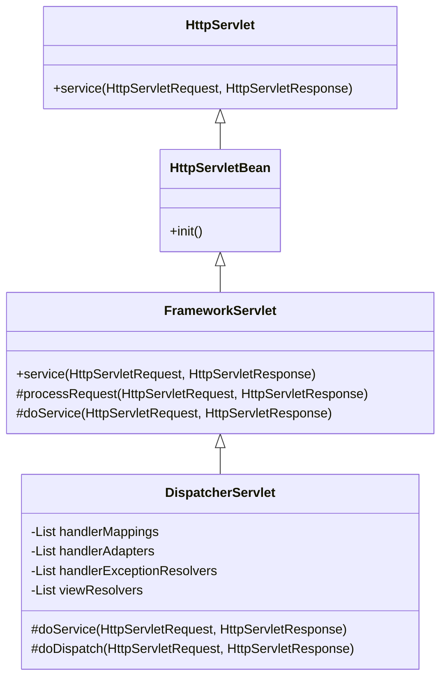
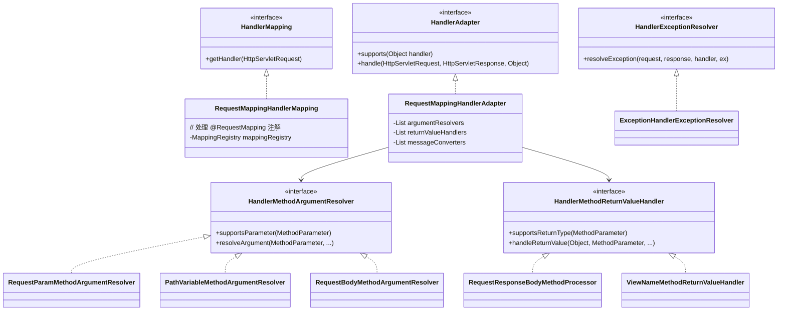
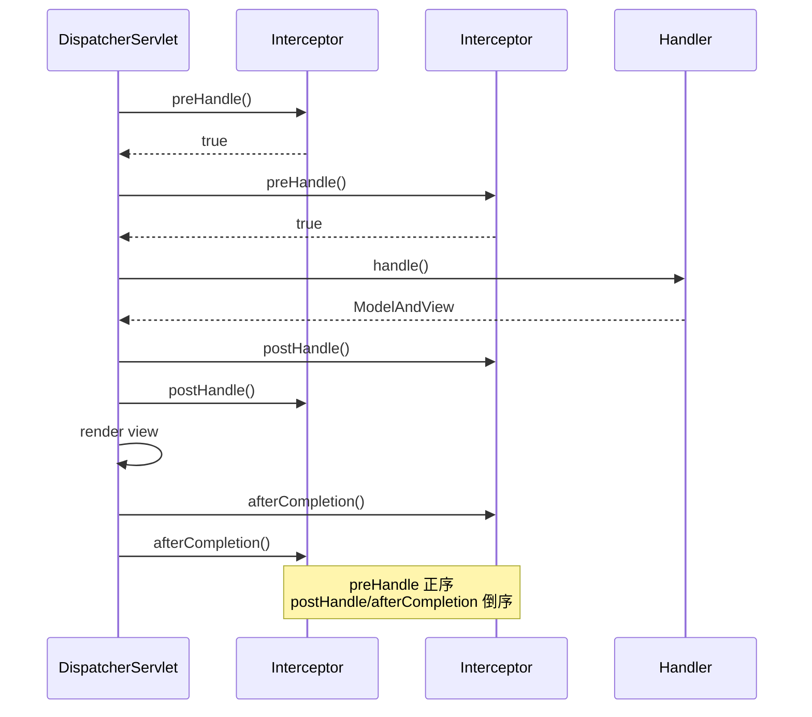

# Spring MVC

## 目标

理解 `DispatcherServlet` 的请求分发流程和核心组件协作机制。

## 核心类

- [DispatcherServlet.java](../../spring-webmvc/src/main/java/org/springframework/web/servlet/DispatcherServlet.java)
- [HandlerMapping.java](../../spring-webmvc/src/main/java/org/springframework/web/servlet/HandlerMapping.java)
- [RequestMappingHandlerMapping.java](../../spring-webmvc/src/main/java/org/springframework/web/servlet/mvc/method/annotation/RequestMappingHandlerMapping.java)
- [HandlerAdapter.java](../../spring-webmvc/src/main/java/org/springframework/web/servlet/HandlerAdapter.java)
- [RequestMappingHandlerAdapter.java](../../spring-webmvc/src/main/java/org/springframework/web/servlet/mvc/method/annotation/RequestMappingHandlerAdapter.java)
- [HandlerMethodArgumentResolver.java](../../spring-web/src/main/java/org/springframework/web/method/support/HandlerMethodArgumentResolver.java)
- [HandlerMethodReturnValueHandler.java](../../spring-web/src/main/java/org/springframework/web/method/support/HandlerMethodReturnValueHandler.java)
- [HandlerInterceptor.java](../../spring-webmvc/src/main/java/org/springframework/web/servlet/HandlerInterceptor.java)
- [HandlerExceptionResolver.java](../../spring-webmvc/src/main/java/org/springframework/web/servlet/HandlerExceptionResolver.java)
- [ViewResolver.java](../../spring-webmvc/src/main/java/org/springframework/web/servlet/ViewResolver.java)

## 类继承关系



## 核心组件



## 设计模式

| 模式 | 应用位置 | 说明 |
|------|---------|------|
| **前端控制器** | `DispatcherServlet` | 所有请求的统一入口 |
| **策略模式** | `HandlerMapping`、`HandlerAdapter` 等 | 不同的策略处理不同类型的请求 |
| **适配器模式** | `HandlerAdapter` | 统一调用不同类型的 Handler |
| **责任链** | `HandlerInterceptor` | 拦截器链顺序执行 |
| **组合模式** | `HandlerMethodArgumentResolverComposite` | 组合多个解析器 |
| **模板方法** | `FrameworkServlet.processRequest()` | 请求处理的标准骨架 |

## 核心源码分析

### DispatcherServlet 初始化

```java
// DispatcherServlet.java
@Override
protected void onRefresh(ApplicationContext context) {
    initStrategies(context);
}

protected void initStrategies(ApplicationContext context) {
    // 初始化九大组件
    initMultipartResolver(context);          // 文件上传解析器
    initLocaleResolver(context);             // 国际化解析器
    initThemeResolver(context);              // 主题解析器
    initHandlerMappings(context);            // 处理器映射器（找 Handler）
    initHandlerAdapters(context);            // 处理器适配器（调 Handler）
    initHandlerExceptionResolvers(context);  // 异常解析器
    initRequestToViewNameTranslator(context);// 视图名翻译器
    initViewResolvers(context);              // 视图解析器
    initFlashMapManager(context);            // Flash 属性管理
}
```

### doDispatch() — 请求分发核心

```java
// DispatcherServlet.java
protected void doDispatch(HttpServletRequest request, HttpServletResponse response) throws Exception {
    HttpServletRequest processedRequest = request;
    HandlerExecutionChain mappedHandler = null;
    boolean multipartRequestParsed = false;

    WebAsyncManager asyncManager = WebAsyncUtils.getAsyncManager(request);

    try {
        ModelAndView mv = null;
        Exception dispatchException = null;

        try {
            // 1. 检查是否是文件上传请求
            processedRequest = checkMultipart(request);
            multipartRequestParsed = (processedRequest != request);

            // 2. 查找 Handler（遍历所有 HandlerMapping）
            mappedHandler = getHandler(processedRequest);
            if (mappedHandler == null) {
                noHandlerFound(processedRequest, response);
                return;
            }

            // 3. 查找 HandlerAdapter（适配不同类型的 Handler）
            HandlerAdapter ha = getHandlerAdapter(mappedHandler.getHandler());

            // 4. 处理 Last-Modified（HTTP 缓存）
            String method = request.getMethod();
            boolean isGet = HttpMethod.GET.matches(method);
            if (isGet || HttpMethod.HEAD.matches(method)) {
                long lastModified = ha.getLastModified(request, mappedHandler.getHandler());
                if (new ServletWebRequest(request, response).checkNotModified(lastModified) && isGet) {
                    return;
                }
            }

            // 5. 执行拦截器 preHandle
            if (!mappedHandler.applyPreHandle(processedRequest, response)) {
                return;  // 拦截器返回 false，中断请求
            }

            // 6. 实际执行 Handler（Controller 方法）
            mv = ha.handle(processedRequest, response, mappedHandler.getHandler());

            // 7. 异步请求判断
            if (asyncManager.isConcurrentHandlingStarted()) {
                return;
            }

            // 8. 应用默认视图名（如果 Handler 没有返回视图名）
            applyDefaultViewName(processedRequest, mv);

            // 9. 执行拦截器 postHandle
            mappedHandler.applyPostHandle(processedRequest, response, mv);
        }
        catch (Exception ex) {
            dispatchException = ex;
        }
        catch (Throwable err) {
            dispatchException = new ServletException("Handler dispatch failed", err);
        }

        // 10. 处理分发结果（渲染视图或处理异常）
        processDispatchResult(processedRequest, response, mappedHandler, mv, dispatchException);
    }
    catch (Exception ex) {
        triggerAfterCompletion(processedRequest, response, mappedHandler, ex);
    }
    finally {
        if (asyncManager.isConcurrentHandlingStarted()) {
            if (mappedHandler != null) {
                mappedHandler.applyAfterConcurrentHandlingStarted(processedRequest, response);
            }
        } else {
            if (multipartRequestParsed) {
                cleanupMultipart(processedRequest);
            }
        }
    }
}
```

### getHandler() — 查找处理器

```java
// DispatcherServlet.java
protected HandlerExecutionChain getHandler(HttpServletRequest request) throws Exception {
    if (this.handlerMappings != null) {
        // 遍历所有 HandlerMapping，找到第一个匹配的
        for (HandlerMapping mapping : this.handlerMappings) {
            HandlerExecutionChain handler = mapping.getHandler(request);
            if (handler != null) {
                return handler;
            }
        }
    }
    return null;
}
```

`HandlerMapping` 返回的是 `HandlerExecutionChain`，包含：
- `handler`：实际处理器（如 `HandlerMethod`）
- `interceptors`：匹配的拦截器列表

### RequestMappingHandlerMapping — URL 到 Controller 方法的映射

```java
// RequestMappingHandlerMapping.java
// 在初始化时扫描所有 @Controller 类的 @RequestMapping 方法

@Override
protected boolean isHandler(Class<?> beanType) {
    return AnnotatedElementUtils.hasAnnotation(beanType, Controller.class) ||
           AnnotatedElementUtils.hasAnnotation(beanType, RequestMapping.class);
}

@Override
protected RequestMappingInfo getMappingForMethod(Method method, Class<?> handlerType) {
    // 解析方法上的 @RequestMapping（及 @GetMapping 等）
    RequestMappingInfo info = createRequestMappingInfo(method);
    if (info != null) {
        // 合并类级别的 @RequestMapping
        RequestMappingInfo typeInfo = createRequestMappingInfo(handlerType);
        if (typeInfo != null) {
            info = typeInfo.combine(info);
        }
    }
    return info;
}
```

### RequestMappingHandlerAdapter.handle() — 执行 Controller 方法

```java
// RequestMappingHandlerAdapter.java
@Override
protected ModelAndView handleInternal(HttpServletRequest request, HttpServletResponse response,
        HandlerMethod handlerMethod) throws Exception {

    ModelAndView mav;
    // 检查请求方法和 session 要求
    checkRequest(request);

    // 调用 Handler 方法
    mav = invokeHandlerMethod(request, response, handlerMethod);

    // 处理缓存头
    if (!response.containsHeader(HEADER_CACHE_CONTROL)) {
        prepareResponse(response);
    }
    return mav;
}

protected ModelAndView invokeHandlerMethod(HttpServletRequest request, HttpServletResponse response,
        HandlerMethod handlerMethod) throws Exception {

    ServletWebRequest webRequest = new ServletWebRequest(request, response);

    // 1. 创建 ServletInvocableHandlerMethod
    ServletInvocableHandlerMethod invocableMethod = createInvocableHandlerMethod(handlerMethod);

    // 2. 设置参数解析器（解析 @RequestParam、@PathVariable、@RequestBody 等）
    if (this.argumentResolvers != null) {
        invocableMethod.setHandlerMethodArgumentResolvers(this.argumentResolvers);
    }
    // 3. 设置返回值处理器（处理 @ResponseBody、ModelAndView、String 等）
    if (this.returnValueHandlers != null) {
        invocableMethod.setHandlerMethodReturnValueHandlers(this.returnValueHandlers);
    }

    // 4. 创建 ModelAndViewContainer
    ModelAndViewContainer mavContainer = new ModelAndViewContainer();

    // 5. 执行方法
    invocableMethod.invokeAndHandle(webRequest, mavContainer);

    // 6. 获取 ModelAndView
    return getModelAndView(mavContainer, ...);
}
```

### 参数解析 — HandlerMethodArgumentResolver

```java
// InvocableHandlerMethod.java
protected Object[] getMethodArgumentValues(NativeWebRequest request, ...) {
    MethodParameter[] parameters = getMethodParameters();
    Object[] args = new Object[parameters.length];

    for (int i = 0; i < parameters.length; i++) {
        MethodParameter parameter = parameters[i];

        // 找到支持该参数的解析器
        HandlerMethodArgumentResolver resolver = this.resolvers.getArgumentResolver(parameter);

        // 解析参数值
        args[i] = resolver.resolveArgument(parameter, mavContainer, request, ...);
    }
    return args;
}
```

### 常见参数解析器

| 解析器 | 处理注解/类型 | 数据来源 |
|--------|-------------|---------|
| `RequestParamMethodArgumentResolver` | `@RequestParam` | Query 参数 / Form |
| `PathVariableMethodArgumentResolver` | `@PathVariable` | URL 路径变量 |
| `RequestBodyMethodArgumentResolver` | `@RequestBody` | 请求体 JSON/XML |
| `RequestHeaderMethodArgumentResolver` | `@RequestHeader` | HTTP Header |
| `CookieValueMethodArgumentResolver` | `@CookieValue` | Cookie |
| `ModelAttributeMethodProcessor` | `@ModelAttribute` 或普通 POJO | Form / Query |
| `ServletRequestMethodArgumentResolver` | `HttpServletRequest` 等 | Servlet 对象 |

### 返回值处理 — HandlerMethodReturnValueHandler

```java
// HandlerMethodReturnValueHandlerComposite.java
public void handleReturnValue(Object returnValue, MethodParameter returnType,
        ModelAndViewContainer mavContainer, NativeWebRequest webRequest) {

    // 找到支持该返回类型的处理器
    HandlerMethodReturnValueHandler handler = selectHandler(returnValue, returnType);
    handler.handleReturnValue(returnValue, returnType, mavContainer, webRequest);
}
```

| 处理器 | 处理类型 | 行为 |
|--------|---------|------|
| `RequestResponseBodyMethodProcessor` | `@ResponseBody` | 使用 HttpMessageConverter 序列化写入响应体 |
| `ViewNameMethodReturnValueHandler` | `String`（视图名） | 设置视图名，后续由 ViewResolver 解析 |
| `ModelAndViewMethodReturnValueHandler` | `ModelAndView` | 直接使用 |
| `HttpEntityMethodProcessor` | `ResponseEntity` | 直接控制状态码和响应头 |
| `StreamingResponseBodyReturnValueHandler` | `StreamingResponseBody` | 异步流式响应 |

### @ResponseBody 处理流程

```java
// RequestResponseBodyMethodProcessor.java
@Override
public void handleReturnValue(Object returnValue, MethodParameter returnType,
        ModelAndViewContainer mavContainer, NativeWebRequest webRequest) {

    // 标记请求已处理（不需要视图渲染）
    mavContainer.setRequestHandled(true);

    ServletServerHttpRequest inputMessage = createInputMessage(webRequest);
    ServletServerHttpResponse outputMessage = createOutputMessage(webRequest);

    // 使用 HttpMessageConverter 将返回值写入响应
    writeWithMessageConverters(returnValue, returnType, inputMessage, outputMessage);
}
```

### HttpMessageConverter 选择

```java
// AbstractMessageConverterMethodProcessor.java
// 常见的 MessageConverter：
// - MappingJackson2HttpMessageConverter → JSON（application/json）
// - StringHttpMessageConverter → 纯文本（text/plain）
// - ByteArrayHttpMessageConverter → 二进制（application/octet-stream）
// - MappingJackson2XmlHttpMessageConverter → XML（application/xml）

// 选择逻辑：
// 1. 根据请求 Accept 头和 @RequestMapping(produces) 确定内容类型
// 2. 遍历所有 MessageConverter，找到支持该类型且能写入的
// 3. 调用 converter.write(returnValue, mediaType, outputMessage)
```

## 请求处理完整流程图

```mermaid
flowchart TD
    A[HTTP 请求] --> B[DispatcherServlet.doDispatch]
    B --> C[checkMultipart<br>文件上传检查]
    C --> D[getHandler<br>遍历 HandlerMapping]
    D --> E{找到 Handler?}
    E -->|否| F[404 Not Found]
    E -->|是| G[getHandlerAdapter<br>找适配器]

    G --> H[拦截器 preHandle]
    H --> I{全部返回 true?}
    I -->|否| J[中断请求]
    I -->|是| K[HandlerAdapter.handle]

    K --> L[参数解析<br>ArgumentResolver]
    L --> M[反射调用 Controller 方法]
    M --> N[返回值处理<br>ReturnValueHandler]

    N --> O{@ResponseBody?}
    O -->|是| P[HttpMessageConverter<br>序列化写入响应]
    O -->|否| Q[返回 ModelAndView]

    P --> R[拦截器 postHandle]
    Q --> R
    R --> S[processDispatchResult]
    S --> T{有异常?}
    T -->|是| U[HandlerExceptionResolver<br>处理异常]
    T -->|否| V{需要渲染视图?}
    V -->|是| W[ViewResolver 解析视图<br>View.render 渲染]
    V -->|否| X[直接返回响应]

    U --> Y[拦截器 afterCompletion]
    W --> Y
    X --> Y
    Y --> Z[响应返回客户端]
```

## 拦截器执行时序



## 异常处理机制

```java
// DispatcherServlet.java
private void processDispatchResult(HttpServletRequest request, HttpServletResponse response,
        HandlerExecutionChain mappedHandler, ModelAndView mv, Exception exception) {

    if (exception != null) {
        // 异常处理
        if (exception instanceof ModelAndViewDefiningException mavDefiningException) {
            mv = mavDefiningException.getModelAndView();
        } else {
            Object handler = (mappedHandler != null ? mappedHandler.getHandler() : null);
            mv = processHandlerException(request, response, handler, exception);
        }
    }

    // 渲染视图
    if (mv != null && !mv.wasCleared()) {
        render(mv, request, response);
    }

    // 触发 afterCompletion
    if (mappedHandler != null) {
        mappedHandler.triggerAfterCompletion(request, response, null);
    }
}
```

### @ExceptionHandler 处理流程

```java
// ExceptionHandlerExceptionResolver.java
// 查找 @ExceptionHandler 方法的顺序：
// 1. 当前 Controller 类中的 @ExceptionHandler 方法
// 2. @ControllerAdvice 类中的 @ExceptionHandler 方法

@Override
protected ModelAndView doResolveHandlerMethodException(HttpServletRequest request,
        HttpServletResponse response, HandlerMethod handlerMethod, Exception exception) {

    // 1. 查找匹配的 @ExceptionHandler 方法
    ServletInvocableHandlerMethod exceptionHandlerMethod = getExceptionHandlerMethod(handlerMethod, exception);

    if (exceptionHandlerMethod == null) {
        return null;
    }

    // 2. 设置参数解析器和返回值处理器
    exceptionHandlerMethod.setHandlerMethodArgumentResolvers(this.argumentResolvers);
    exceptionHandlerMethod.setHandlerMethodReturnValueHandlers(this.returnValueHandlers);

    // 3. 执行 @ExceptionHandler 方法
    exceptionHandlerMethod.invokeAndHandle(webRequest, mavContainer, exception, handlerMethod);

    // 4. 获取 ModelAndView
    return getModelAndView(mavContainer, ...);
}
```

## 常见面试题

### 1. DispatcherServlet 的请求处理流程？

1. 接收请求，进入 `doDispatch()`
2. 遍历 `HandlerMapping` 找到匹配的 Handler 和拦截器链
3. 找到对应的 `HandlerAdapter`
4. 执行拦截器 `preHandle()`
5. 通过 `HandlerAdapter` 调用 Controller 方法（参数解析 → 执行 → 返回值处理）
6. 执行拦截器 `postHandle()`
7. 渲染视图或直接返回响应
8. 执行拦截器 `afterCompletion()`

### 2. HandlerMapping 和 HandlerAdapter 为什么要分开？

- **HandlerMapping** 负责"找"——根据 URL 找到处理器（Handler 可以是 Controller 方法、Servlet、HttpRequestHandler 等）
- **HandlerAdapter** 负责"调"——统一调用不同类型的处理器

分离后可以灵活组合，一个 HandlerMapping 可以配合多种 HandlerAdapter，反之亦然。这是**策略模式**和**适配器模式**的典型应用。

### 3. @Controller 和 @RestController 的区别？

```java
// @RestController = @Controller + @ResponseBody
// @ResponseBody 使得所有方法的返回值直接序列化为响应体（不走视图解析）
```

### 4. 拦截器和过滤器的区别？

| 对比项 | Filter | HandlerInterceptor |
|--------|--------|-------------------|
| 规范 | Servlet 规范 | Spring 框架 |
| 作用范围 | 所有请求（含静态资源） | 只对 Handler 请求 |
| 能否获取 Handler | 否 | 是（preHandle 参数） |
| 能否获取异常 | 否 | 是（afterCompletion 参数） |
| Spring 注入 | 不方便 | 方便（本身就是 Bean） |
| 执行顺序 | 在 DispatcherServlet 之前 | 在 DispatcherServlet 内部 |

### 5. @RequestBody 如何将 JSON 转换为 Java 对象？

1. `RequestResponseBodyMethodProcessor` 处理 `@RequestBody` 参数
2. 根据请求的 `Content-Type` 头选择合适的 `HttpMessageConverter`
3. 对于 `application/json`，使用 `MappingJackson2HttpMessageConverter`
4. 调用 Jackson `ObjectMapper.readValue()` 反序列化

## 实战应用场景

### 场景 1：全局异常处理

```java
@RestControllerAdvice
public class GlobalExceptionHandler {

    @ExceptionHandler(BusinessException.class)
    public ResponseEntity<ErrorResponse> handleBusiness(BusinessException ex) {
        return ResponseEntity.status(HttpStatus.BAD_REQUEST)
            .body(new ErrorResponse(ex.getCode(), ex.getMessage()));
    }

    @ExceptionHandler(MethodArgumentNotValidException.class)
    public ResponseEntity<ErrorResponse> handleValidation(MethodArgumentNotValidException ex) {
        String message = ex.getBindingResult().getFieldErrors().stream()
            .map(e -> e.getField() + ": " + e.getDefaultMessage())
            .collect(Collectors.joining(", "));
        return ResponseEntity.badRequest().body(new ErrorResponse("VALIDATION_ERROR", message));
    }

    @ExceptionHandler(Exception.class)
    public ResponseEntity<ErrorResponse> handleGeneral(Exception ex) {
        log.error("未处理异常", ex);
        return ResponseEntity.status(HttpStatus.INTERNAL_SERVER_ERROR)
            .body(new ErrorResponse("INTERNAL_ERROR", "服务器内部错误"));
    }
}
```

### 场景 2：自定义参数解析器

```java
// 自定义注解：从 Token 中解析当前用户
@Target(ElementType.PARAMETER)
@Retention(RetentionPolicy.RUNTIME)
public @interface CurrentUser {}

public class CurrentUserArgumentResolver implements HandlerMethodArgumentResolver {
    @Override
    public boolean supportsParameter(MethodParameter parameter) {
        return parameter.hasParameterAnnotation(CurrentUser.class);
    }

    @Override
    public Object resolveArgument(MethodParameter parameter, ModelAndViewContainer mavContainer,
            NativeWebRequest webRequest, WebDataBinderFactory binderFactory) {
        String token = webRequest.getHeader("Authorization");
        return tokenService.parseUser(token);
    }
}

// 使用
@GetMapping("/profile")
public UserProfile getProfile(@CurrentUser User user) {
    return userService.getProfile(user.getId());
}
```

### 场景 3：自定义 HttpMessageConverter

```java
// 支持 CSV 格式响应
public class CsvHttpMessageConverter extends AbstractHttpMessageConverter<List<?>> {
    public CsvHttpMessageConverter() {
        super(new MediaType("text", "csv"));
    }

    @Override
    protected boolean supports(Class<?> clazz) {
        return List.class.isAssignableFrom(clazz);
    }

    @Override
    protected void writeInternal(List<?> list, HttpOutputMessage outputMessage) throws IOException {
        Writer writer = new OutputStreamWriter(outputMessage.getBody());
        // 将 List 转换为 CSV 格式
        csvWriter.write(list, writer);
        writer.flush();
    }
}
```

### 更多业务场景（低代码 & 审批流）

> 详见 [实战场景-低代码与审批流](../00-13-实战场景-低代码与审批流.md)

- **低代码 — 动态 API 路由**：自定义 `HandlerMapping` 拦截 `/api/models/{modelId}/data/**`，将用户创建的数据模型自动生成 CRUD API
- **审批流 — 自定义参数解析器**：`@CurrentTask` + `HandlerMethodArgumentResolver` 自动从请求中解析审批任务并校验权限
- **低代码 — 统一异常处理**：`@RestControllerAdvice` 统一处理表单校验、审批异常、租户异常、并发冲突等错误码

## 建议断点

- `DispatcherServlet.doDispatch(...)`
- `DispatcherServlet.getHandler(...)`
- `RequestMappingHandlerMapping.getHandlerInternal(...)`
- `RequestMappingHandlerAdapter.handleInternal(...)`
- `InvocableHandlerMethod.getMethodArgumentValues(...)`
- `RequestResponseBodyMethodProcessor.resolveArgument(...)` — @RequestBody
- `RequestResponseBodyMethodProcessor.handleReturnValue(...)` — @ResponseBody
- `ExceptionHandlerExceptionResolver.doResolveHandlerMethodException(...)`
- `HandlerExecutionChain.applyPreHandle(...)`

## 阶段目标

- [ ] 能说明从 HTTP 请求到 Controller 方法执行的完整路径
- [ ] 能理解 HandlerMapping、HandlerAdapter 的协作关系
- [ ] 能说明参数解析器和返回值处理器的工作机制
- [ ] 能理解拦截器的执行时序和异常处理流程
- [ ] 能说明 @ResponseBody 的序列化流程

## 学习笔记

<!-- 在这里记录你的阅读收获 -->
