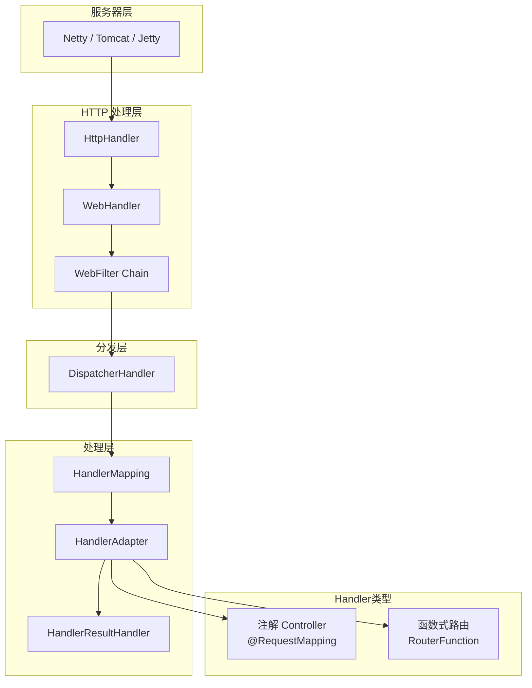
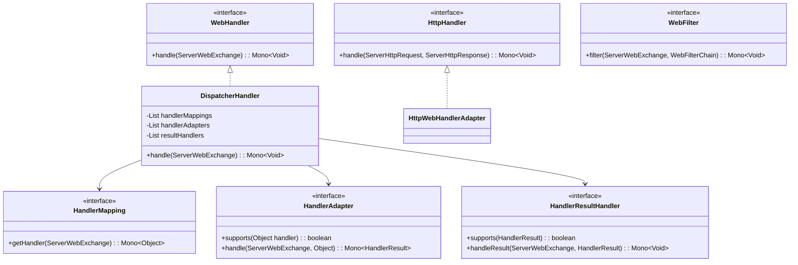
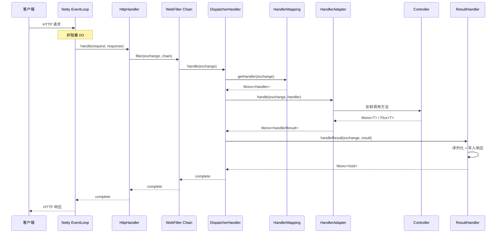

# WebFlux（响应式 Web 框架）

## 目标

理解 Spring WebFlux 的响应式请求处理模型和核心组件。

## 核心类

- [DispatcherHandler.java](../../spring-webflux/src/main/java/org/springframework/web/reactive/DispatcherHandler.java)
- [HandlerMapping.java](../../spring-webflux/src/main/java/org/springframework/web/reactive/HandlerMapping.java)
- [RequestMappingHandlerMapping.java](../../spring-webflux/src/main/java/org/springframework/web/reactive/result/method/annotation/RequestMappingHandlerMapping.java)
- [HandlerAdapter.java](../../spring-webflux/src/main/java/org/springframework/web/reactive/HandlerAdapter.java)
- [RequestMappingHandlerAdapter.java](../../spring-webflux/src/main/java/org/springframework/web/reactive/result/method/annotation/RequestMappingHandlerAdapter.java)
- [HandlerResultHandler.java](../../spring-webflux/src/main/java/org/springframework/web/reactive/HandlerResultHandler.java)
- [WebFilter.java](../../spring-web/src/main/java/org/springframework/web/server/WebFilter.java)
- [WebHandler.java](../../spring-web/src/main/java/org/springframework/web/server/WebHandler.java)
- [HttpHandler.java](../../spring-web/src/main/java/org/springframework/http/server/reactive/HttpHandler.java)
- [RouterFunction.java](../../spring-webflux/src/main/java/org/springframework/web/reactive/function/server/RouterFunction.java)

## WebFlux vs Spring MVC 对比

| 对比项 | Spring MVC | WebFlux |
|--------|-----------|---------|
| 编程模型 | 命令式（阻塞） | 响应式（非阻塞） |
| Servlet API | 依赖 | 不依赖 |
| 线程模型 | 每请求一线程 | 少量线程 + 事件循环 |
| 核心分发器 | `DispatcherServlet` | `DispatcherHandler` |
| 返回类型 | 普通对象 / ResponseEntity | `Mono<T>` / `Flux<T>` |
| 底层服务器 | Tomcat、Jetty | Netty、Tomcat、Jetty |
| 适用场景 | CRUD、传统 Web | 高并发、流式、微服务网关 |
| 数据库访问 | JDBC（阻塞） | R2DBC（响应式） |

## 核心架构



## 类关系图



## 设计模式

| 模式 | 应用位置 | 说明 |
|------|---------|------|
| **责任链** | `WebFilterChain` | 过滤器链式调用 |
| **策略模式** | `HandlerMapping`、`HandlerAdapter` | 不同的路由和处理策略 |
| **响应式流** | Reactor `Mono` / `Flux` | 背压、非阻塞数据流 |
| **函数式编程** | `RouterFunction` + `HandlerFunction` | 函数式路由定义 |
| **适配器** | `HttpWebHandlerAdapter` | 将 `WebHandler` 适配为 `HttpHandler` |

## 核心源码分析

### DispatcherHandler.handle() — 响应式分发

```java
// DispatcherHandler.java
@Override
public Mono<Void> handle(ServerWebExchange exchange) {
    if (this.handlerMappings == null) {
        return createNotFoundError();
    }

    // 响应式管道：HandlerMapping → HandlerAdapter → ResultHandler
    return Flux.fromIterable(this.handlerMappings)
        // 1. 遍历 HandlerMapping，找到第一个匹配的 Handler
        .concatMap(mapping -> mapping.getHandler(exchange))
        .next()
        // 2. 没找到 Handler → 404
        .switchIfEmpty(createNotFoundError())
        // 3. 通过 HandlerAdapter 执行 Handler
        .flatMap(handler -> invokeHandler(exchange, handler))
        // 4. 通过 HandlerResultHandler 处理结果
        .flatMap(result -> handleResult(exchange, result));
}

private Mono<HandlerResult> invokeHandler(ServerWebExchange exchange, Object handler) {
    // 找到支持该 Handler 的 Adapter
    for (HandlerAdapter adapter : this.handlerAdapters) {
        if (adapter.supports(handler)) {
            return adapter.handle(exchange, handler);
        }
    }
    return Mono.error(new IllegalStateException("No HandlerAdapter: " + handler));
}

private Mono<Void> handleResult(ServerWebExchange exchange, HandlerResult result) {
    // 找到支持该结果的 ResultHandler
    for (HandlerResultHandler resultHandler : this.resultHandlers) {
        if (resultHandler.supports(result)) {
            return resultHandler.handleResult(exchange, result);
        }
    }
    return Mono.error(new IllegalStateException("No HandlerResultHandler: " + result));
}
```

**关键点**：整个过程是**响应式**的，不阻塞任何线程。每一步都返回 `Mono` 或 `Flux`，通过操作符串联。

### WebFilter — 响应式过滤器

```java
// WebFilter.java
public interface WebFilter {
    Mono<Void> filter(ServerWebExchange exchange, WebFilterChain chain);
}

// 使用示例
@Component
public class LoggingWebFilter implements WebFilter {
    @Override
    public Mono<Void> filter(ServerWebExchange exchange, WebFilterChain chain) {
        long start = System.currentTimeMillis();
        String path = exchange.getRequest().getPath().value();

        return chain.filter(exchange)
            .doFinally(signal -> {
                long duration = System.currentTimeMillis() - start;
                log.info("{} {} - {}ms", exchange.getRequest().getMethod(), path, duration);
            });
    }
}
```

### WebFilterChain — 过滤器链执行

```java
// DefaultWebFilterChain.java
@Override
public Mono<Void> filter(ServerWebExchange exchange) {
    if (this.currentFilter != null && this.next != null) {
        // 调用当前 Filter，传入下一个链节点
        return this.currentFilter.filter(exchange, this.next);
    } else {
        // 所有 Filter 执行完毕，调用 WebHandler
        return this.handler.handle(exchange);
    }
}
```

### 函数式路由 — RouterFunction

```java
// 函数式编程风格定义路由
@Configuration
public class RouterConfig {
    @Bean
    public RouterFunction<ServerResponse> routes(UserHandler handler) {
        return RouterFunctions.route()
            .GET("/users", handler::listUsers)
            .GET("/users/{id}", handler::getUser)
            .POST("/users", handler::createUser)
            .PUT("/users/{id}", handler::updateUser)
            .DELETE("/users/{id}", handler::deleteUser)
            .filter(this::loggingFilter)
            .build();
    }

    private Mono<ServerResponse> loggingFilter(ServerRequest request,
            HandlerFunction<ServerResponse> next) {
        log.info("Request: {} {}", request.method(), request.path());
        return next.handle(request);
    }
}

@Component
public class UserHandler {
    @Autowired
    private UserRepository userRepository;

    public Mono<ServerResponse> getUser(ServerRequest request) {
        String id = request.pathVariable("id");
        return userRepository.findById(id)
            .flatMap(user -> ServerResponse.ok().bodyValue(user))
            .switchIfEmpty(ServerResponse.notFound().build());
    }

    public Mono<ServerResponse> listUsers(ServerRequest request) {
        Flux<User> users = userRepository.findAll();
        return ServerResponse.ok().body(users, User.class);
    }

    public Mono<ServerResponse> createUser(ServerRequest request) {
        return request.bodyToMono(User.class)
            .flatMap(userRepository::save)
            .flatMap(saved -> ServerResponse.created(URI.create("/users/" + saved.getId()))
                .bodyValue(saved));
    }
}
```

### ServerWebExchange — 请求/响应封装

```java
// ServerWebExchange 类似于 Servlet 的 HttpServletRequest + HttpServletResponse
public interface ServerWebExchange {
    ServerHttpRequest getRequest();       // 请求对象
    ServerHttpResponse getResponse();     // 响应对象
    Map<String, Object> getAttributes();  // 请求属性（替代 request.setAttribute）
    Mono<WebSession> getSession();        // 会话
    <T extends Principal> Mono<T> getPrincipal();  // 认证信息
    Mono<MultiValueMap<String, String>> getFormData();  // 表单数据
    Mono<MultiValueMap<String, Part>> getMultipartData(); // 文件上传
}
```

### 响应式参数解析

```java
// WebFlux 中的参数解析同样使用 HandlerMethodArgumentResolver
// 但返回 Mono<Object> 而不是 Object

public interface HandlerMethodArgumentResolver {
    boolean supportsParameter(MethodParameter parameter);
    Mono<Object> resolveArgument(MethodParameter parameter, BindingContext bindingContext,
            ServerWebExchange exchange);
}

// @RequestBody 在 WebFlux 中的处理
// AbstractMessageReaderArgumentResolver.java
// 使用 HttpMessageReader（而不是 HttpMessageConverter）读取请求体
// Jackson2JsonDecoder → 响应式 JSON 解码
```

## 请求处理流程图



## Reactor 核心概念

### Mono 和 Flux

```java
// Mono<T> — 0 或 1 个元素的响应式序列
Mono<User> user = userRepository.findById("123");

// Flux<T> — 0 到 N 个元素的响应式序列
Flux<User> users = userRepository.findAll();

// 操作符链
Mono<ServerResponse> response = userRepository.findById(id)
    .map(user -> enrich(user))              // 转换
    .flatMap(user -> validate(user))        // 异步转换
    .switchIfEmpty(Mono.error(new NotFoundException()))  // 空值处理
    .onErrorResume(ex -> fallback(ex))      // 异常恢复
    .timeout(Duration.ofSeconds(5));        // 超时控制
```

### 背压（Backpressure）

```java
// WebFlux 天然支持背压，客户端可以控制数据消费速率
@GetMapping(value = "/stream", produces = MediaType.TEXT_EVENT_STREAM_VALUE)
public Flux<Event> streamEvents() {
    return eventRepository.findAll()
        .delayElements(Duration.ofMillis(100));  // 模拟流式输出
}

// Server-Sent Events（SSE）支持
@GetMapping(value = "/notifications", produces = MediaType.TEXT_EVENT_STREAM_VALUE)
public Flux<ServerSentEvent<String>> notifications() {
    return notificationService.subscribe()
        .map(n -> ServerSentEvent.builder(n.getMessage())
            .id(n.getId())
            .event(n.getType())
            .build());
}
```

## WebFlux 线程模型

```mermaid
flowchart LR
    subgraph EventLoop线程#40;少量#41;
        A[接收连接]
        B[读取请求]
        C[分发处理]
        D[写入响应]
    end

    subgraph 工作线程池#40;可选#41;
        E[CPU 密集计算]
        F[阻塞调用]
    end

    A --> B --> C
    C -->|非阻塞| D
    C -->|阻塞操作| E
    C -->|阻塞操作| F
    E --> D
    F --> D

    Note1[默认：Netty 使用<br>CPU核心数 × 2 个<br>EventLoop 线程]
```

**关键原则**：
- ❌ 不要在 EventLoop 线程上执行阻塞操作
- ✅ 阻塞操作使用 `Schedulers.boundedElastic()` 切换线程
- ✅ 保持整个链路非阻塞

```java
// 错误示范：阻塞 EventLoop
@GetMapping("/bad")
public Mono<String> bad() {
    // ❌ Thread.sleep 会阻塞 EventLoop 线程！
    Thread.sleep(1000);
    return Mono.just("bad");
}

// 正确做法：切换到弹性线程池
@GetMapping("/good")
public Mono<String> good() {
    return Mono.fromCallable(() -> {
        Thread.sleep(1000);  // 在弹性线程池执行
        return "good";
    }).subscribeOn(Schedulers.boundedElastic());
}
```

## 常见面试题

### 1. WebFlux 的工作原理？

基于 Reactor 响应式编程模型，使用少量 EventLoop 线程处理大量并发请求：
1. 请求进入，EventLoop 线程分发到 `DispatcherHandler`
2. 通过 `HandlerMapping` 找到 Handler（返回 `Mono<Handler>`）
3. 通过 `HandlerAdapter` 执行（返回 `Mono<HandlerResult>`）
4. 通过 `HandlerResultHandler` 处理结果（返回 `Mono<Void>`）
5. 整个过程通过 Reactor 操作符链组合，不阻塞线程

### 2. 什么时候该用 WebFlux？什么时候用 MVC？

**用 WebFlux**：
- 高并发、I/O 密集型场景（如 API 网关、微服务聚合）
- 需要流式数据处理（SSE、WebSocket）
- 整个技术栈都支持非阻塞（R2DBC、WebClient）

**用 MVC**：
- 传统 CRUD 应用
- 依赖阻塞 API（JDBC、RestTemplate）
- 团队不熟悉响应式编程
- 调试和错误追踪需要清晰的调用栈

### 3. WebFlux 中如何处理阻塞调用？

```java
// 使用 Schedulers.boundedElastic() 隔离阻塞操作
public Mono<Data> fetchData() {
    return Mono.fromCallable(() -> {
        // 阻塞的 JDBC 调用
        return jdbcTemplate.queryForObject("SELECT ...", Data.class);
    }).subscribeOn(Schedulers.boundedElastic());
}
```

### 4. WebFlux 的 WebFilter 和 MVC 的 HandlerInterceptor 的区别？

| 对比项 | WebFilter | HandlerInterceptor |
|--------|----------|-------------------|
| 框架 | WebFlux | MVC |
| 返回值 | `Mono<Void>`（响应式） | void / boolean |
| 作用范围 | 所有请求 | 仅 Handler 请求 |
| 粒度 | 类似 Servlet Filter | 前置/后置/完成三阶段 |
| 执行位置 | DispatcherHandler 之前 | DispatcherHandler 内部 |

### 5. Mono 和 Flux 的区别？

- `Mono<T>`：0 或 1 个元素。适用于返回单个结果（如根据 ID 查询）
- `Flux<T>`：0 到 N 个元素。适用于返回多个结果（如列表查询、流式数据）

两者都是 Publisher 的实现，支持背压，通过操作符链组合。

## 实战应用场景

### 场景 1：WebClient 非阻塞 HTTP 调用

```java
@Service
public class AggregationService {
    private final WebClient webClient;

    public Mono<AggregatedResult> aggregate(String userId) {
        // 并行调用多个服务
        Mono<UserProfile> profile = webClient.get()
            .uri("/users/{id}/profile", userId)
            .retrieve()
            .bodyToMono(UserProfile.class);

        Mono<List<Order>> orders = webClient.get()
            .uri("/users/{id}/orders", userId)
            .retrieve()
            .bodyToFlux(Order.class)
            .collectList();

        Mono<List<Notification>> notifications = webClient.get()
            .uri("/users/{id}/notifications", userId)
            .retrieve()
            .bodyToFlux(Notification.class)
            .collectList();

        // 组合结果（并行执行，不阻塞）
        return Mono.zip(profile, orders, notifications)
            .map(tuple -> new AggregatedResult(tuple.getT1(), tuple.getT2(), tuple.getT3()));
    }
}
```

### 场景 2：响应式 WebSocket

```java
@Component
public class ChatWebSocketHandler implements WebSocketHandler {
    private final Sinks.Many<String> sink = Sinks.many().multicast().directBestEffort();

    @Override
    public Mono<Void> handle(WebSocketSession session) {
        // 接收消息并广播
        Mono<Void> input = session.receive()
            .map(WebSocketMessage::getPayloadAsText)
            .doOnNext(msg -> sink.tryEmitNext(msg))
            .then();

        // 发送广播消息给客户端
        Mono<Void> output = session.send(
            sink.asFlux()
                .map(session::textMessage));

        return Mono.zip(input, output).then();
    }
}
```

### 场景 3：响应式错误处理

```java
@RestControllerAdvice
public class ReactiveExceptionHandler {

    @ExceptionHandler(NotFoundException.class)
    @ResponseStatus(HttpStatus.NOT_FOUND)
    public Mono<ErrorResponse> handleNotFound(NotFoundException ex) {
        return Mono.just(new ErrorResponse("NOT_FOUND", ex.getMessage()));
    }

    @ExceptionHandler(WebExchangeBindException.class)
    @ResponseStatus(HttpStatus.BAD_REQUEST)
    public Mono<ErrorResponse> handleValidation(WebExchangeBindException ex) {
        String errors = ex.getFieldErrors().stream()
            .map(e -> e.getField() + ": " + e.getDefaultMessage())
            .collect(Collectors.joining(", "));
        return Mono.just(new ErrorResponse("VALIDATION_ERROR", errors));
    }
}
```

### 场景 4：全局 WebFilter — 请求追踪

```java
@Component
@Order(Ordered.HIGHEST_PRECEDENCE)
public class TraceWebFilter implements WebFilter {
    @Override
    public Mono<Void> filter(ServerWebExchange exchange, WebFilterChain chain) {
        String traceId = exchange.getRequest().getHeaders()
            .getFirst("X-Trace-Id");
        if (traceId == null) {
            traceId = UUID.randomUUID().toString();
        }

        // 将 traceId 放入响应头和上下文
        exchange.getResponse().getHeaders().set("X-Trace-Id", traceId);
        String finalTraceId = traceId;

        return chain.filter(exchange)
            .contextWrite(ctx -> ctx.put("traceId", finalTraceId));
    }
}
```

### 更多业务场景（低代码 & 审批流）

> 详见 [实战场景-低代码与审批流](../00-13-实战场景-低代码与审批流.md)

- **审批流 — SSE 实时审批进度推送**：基于 Reactor Sinks 的事件总线，审批详情页通过 SSE 实时接收审批状态更新
- **低代码 — 流式数据导出**：使用 `Flux<DataBuffer>` 流式输出百万级 CSV 数据，避免 OOM
- **低代码 — WebClient 仪表盘数据聚合**：并行调用多个数据源 API + SQL 查询，单个组件失败不影响整个仪表盘

## 建议断点

- `DispatcherHandler.handle(...)`
- `RequestMappingHandlerMapping.getHandlerInternal(...)`
- `RequestMappingHandlerAdapter.handle(...)`
- `InvocableHandlerMethod.invoke(...)` — WebFlux 版本
- `AbstractMessageReaderArgumentResolver.readBody(...)` — @RequestBody
- `ResponseBodyResultHandler.handleResult(...)` — @ResponseBody
- `DefaultWebFilterChain.filter(...)`

## 阶段目标

- [ ] 能说明 WebFlux 的请求处理流程与 MVC 的异同
- [ ] 能理解 DispatcherHandler 的响应式分发机制
- [ ] 能理解 WebFilter 链的工作方式
- [ ] 能说明函数式路由（RouterFunction）的用法
- [ ] 能理解 WebFlux 的线程模型和背压机制

## 学习笔记

<!-- 在这里记录你的阅读收获 -->
