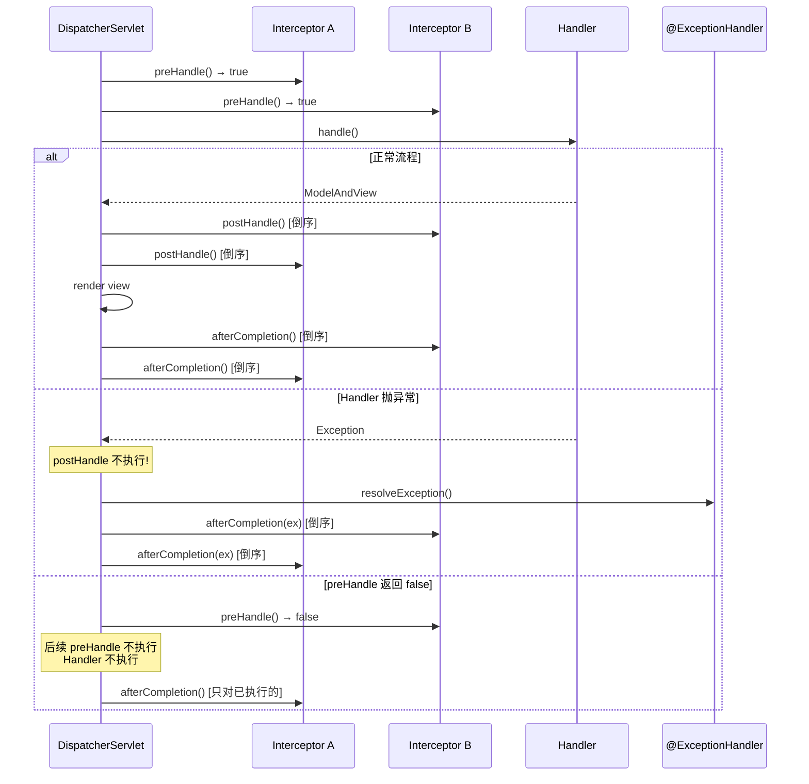

# Day 4 - 异常处理与拦截器

## 今日目标

理解 Spring MVC 异常处理机制（@ExceptionHandler / @ControllerAdvice）和拦截器执行时序。

## 核心类

- [HandlerExceptionResolver.java](../../spring-webmvc/src/main/java/org/springframework/web/servlet/HandlerExceptionResolver.java)
- [ExceptionHandlerExceptionResolver.java](../../spring-webmvc/src/main/java/org/springframework/web/servlet/mvc/method/annotation/ExceptionHandlerExceptionResolver.java)
- [ExceptionHandlerMethodResolver.java](../../spring-web/src/main/java/org/springframework/web/method/annotation/ExceptionHandlerMethodResolver.java)
- [ControllerAdviceBean.java](../../spring-web/src/main/java/org/springframework/web/method/ControllerAdviceBean.java)
- [HandlerInterceptor.java](../../spring-webmvc/src/main/java/org/springframework/web/servlet/HandlerInterceptor.java)
- [HandlerExecutionChain.java](../../spring-webmvc/src/main/java/org/springframework/web/servlet/HandlerExecutionChain.java)
- [MappedInterceptor.java](../../spring-webmvc/src/main/java/org/springframework/web/servlet/handler/MappedInterceptor.java)

## 阅读路径

### 异常处理

```text
DispatcherServlet.doDispatch()
  → try { ha.handle() } catch (Exception ex) { dispatchException = ex; }
  → processDispatchResult(request, response, mappedHandler, mv, dispatchException)
    → processHandlerException(request, response, handler, ex)
      → 遍历 handlerExceptionResolvers:
        → ExceptionHandlerExceptionResolver.resolveException()
          → doResolveHandlerMethodException()
            → getExceptionHandlerMethod(handlerMethod, exception)
              → 1. 先在当前 Controller 类中查找 @ExceptionHandler
              → 2. 再在 @ControllerAdvice 类中查找
            → 执行 @ExceptionHandler 方法（复用参数解析和返回值处理）
```

### 拦截器

```text
DispatcherServlet.doDispatch()
  → mappedHandler.applyPreHandle(request, response)
    → for (int i = 0; i < interceptors.length; i++)
      → interceptor.preHandle(request, response, handler)
      → 如果返回 false: triggerAfterCompletion() 并中断

  → ha.handle(request, response, handler)  // 执行 Controller

  → mappedHandler.applyPostHandle(request, response, mv)
    → for (int i = interceptors.length - 1; i >= 0; i--)  // 倒序！
      → interceptor.postHandle(request, response, handler, mv)

  → processDispatchResult()  // 渲染视图
    → mappedHandler.triggerAfterCompletion(request, response, ex)
      → for (int i = this.interceptorIndex; i >= 0; i--)  // 倒序！
        → interceptor.afterCompletion(request, response, handler, ex)
```

## 关键代码片段

### @ExceptionHandler 方法查找

```java
// ExceptionHandlerExceptionResolver.java
protected ServletInvocableHandlerMethod getExceptionHandlerMethod(
        HandlerMethod handlerMethod, Exception exception) {

    Class<?> handlerType = handlerMethod.getBeanType();

    // 1. 当前 Controller 类中查找
    ExceptionHandlerMethodResolver resolver = this.exceptionHandlerCache.get(handlerType);
    if (resolver == null) {
        resolver = new ExceptionHandlerMethodResolver(handlerType);
        this.exceptionHandlerCache.put(handlerType, resolver);
    }
    Method method = resolver.resolveMethod(exception);
    if (method != null) {
        return new ServletInvocableHandlerMethod(handlerMethod.getBean(), method, ...);
    }

    // 2. @ControllerAdvice 类中查找
    for (Map.Entry<ControllerAdviceBean, ExceptionHandlerMethodResolver> entry :
            this.exceptionHandlerAdviceCache.entrySet()) {
        ControllerAdviceBean advice = entry.getKey();
        // 检查 @ControllerAdvice 的 basePackages/assignableTypes/annotations 是否匹配
        if (advice.isApplicableToBeanType(handlerType)) {
            ExceptionHandlerMethodResolver adviceResolver = entry.getValue();
            method = adviceResolver.resolveMethod(exception);
            if (method != null) {
                return new ServletInvocableHandlerMethod(advice.resolveBean(), method, ...);
            }
        }
    }
    return null;
}
```

### 异常类型匹配规则

```java
// ExceptionHandlerMethodResolver.java
// @ExceptionHandler 方法的匹配规则：
// 1. 精确匹配异常类型
// 2. 匹配父类异常（就近原则）
// 3. 多个匹配时选最具体的（异常继承深度最浅的）

public Method resolveMethod(Exception exception) {
    return resolveMethodByExceptionType(exception.getClass());
}

private Method resolveMethodByExceptionType(Class<? extends Throwable> exceptionType) {
    Method method = this.mappedMethods.get(exceptionType);
    if (method == null) {
        // 查找能处理该异常（含父类）的方法
        method = getMappedMethod(exceptionType);
        this.mappedMethods.put(exceptionType, method);
    }
    return method;
}
```

### 拦截器执行 — preHandle

```java
// HandlerExecutionChain.java
boolean applyPreHandle(HttpServletRequest request, HttpServletResponse response) throws Exception {
    for (int i = 0; i < this.interceptorList.size(); i++) {
        HandlerInterceptor interceptor = this.interceptorList.get(i);
        if (!interceptor.preHandle(request, response, this.handler)) {
            // 返回 false → 触发已执行拦截器的 afterCompletion
            triggerAfterCompletion(request, response, null);
            return false;
        }
        this.interceptorIndex = i;  // 记录执行到哪个拦截器
    }
    return true;
}
```

## 拦截器执行时序图



## 建议断点

- `DispatcherServlet.processHandlerException(...)`
- `ExceptionHandlerExceptionResolver.doResolveHandlerMethodException(...)`
- `ExceptionHandlerExceptionResolver.getExceptionHandlerMethod(...)`
- `ExceptionHandlerMethodResolver.resolveMethod(...)`
- `HandlerExecutionChain.applyPreHandle(...)`
- `HandlerExecutionChain.applyPostHandle(...)`
- `HandlerExecutionChain.triggerAfterCompletion(...)`

## 调试步骤

1. 编写 @ControllerAdvice + @ExceptionHandler，处理不同异常类型
2. 在 `getExceptionHandlerMethod()` 设置断点，观察查找顺序
3. 制造 Controller 内的 @ExceptionHandler 和 @ControllerAdvice 同时匹配，验证优先级
4. 编写两个拦截器，在各回调方法打日志，验证执行顺序
5. 在第二个拦截器 preHandle 返回 false，验证 afterCompletion 只执行已通过的拦截器

## 今日产出

- [ ] 能说明异常处理方法的查找顺序和匹配规则
- [ ] 能理解 @ControllerAdvice 的作用域过滤机制
- [ ] 能画出拦截器正常/异常/中断三种场景的执行时序
- [ ] 能说明 postHandle 在异常时不执行但 afterCompletion 始终执行

## 学习笔记

<!-- 在这里记录 -->
