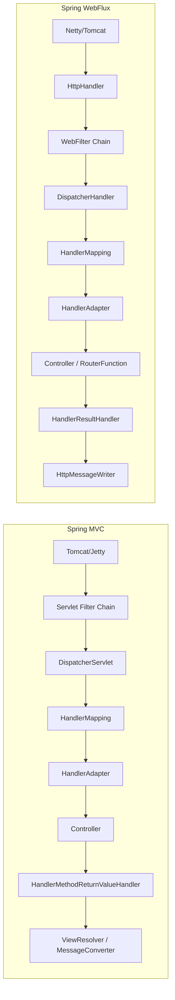
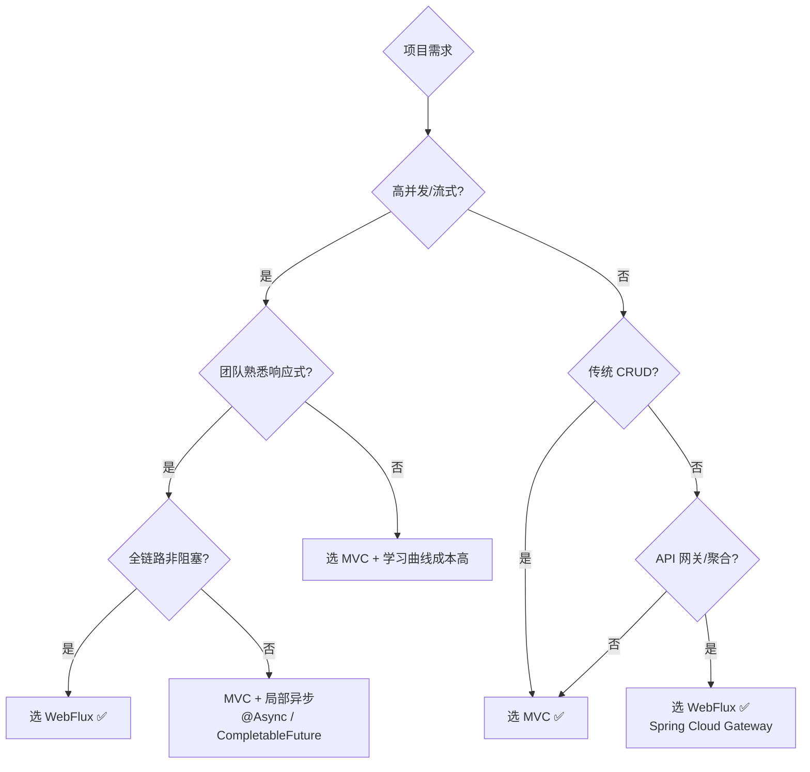

# Day 7 - MVC vs WebFlux 联合复盘

## 今日目标

从全局视角对比两种 Web 框架的设计哲学、架构差异和适用场景，形成完整的知识体系。

## 架构对比全景图



## 核心差异对照表

| 维度 | Spring MVC | Spring WebFlux |
|------|-----------|----------------|
| **编程范式** | 命令式（同步阻塞） | 响应式（异步非阻塞） |
| **底层容器** | Servlet Container | HttpHandler（独立于 Servlet） |
| **线程模型** | 每请求一线程（Thread-per-request） | EventLoop（少量线程） |
| **核心分发** | `DispatcherServlet.doDispatch()` | `DispatcherHandler.handle()` |
| **返回值** | `Object` / `ModelAndView` | `Mono<T>` / `Flux<T>` |
| **请求封装** | `HttpServletRequest` | `ServerWebExchange` |
| **过滤机制** | `Filter` + `HandlerInterceptor` | `WebFilter` |
| **消息转换** | `HttpMessageConverter` | `HttpMessageReader/Writer` |
| **路由方式** | `@RequestMapping` 注解 | 注解 + `RouterFunction` |
| **异常处理** | `HandlerExceptionResolver` | `WebExceptionHandler` |
| **背压支持** | 不支持 | 天然支持（Reactive Streams） |
| **调用栈** | 完整清晰 | 操作符链（调试较难） |

## 请求处理流程对比

### MVC — 同步顺序执行

```java
// 伪代码，体现同步特征
void doDispatch(request, response) {
    handler = getHandler(request);           // 同步查找
    adapter = getHandlerAdapter(handler);    // 同步查找
    applyPreHandle(request, response);       // 同步拦截器
    mv = adapter.handle(request, response, handler);  // 同步执行（线程阻塞等待 DB/RPC）
    applyPostHandle(request, response, mv);  // 同步后置
    render(mv, request, response);           // 同步渲染
}
```

### WebFlux — 响应式管道

```java
// 伪代码，体现异步非阻塞特征
Mono<Void> handle(exchange) {
    return findHandler(exchange)              // Mono<Handler>
        .flatMap(h -> invokeHandler(h))      // Mono<HandlerResult> — 不阻塞线程
        .flatMap(r -> handleResult(r));      // Mono<Void> — 异步写入响应
    // 整个链路没有阻塞点，线程可以去处理其他请求
}
```

## 线程模型对比

### MVC — Thread-per-request

```text
线程池（200 个线程）:
  Thread-1: 处理请求 A（等待 DB 100ms）→ 响应 A
  Thread-2: 处理请求 B（等待 RPC 200ms）→ 响应 B
  Thread-3: 处理请求 C（等待 DB 50ms）→ 响应 C
  ...
  Thread-200: 处理请求 200
  请求 201: 等待线程释放... ← 线程耗尽！

问题：I/O 等待时线程被占用，高并发下线程成为瓶颈
```

### WebFlux — EventLoop

```text
EventLoop 线程（8 个，= CPU 核心数）:
  EventLoop-1: 接收请求 A → 发起 DB 查询 → 注册回调 → 处理请求 B → 发起 RPC → ...
               ← DB 结果返回 → 继续处理 A → 写响应 A
               ← RPC 结果返回 → 继续处理 B → 写响应 B

优势：线程不等待 I/O，8 个线程可以处理数万并发
约束：不能在 EventLoop 上执行阻塞操作！
```

## 技术选型决策树



## 常见面试题

### 1. MVC 和 WebFlux 可以共存吗？

不能在同一个应用中同时使用两套 Web 框架。但可以：
- MVC 应用中使用 `WebClient`（替代 RestTemplate）
- 微服务架构中，不同服务选择不同框架

### 2. WebFlux 一定比 MVC 性能好吗？

**不一定**。WebFlux 的优势在于**吞吐量**（相同硬件能处理更多并发），而非**延迟**。
- CPU 密集型任务：WebFlux 没有优势
- I/O 密集 + 高并发：WebFlux 优势明显
- 简单 CRUD + 中等并发：MVC 够用，且更易维护

### 3. WebFlux 中如何调试？

```java
// 1. 使用 .log() 操作符
userRepository.findById(id)
    .log("findUser")  // 打印 Reactor 信号
    .flatMap(...)

// 2. 使用 Hooks.onOperatorDebug()（开发环境）
// 会记录完整的操作符组装调用栈，但有性能开销

// 3. 使用 checkpoint()
Mono.just(data)
    .map(this::transform)
    .checkpoint("transform 之后")  // 标记检查点
    .flatMap(...)

// 4. BlockHound 检测阻塞调用
// 在测试环境安装，自动发现 EventLoop 上的阻塞操作
```

### 4. 为什么 Spring Cloud Gateway 选择 WebFlux？

API 网关的特点：
- 高并发（所有请求都经过网关）
- I/O 密集（转发请求到下游服务）
- 不做 CPU 密集计算
- 需要流式处理（大文件透传）

这正是 WebFlux 最擅长的场景。

### 5. @Controller 在 WebFlux 中的行为变化？

```java
// 同一个注解，在 MVC 和 WebFlux 中行为不同

// MVC: 返回值直接是结果
@GetMapping("/user/{id}")
public User getUser(@PathVariable String id) {
    return userService.findById(id);  // 阻塞调用
}

// WebFlux: 返回 Mono/Flux，框架订阅后执行
@GetMapping("/user/{id}")
public Mono<User> getUser(@PathVariable String id) {
    return userService.findById(id);  // 非阻塞，返回后不会立即执行
}
```

## 三周学习路径回顾

```mermaid
flowchart TD
    subgraph 第一周: IoC 与 Bean 生命周期
        W1A[BeanDefinition 注册] --> W1B[Bean 创建流程]
        W1B --> W1C[依赖注入]
        W1C --> W1D[生命周期回调]
        W1D --> W1E[事件与资源]
    end

    subgraph 第二周: AOP 与事务
        W2A[代理创建] --> W2B[Advisor 匹配]
        W2B --> W2C[拦截器链]
        W2C --> W2D[@Transactional 拦截]
        W2D --> W2E[传播行为]
        W2E --> W2F[连接管理]
    end

    subgraph 第三周: MVC 与 WebFlux
        W3A[DispatcherServlet] --> W3B[路由匹配]
        W3B --> W3C[参数/返回值]
        W3C --> W3D[异常/拦截器]
        W3D --> W3E[DispatcherHandler]
        W3E --> W3F[响应式/函数式]
    end

    W1E --> W2A
    W2F --> W3A
```

## 本周总结 Checklist

### MVC 部分
- [ ] 能说明 DispatcherServlet 初始化和请求分发流程
- [ ] 能说明 HandlerMapping 的注册和匹配机制
- [ ] 能说明参数解析器和返回值处理器的工作原理
- [ ] 能说明异常处理和拦截器的执行时序

### WebFlux 部分
- [ ] 能说明 DispatcherHandler 的响应式分发流程
- [ ] 能对比 MVC 和 WebFlux 的核心组件差异
- [ ] 能使用 RouterFunction 定义函数式路由
- [ ] 能说明 WebFlux 的线程模型和适用场景

### 综合
- [ ] 能根据项目需求选择 MVC 或 WebFlux
- [ ] 能说明 WebFlux 的优势和局限性
- [ ] 能从头到尾追踪一个 HTTP 请求的完整处理链路

## 学习笔记

<!-- 在这里记录三周总结 -->
