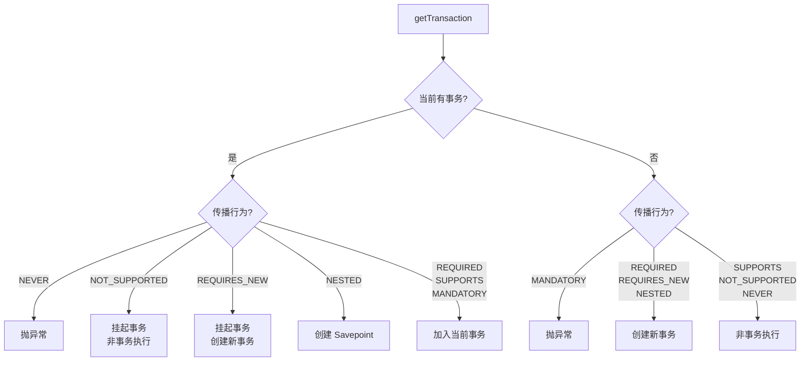

# Day 5 - 事务传播行为实现

## 今日目标

理解七种传播行为在 `AbstractPlatformTransactionManager.getTransaction()` 中的具体实现，尤其是 REQUIRED、REQUIRES_NEW 和 NESTED 的区别。

## 核心类

- [AbstractPlatformTransactionManager.java](../../spring-tx/src/main/java/org/springframework/transaction/support/AbstractPlatformTransactionManager.java)
- [DataSourceTransactionManager.java](../../spring-jdbc/src/main/java/org/springframework/jdbc/datasource/DataSourceTransactionManager.java)
- [TransactionDefinition.java](../../spring-tx/src/main/java/org/springframework/transaction/TransactionDefinition.java)
- [DefaultTransactionStatus.java](../../spring-tx/src/main/java/org/springframework/transaction/support/DefaultTransactionStatus.java)

## 阅读路径

```text
TransactionAspectSupport.createTransactionIfNecessary()
  → PlatformTransactionManager.getTransaction(TransactionDefinition)
    → AbstractPlatformTransactionManager.getTransaction()
      → doGetTransaction()  // 获取当前事务对象（DataSourceTransactionObject）
      → isExistingTransaction(transaction)  // 判断是否已有事务

      [已有事务]:
        → handleExistingTransaction(definition, transaction)
          → NEVER: 抛异常
          → NOT_SUPPORTED: suspend(transaction) + 非事务执行
          → REQUIRES_NEW: suspend(transaction) + startTransaction()
          → NESTED: createAndHoldSavepoint()
          → REQUIRED/SUPPORTS/MANDATORY: 加入当前事务

      [没有事务]:
        → MANDATORY: 抛异常
        → REQUIRED/REQUIRES_NEW/NESTED: startTransaction()
        → SUPPORTS/NOT_SUPPORTED/NEVER: 非事务执行
```

## 关键代码片段

### DataSourceTransactionManager.doGetTransaction()

```java
// DataSourceTransactionManager.java
@Override
protected Object doGetTransaction() {
    DataSourceTransactionObject txObject = new DataSourceTransactionObject();
    txObject.setSavepointAllowed(isNestedTransactionAllowed());
    // 从 ThreadLocal 获取当前线程绑定的数据库连接
    ConnectionHolder conHolder = TransactionSynchronizationManager.getResource(obtainDataSource());
    txObject.setConnectionHolder(conHolder, false);
    return txObject;
}

@Override
protected boolean isExistingTransaction(Object transaction) {
    DataSourceTransactionObject txObject = (DataSourceTransactionObject) transaction;
    // 如果 ConnectionHolder 存在且事务已激活，说明已有事务
    return (txObject.hasConnectionHolder() && txObject.getConnectionHolder().isTransactionActive());
}
```

### doBegin() — 开启新事务

```java
// DataSourceTransactionManager.java
@Override
protected void doBegin(Object transaction, TransactionDefinition definition) {
    DataSourceTransactionObject txObject = (DataSourceTransactionObject) transaction;

    Connection con = null;
    try {
        // 1. 获取新连接
        if (!txObject.hasConnectionHolder()) {
            Connection newCon = obtainDataSource().getConnection();
            txObject.setConnectionHolder(new ConnectionHolder(newCon), true);
        }
        con = txObject.getConnectionHolder().getConnection();

        // 2. 设置隔离级别
        Integer previousIsolationLevel = DataSourceUtils.prepareConnectionForTransaction(con, definition);
        txObject.setPreviousIsolationLevel(previousIsolationLevel);

        // 3. 关闭自动提交！
        if (con.getAutoCommit()) {
            txObject.setMustRestoreAutoCommit(true);
            con.setAutoCommit(false);
        }

        // 4. 标记事务激活
        txObject.getConnectionHolder().setTransactionActive(true);

        // 5. 设置超时
        int timeout = determineTimeout(definition);
        if (timeout != TransactionDefinition.TIMEOUT_DEFAULT) {
            txObject.getConnectionHolder().setTimeoutInSeconds(timeout);
        }

        // 6. 将连接绑定到 ThreadLocal（关键！后续 DAO 操作通过此获取连接）
        if (txObject.isNewConnectionHolder()) {
            TransactionSynchronizationManager.bindResource(obtainDataSource(), txObject.getConnectionHolder());
        }
    } catch (Throwable ex) {
        // 异常处理...
    }
}
```

### suspend() — 挂起事务

```java
// AbstractPlatformTransactionManager.java
protected final SuspendedResourcesHolder suspend(Object transaction) {
    if (TransactionSynchronizationManager.isSynchronizationActive()) {
        List<TransactionSynchronization> suspendedSynchronizations = doSuspendSynchronization();
        Object suspendedResources = null;
        if (transaction != null) {
            // 解绑当前连接（从 ThreadLocal 移除）
            suspendedResources = doSuspend(transaction);
        }
        // 保存当前事务上下文（名称、readOnly、隔离级别等）
        String name = TransactionSynchronizationManager.getCurrentTransactionName();
        TransactionSynchronizationManager.setCurrentTransactionName(null);
        boolean readOnly = TransactionSynchronizationManager.isCurrentTransactionReadOnly();
        TransactionSynchronizationManager.setCurrentTransactionReadOnly(false);
        // ... 保存并清理所有事务状态
        return new SuspendedResourcesHolder(suspendedResources, suspendedSynchronizations, name, readOnly, ...);
    }
}
```

## 传播行为决策流程图



## 建议断点

- `AbstractPlatformTransactionManager.getTransaction(...)`
- `AbstractPlatformTransactionManager.handleExistingTransaction(...)`
- `AbstractPlatformTransactionManager.suspend(...)`
- `AbstractPlatformTransactionManager.startTransaction(...)`
- `DataSourceTransactionManager.doGetTransaction()`
- `DataSourceTransactionManager.doBegin(...)`
- `DefaultTransactionStatus.createAndHoldSavepoint()`

## 调试步骤

1. 编写两个嵌套的 @Transactional 方法，外层 REQUIRED，内层 REQUIRES_NEW
2. 在 `getTransaction()` 设置断点，观察第二次进入时的执行路径
3. 观察 `suspend()` 如何保存和清理当前事务状态
4. 观察 `doBegin()` 如何从 DataSource 获取新连接
5. 修改内层为 NESTED，观察 Savepoint 的创建

## 今日产出

- [ ] 能画出传播行为的决策树
- [ ] 能说明 REQUIRES_NEW 的挂起/恢复机制
- [ ] 能说明 NESTED 的 Savepoint 创建过程
- [ ] 能理解事务连接是如何通过 ThreadLocal 绑定和传递的

## 学习笔记

<!-- 在这里记录 -->
