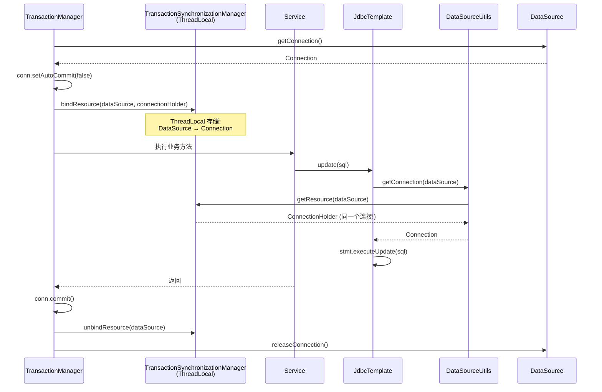

# Day 6 - 事务同步与连接管理

## 今日目标

理解事务信息如何通过 ThreadLocal 在调用链中传递，以及 `TransactionSynchronization` 回调机制。

## 核心类

- [TransactionSynchronizationManager.java](../../spring-tx/src/main/java/org/springframework/transaction/support/TransactionSynchronizationManager.java)
- [TransactionSynchronization.java](../../spring-tx/src/main/java/org/springframework/transaction/support/TransactionSynchronization.java)
- [DataSourceUtils.java](../../spring-jdbc/src/main/java/org/springframework/jdbc/datasource/DataSourceUtils.java)
- [ConnectionHolder.java](../../spring-jdbc/src/main/java/org/springframework/jdbc/datasource/ConnectionHolder.java)
- [TransactionTemplate.java](../../spring-tx/src/main/java/org/springframework/transaction/support/TransactionTemplate.java)

## 阅读路径

```text
事务开启:
  DataSourceTransactionManager.doBegin()
    → TransactionSynchronizationManager.bindResource(dataSource, connectionHolder)
      → 将 Connection 绑定到当前线程 ThreadLocal

DAO 操作获取连接:
  JdbcTemplate.execute()
    → DataSourceUtils.getConnection(dataSource)
      → TransactionSynchronizationManager.getResource(dataSource)
        → 从 ThreadLocal 获取同一个 Connection（保证事务一致性！）

事务同步回调:
  AbstractPlatformTransactionManager.processCommit()
    → triggerBeforeCommit(status)
    → triggerBeforeCompletion(status)
    → doCommit(status)
    → triggerAfterCommit(status)
    → triggerAfterCompletion(status, STATUS_COMMITTED)
```

## 关键代码片段

### TransactionSynchronizationManager — ThreadLocal 结构

```java
// TransactionSynchronizationManager.java
// 资源绑定：DataSource → ConnectionHolder
private static final ThreadLocal<Map<Object, Object>> resources = new NamedThreadLocal<>("Transactional resources");

// 事务同步回调列表
private static final ThreadLocal<Set<TransactionSynchronization>> synchronizations = new NamedThreadLocal<>("Transaction synchronizations");

// 绑定资源
public static void bindResource(Object key, Object value) {
    Map<Object, Object> map = resources.get();
    if (map == null) {
        map = new HashMap<>();
        resources.set(map);
    }
    map.put(actualKey, value);
}

// 获取资源（DAO 通过这个拿到事务中的 Connection）
public static Object getResource(Object key) {
    Map<Object, Object> map = resources.get();
    if (map == null) return null;
    return map.get(actualKey);
}
```

### DataSourceUtils.getConnection() — DAO 获取连接

```java
// DataSourceUtils.java
public static Connection getConnection(DataSource dataSource) {
    // 1. 从 ThreadLocal 获取当前事务绑定的连接
    ConnectionHolder conHolder = TransactionSynchronizationManager.getResource(dataSource);
    if (conHolder != null && conHolder.hasConnection()) {
        conHolder.requested();
        return conHolder.getConnection();  // 返回事务中的同一个连接！
    }
    // 2. 没有事务绑定，从 DataSource 获取新连接
    Connection con = dataSource.getConnection();
    // 3. 如果有事务同步激活，注册同步回调并绑定
    if (TransactionSynchronizationManager.isSynchronizationActive()) {
        ConnectionHolder holderToUse = new ConnectionHolder(con);
        TransactionSynchronizationManager.bindResource(dataSource, holderToUse);
        TransactionSynchronizationManager.registerSynchronization(
            new ConnectionSynchronization(holderToUse, dataSource));
    }
    return con;
}
```

### TransactionSynchronization 接口

```java
// TransactionSynchronization.java
public interface TransactionSynchronization {
    // 事务提交前（可以刷新缓存到数据库）
    default void beforeCommit(boolean readOnly) {}

    // 事务完成前（提交或回滚之前）
    default void beforeCompletion() {}

    // 事务提交后（保证数据已持久化，适合发消息）
    default void afterCommit() {}

    // 事务完成后（无论提交还是回滚）
    default void afterCompletion(int status) {}
    // status: STATUS_COMMITTED / STATUS_ROLLED_BACK / STATUS_UNKNOWN

    // 挂起
    default void suspend() {}

    // 恢复
    default void resume() {}
}
```

### TransactionTemplate — 编程式事务

```java
// TransactionTemplate.java
@Override
public <T> T execute(TransactionCallback<T> action) {
    TransactionStatus status = this.transactionManager.getTransaction(this);
    T result;
    try {
        result = action.doInTransaction(status);
    } catch (RuntimeException | Error ex) {
        rollbackOnException(status, ex);
        throw ex;
    } catch (Throwable ex) {
        rollbackOnException(status, ex);
        throw new UndeclaredThrowableException(ex);
    }
    this.transactionManager.commit(status);
    return result;
}
```

## 连接传递流程图



## 建议断点

- `TransactionSynchronizationManager.bindResource(...)`
- `TransactionSynchronizationManager.getResource(...)`
- `DataSourceUtils.getConnection(DataSource)`
- `DataSourceUtils.releaseConnection(...)`
- `AbstractPlatformTransactionManager.triggerAfterCommit(...)`
- `TransactionTemplate.execute(...)`

## 调试步骤

1. 在 `@Transactional` 方法中调用 `JdbcTemplate`
2. 在 `DataSourceUtils.getConnection()` 设置断点
3. 观察 `getResource()` 返回的 ConnectionHolder 是否和事务开启时的同一个
4. 注册一个 `TransactionSynchronization`，观察 `afterCommit()` 回调
5. 测试多线程场景：验证不同线程获取到不同的 Connection

## 今日产出

- [ ] 能说明 DAO 如何获取到事务中的同一个 Connection
- [ ] 能理解 ThreadLocal 在事务传播中的核心作用
- [ ] 能说明 TransactionSynchronization 的回调时机
- [ ] 能使用编程式事务（TransactionTemplate）处理复杂场景

## 学习笔记

<!-- 在这里记录 -->
