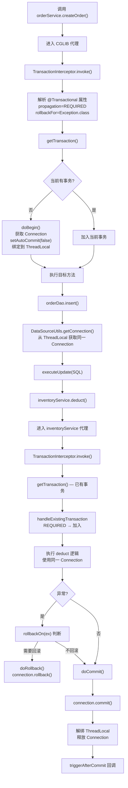

# Day 7 - AOP + 事务联合复盘

## 今日目标

将本周学习的 AOP 和事务知识串联，从全局视角理解 `@Transactional` 的完整执行链路。

## 完整执行链路

```text
@Service
public class OrderService {
    @Transactional(propagation = REQUIRED, rollbackFor = Exception.class)
    public Order createOrder(OrderRequest request) {
        orderDao.insert(order);
        inventoryService.deduct(order.getItems());  // 另一个 @Transactional 方法
        return order;
    }
}
```

从调用 `orderService.createOrder()` 开始：



## 知识串联

### AOP 视角

| 概念 | 在事务中的体现 |
|------|--------------|
| Advisor | `BeanFactoryTransactionAttributeSourceAdvisor` |
| Pointcut | `TransactionAttributeSourcePointcut`（匹配有 @Transactional 的方法） |
| Advice | `TransactionInterceptor`（实现了 MethodInterceptor） |
| 代理创建 | `InfrastructureAdvisorAutoProxyCreator`（AbstractAutoProxyCreator 子类） |
| 拦截器链 | TransactionInterceptor 作为链中的一个节点 |

### 事务视角

| 阶段 | 源码位置 |
|------|---------|
| 注解解析 | `SpringTransactionAnnotationParser` |
| 事务开启 | `AbstractPlatformTransactionManager.getTransaction()` |
| 连接绑定 | `DataSourceTransactionManager.doBegin()` |
| 连接获取 | `DataSourceUtils.getConnection()` |
| 提交/回滚 | `AbstractPlatformTransactionManager.commit()/rollback()` |
| 连接释放 | `DataSourceTransactionManager.doCleanupAfterCompletion()` |

## 常见陷阱复盘

### 陷阱 1：this 调用不走代理

```java
@Service
public class OrderService {
    @Transactional
    public void createOrder() { ... }

    public void batchCreate() {
        this.createOrder();  // ❌ 不走代理，事务不生效
    }
}
```

**根因**：`this` 是原始对象而非代理对象，AOP 拦截不到。

### 陷阱 2：异常被吞

```java
@Transactional
public void process() {
    try {
        riskyOperation();
    } catch (Exception e) {
        log.error("失败", e);  // ❌ 异常被 catch，TransactionInterceptor 看不到
    }
}
```

**根因**：`completeTransactionAfterThrowing()` 依赖异常传播到拦截器。

### 陷阱 3：多数据源事务

```java
@Transactional
public void crossDbOperation() {
    db1Dao.insert(...);  // DataSource A 的 Connection
    db2Dao.insert(...);  // DataSource B 的 Connection ← 不在同一事务中！
}
```

**根因**：`TransactionSynchronizationManager` 按 DataSource 绑定 Connection，单个 `@Transactional` 只管理一个数据源。需要分布式事务（JTA/Seata）。

### 陷阱 4：@Transactional + @Async

```java
@Transactional
@Async
public void asyncProcess() {
    // ❌ 事务在新线程执行，但事务状态在原线程的 ThreadLocal 中
}
```

**根因**：事务依赖 ThreadLocal，异步线程没有继承事务上下文。

## 面试全链路回答模板

**问：@Transactional 的完整原理？**

```text
1. 基础设施注册：@EnableTransactionManagement 导入 ProxyTransactionManagementConfiguration，
   注册 TransactionInterceptor（Advice）+ TransactionAttributeSourceAdvisor

2. 代理创建：InfrastructureAdvisorAutoProxyCreator 在 Bean 初始化后，
   检测到 @Transactional 方法匹配 Advisor 的 Pointcut，创建 CGLIB/JDK 代理

3. 运行时拦截：调用目标方法时进入代理 → TransactionInterceptor.invoke()
   → invokeWithinTransaction()

4. 事务管理：
   - 解析注解属性 → TransactionAttribute
   - 获取事务管理器 → PlatformTransactionManager
   - 开启事务 → getTransaction()（处理传播行为）→ doBegin()（获取连接，关闭自动提交，绑定 ThreadLocal）
   - 执行方法 → DAO 通过 DataSourceUtils 从 ThreadLocal 获取同一连接
   - 结果处理 → 正常提交 / 异常回滚（根据 rollbackOn 规则判断）
   - 清理 → 解绑 ThreadLocal，恢复自动提交，释放连接
```

## 本周总结 Checklist

### AOP 部分
- [ ] 能说明代理创建的时机和选择策略
- [ ] 能说明 @Aspect 解析和 Advisor 匹配过程
- [ ] 能说明拦截器链的递归执行机制
- [ ] 能画出五种通知的执行顺序

### 事务部分
- [ ] 能说明 @Transactional 从注解到拦截的完整链路
- [ ] 能说明七种传播行为的实现方式
- [ ] 能说明 Connection 如何通过 ThreadLocal 传递
- [ ] 能说明回滚判断的规则

### 综合
- [ ] 能从 AOP 视角解释事务的组成（Advisor + Pointcut + Advice）
- [ ] 能说明至少 4 种 @Transactional 失效场景及原因
- [ ] 能在调试中跟踪完整的事务执行路径

## 学习笔记

<!-- 在这里记录本周总结 -->
